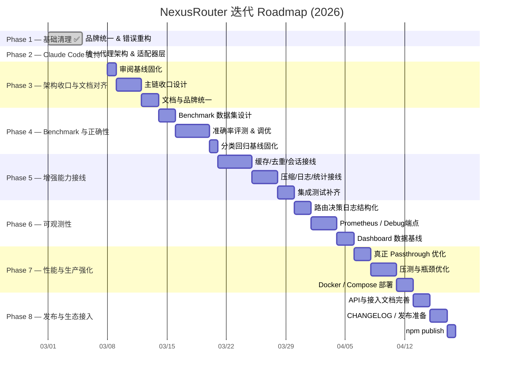
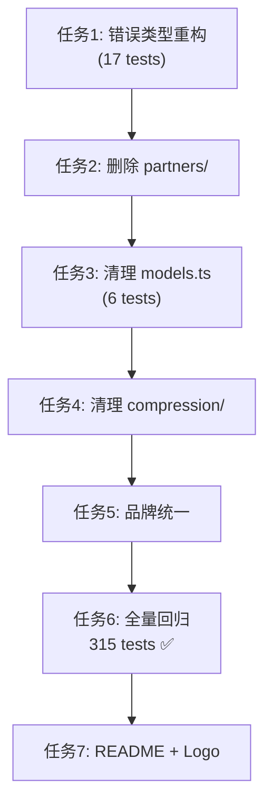

# NexusRouter — Roadmap & 进度追踪

> 当前 Roadmap 已根据 2026-03-08 项目审阅结果重排优先级。
> 审阅基线文档：`docs/reviews/2026-03-08-project-summary.md`
> 架构收口方案：`docs/plans/2026-03-08-architecture-consolidation-plan.md`
> Phase 规划依据：`docs/plans/2026-03-08-phase-priority-plan.md`

## 整体 Roadmap



## 注意事项

* [临时想法](#临时想法)这是一些临时想法，每当读取这个文件的时候，都要看一下这里，评估这些想法的可行性，难度，优先级，并分型拆分成可执行的需求任务移动到合适的阶段去执行，并更新其状态。

  > [!WARNING]
  >
  > 保持专业，并不是所有的想法都是合理的，要以你的专业态度去评判这个想法，如果不合理把他放到[垃圾箱](#垃圾箱)里

* 执行每个Phase时，每次都要要遵循SPEC +TDD 原则，

---

## 零散想法
### 临时想法

- [ ] 现在的文件到处散落，还有很多没用的文件，整理一下，让目录和文件变得清爽，但不要影响任何功能
- [ ] 对 README / docs / plugin metadata 做一次彻底收口，避免继续出现旧品牌和旧支付叙事
- [ ] 评估哪些模块应视为 experimental，哪些应该立即接入主链

### 垃圾箱


## 🔴 待处理缺陷（阻塞 Phase 3）

| 编号 | 缺陷 | 严重级别 | 状态 | 文档 |
|:-----|:-----|:--------:|:----:|:-----|
| D-001 | `hasTools` 恒真使三层分类器退化：CC 流量 100% 钉在 COMPLEX/REASONING，SIMPLE/MEDIUM 永不生效 | 🔴 高 | ✅ 分类侧已修复（能力侧留 Phase 3） | [评审报告](docs/reviews/2026-08-17-classifier-hastools-defect.md) · [修复记录](docs/reviews/2026-08-18-classifier-d001-fix.md) |

**D-001 处置结果（2026-08-18）**：

- 实测观测 7 条真实 CC 流量，**修正了评审报告的核心预测**：`reason` 分布 100% 是 `reasoning-keyword` 而非 `has-tools`。根因是 `hybrid.ts` 用 `includes()` 做关键词匹配，CC 每轮注入的 skills 清单必含 `improve`（内含 `prove`），在 hasTools 分支之前就命中 REASONING。
- 本轮已修复（TDD，408/408 绿灯）：
  1. 推理关键词改 `\b` 整词匹配（`logical` → `logically`，对齐上游）
  2. 移植上游 `tool-intent.ts`：`requiresTools` 拆开「带工具表」与「这一轮要动手」
  3. `AgentProfile.sanitizeForClassification`：CC 剥离 `<system-reminder>` 注入块，转发 body 不受影响
  4. `hints.thinking` 开关（`config.yaml` 顶层，默认 `off`）—— thinking 恒真（`CLAUDE_CODE_EFFORT_LEVEL=max` 常开所致）不再参与档位融合
- 遗留（并入 Phase 3.3）：能力侧 `filterByToolCalling` 接入需 `router/` 上主链。**阻塞项**：`config.yaml` 四档模型（`claude-opus-*`）均未注册进 `models.ts`，直接接入会把四档全过滤掉；须先解决双配置源归属。

---

## Phase 状态总览

| Phase | 目标 | 状态 | 提交 | 测试 |
|:------|:-----|:----:|:----:|:----:|
| Phase 1 | 基础清理 & 品牌统一 | ✅ **完成** | `e2b9adc` | 315/315 |
| Phase 2 | Claude Code 支持 & 统一代理架构 | ✅ **完成** | `1b43dae` | 340/340 |
| Phase 3 | 架构收口与文档对齐 | 🔲 未开始 | — | 基线：340/340 |
| Phase 4 | Benchmark 与正确性 | 🔲 未开始 | — | 继承 Phase 3 |
| Phase 5 | 增强能力接线 | 🔲 未开始 | — | 继承 Phase 4 |
| Phase 6 | 可观测性 | 🔲 未开始 | — | 继承 Phase 5 |
| Phase 7 | 性能与生产强化 | 🔲 未开始 | — | 继承 Phase 6 |
| Phase 8 | 发布与生态接入 | 🔲 未开始 | — | 继承 Phase 7 |

---

## ✅ Phase 1 — 基础清理与品牌统一

> **完成时间**: 2026-03-05 | **提交**: `cdad3f4` / `e2b9adc`

### 交付清单

- [x] 移除支付残留错误类型（`InsufficientFundsError` 等），替换为路由错误体系（`ConfigurationError` / `ProviderError` / `ClassificationError` / `RoutingError`）
- [x] 删除 `src/partners/` 支付合作伙伴模块
- [x] 清理 `src/models.ts` 中的 `BlockRun` / `blockrun/` 引用
- [x] 品牌统一：`ClawRouter / BlockRun` → `NexusRouter`，更新 `package.json`、`bin`、logger、stats、updater
- [x] 全量回归：`typecheck` 0 errors / `build` 成功 / 315 tests 全绿
- [x] 像素风格 README.md + NexusRouter Logo
- [x] `ROADMAP.md` / `TASK_TRACKER.md` / `WALKTHROUGH_PHASE1.md` 落地项目根目录
- [x] 代码评审：零高优先级遗留问题

### SDD/TDD 任务执行顺序（历史记录）



---

## ✅ Phase 2 — Claude Code 支持 & 统一代理架构

> **完成时间**: 2026-03-05 | **提交**: `90a150b`（功能）+ `1b43dae`（评审修复）

### 核心设计

深度研究 [claude-code-router](https://github.com/musistudio/claude-code-router)，借鉴其 Transformer 链模式，融合 NexusRouter 的 15 维分类器，设计出统一代理架构：

```
任何 Agent (Claude Code / OpenClaw / Cursor / ...)
        │
        ▼  POST /<agent>/v1/messages  OR  /v1/chat/completions
┌───────────────────────────────────┐
│  ProtocolAdapter (策略模式)        │  toUnified()
│  ├─ AnthropicAdapter              │
│  └─ OpenAIAdapter                 │
├───────────────────────────────────┤
│  AgentProfile (插件模式)           │  extractHints() → computeWeights()
│  ├─ claude-code: haiku=80% hint   │
│  └─ openclaw: 100% classifier     │
├───────────────────────────────────┤
│  15维分类器 × 动态加权融合         │  → Tier (SIMPLE/MEDIUM/COMPLEX/REASONING)
├───────────────────────────────────┤
│  ProviderForwarder                │  forward() → upstream API
└───────────────────────────────────┘
```

### 交付清单

- [x] `src/adapter/types.ts` — `UnifiedRequest` / `AgentHints` / `ClassifierWeights` 统一类型
- [x] `src/adapter/adapter.ts` — `ProtocolAdapter` 策略接口 + Factory + 协议检测器
- [x] `src/adapter/anthropic.ts` — `AnthropicAdapter`（Anthropic ↔ 统一格式，SSE 透传支持）
- [x] `src/adapter/openai.ts` — `OpenAIAdapter`（OpenAI ↔ 统一格式）
- [x] `src/adapter/profile.ts` — `AgentProfile` 插件注册表 + 动态加权融合
- [x] `src/server.ts` — 重构为 5 步流水线 + Agent 前缀路由（`/anthropic/` `/openclaw/` 等）+ 向后兼容
- [x] `src/adapter/adapter.test.ts` — 25 个专项测试
- [x] 全量回归：typecheck 0 errors / 340 tests 全绿
- [x] 代码评审（`CODE_REVIEW_PHASE2.md`）：6 个问题全部修复

### Claude Code 接入方式

```bash
export ANTHROPIC_BASE_URL=http://127.0.0.1:8402/anthropic
claude   # 15维分类器自动路由，无需其他配置
```

### Agent 端点兼容矩阵

| Agent | URL | 状态 |
|:------|:----|:----:|
| Claude Code | `http://host:8402/anthropic` | ✅ 支持 |
| OpenClaw | `http://host:8402/openclaw/v1` | ✅ 支持 |
| 旧版 OpenClaw | `http://host:8402/v1` | ✅ 向后兼容 |
| Cursor | `http://host:8402/cursor/v1` | 🔲 框架已就绪 |
| Gemini CLI | `http://host:8402/gemini/v1` | 🔲 框架已就绪 |

---

## 🔲 Phase 3 — 架构收口与文档对齐

> **预计时长**: ~6 天
> **关联文档**:
> `docs/reviews/2026-03-08-project-summary.md`
> `docs/plans/2026-03-08-architecture-consolidation-plan.md`
> `docs/plans/2026-03-08-phase-priority-plan.md`

### 目标

1. 明确唯一 authoritative routing path
2. 收口 `server.ts` 与 `router/` 的职责边界
3. 统一 README / docs / plugin metadata 的产品叙事
4. 为后续 benchmark、接线、可观测性提供稳定基线

### 关键任务

- [ ] **3.1** 基于审阅报告确认“当前真实主链”与“计划保留主链”
- [ ] **3.2** 设计统一 `RoutingDecision` 输出结构
- [ ] **3.3** 决定 `HybridClassifier` 与 `router/` 的归位关系，消除双主线
  - 前置（D-001 遗留）：`config.yaml` 四档模型未注册 `models.ts`，`filterByToolCalling`/成本估算接入前必须先定模型注册表与 YAML 档位配置的归属（参考 `src/router/config.ts` 硬编码 DEFAULT_ROUTING_CONFIG 的双配置源问题）
- [ ] **3.4** 清理 `README.md`、`docs/architecture.md`、`docs/features.md`、`docs/configuration.md` 中的旧叙事
- [ ] **3.5** 清理 `openclaw.plugin.json`、`openclaw.security.json` 中的旧支付/x402 描述
- [ ] **3.6** 产出本 Phase 的架构收口说明与变更记录
- [x] **3.7** 默认配置路径改为用户主目录 `~/.nexus-router/config.yaml`（跨平台），首启自动从内嵌模板创建，`--help` 按 OS 提示真实路径
- [ ] 全量回归 + 代码评审 + 提交

### 验收标准

| 指标 | 目标 |
|:-----|:-----|
| 主链唯一性 | `server.ts` 只保留一套清晰决策主线 |
| 文档一致性 | README / docs 主叙事与当前代码一致 |
| 品牌一致性 | 主文档与插件元数据不再出现旧产品核心叙事 |
| 交付物 | 架构收口变更记录与文档更新 |

---

## 🔲 Phase 4 — Benchmark 与正确性

> **预计时长**: ~7 天
> **关联文档**:
> `docs/plans/2026-03-08-phase-priority-plan.md`

### 目标

1. **Benchmark 数据集**：构建 500+ 带标注 prompt，量化 15 维分类器准确率
2. **准确率评测**：分类准确率 ≥ 85%，F1-Score 报告
3. **评分器调优**：根据 benchmark 结果优化 rule/heuristic/ai 权重
4. **分类基线固化**：建立回归集，防止后续收敛过程引入分类退化

### 关键任务

- [ ] **4.1** 设计 benchmark 数据集格式（prompt / expected_tier / reasoning）
- [ ] **4.2** 构建 500+ 标注样本（覆盖 SIMPLE/MEDIUM/COMPLEX/REASONING 各 125+）
- [ ] **4.3** 自动化 benchmark runner（输出准确率/F1/混淆矩阵）
- [ ] **4.4** 分类器调优（基于 benchmark 结果调整阈值和关键词）
- [ ] **4.5** 建立分类回归集与回归门禁
- [ ] **4.6** 输出 benchmark 报告与调优结论
- [ ] 全量回归 + 代码评审 + 提交

### 验收标准

| 指标 | 目标 |
|:-----|:-----|
| 分类准确率 | ≥ 85%（vs 人工标注） |
| F1-Score (REASONING) | ≥ 0.80 |
| 回归门禁 | 有固定回归集并纳入测试流程 |
| 发布报告 | `BENCHMARK_PHASE4.md` |

---

## 🔲 Phase 5 — 增强能力接线

> **预计时长**: ~9 天
> **关联文档**:
> `docs/reviews/2026-03-08-project-summary.md`
> `docs/plans/2026-03-08-architecture-consolidation-plan.md`
> `docs/plans/2026-08-19-savings-ledger-design.md`（5.6 省钱记账体系设计）

### 目标

- 将已实现但未接入的增强模块分批接入主请求链路
- 用统一 middleware / pipeline 方式承载这些能力
- 让 README 中列出的核心高级能力具备真实运行路径

### 关键任务

- [ ] **5.1** 设计 request/response middleware 或 pipeline 结构
- [ ] **5.2** 接入 `RequestDeduplicator`
- [ ] **5.3** 接入 `ResponseCache`
- [ ] **5.4** 接入 `SessionStore` / `SessionJournal`
- [ ] **5.5** 接入 `Compression`
- [ ] **5.6** 接入 `Logger` / `Stats` / `Report` —— **Savings Ledger 省钱记账体系**（方案：[`docs/plans/2026-08-19-savings-ledger-design.md`](docs/plans/2026-08-19-savings-ledger-design.md)）
  - 🔴 **硬前置**：Phase 3.3 未完成前不可施工。四档模型（`claude-opus-*`）未注册进 `models.ts`，成本计算 100% 依赖该价格表，此时接线记出来的账全是 `0` / `null`
  - 现状审计：`logUsage()` 零调用点、`stats.ts`/`report.ts` 无 CLI 入口、上游 `usage` 从不解析、美元数字基于 `maxTokens` 虚构、`savings` 字段单位一名两义（共 10 项缺陷，详见方案第 2 节）
  - ✅ **缺陷 11 已修**（2026-08-20，Step D0）：抽出 `src/paths.ts` 作为日志路径唯一真相源（`resolveLogDir()` **每次调用**重新解析 `NEXUSROUTER_LOG_DIR`，因为 CLI / 容器入口可能在模块 import 之后才设值），`logger.ts` 与 `stats.ts` 双侧改为共用；`getLogFiles()` 由模块常量改为参数传入。新增 `src/paths.test.ts`（8 例）与 `src/stats.test.ts`（5 例，含「读侧认环境变量」「日志目录不存在返回 0 而非抛错」「忽略 `routing-*.jsonl` 不交叉污染」）
  - 📌 命名不一致保留现状（配置 `~/.nexus-router/` vs 日志 `~/.nexusrouter/`），已在 `paths.ts` 注释显式标注；改名属破坏性变更，留待单独决策
  - [ ] **5.6.1** `src/pricing/` 分档定价（in / out / cacheRead / cacheWrite5m / cacheWrite1h），未知模型返回 `null` 而非 `0`
  - [ ] **5.6.2** `src/accounting/` `BaselineResolver` 策略：`requested`（默认，用客户端实际请求的模型）/ `reference` / `off`
  - [ ] **5.6.3** `src/adapter/` usage 捕获：非流式复用既有 `JSON.parse`（+0.0001ms）；流式用 **4KB 预分配环形尾窗**，写法锁定 `Uint8Array` + `TypedArray.set`（实测 43-57 ns/chunk；改用 `Buffer.concat` 累积会慢 **1100×**，评审红线）
  - [ ] **5.6.4** 日志 schema v2（`costUsd` / `baselineCostUsd` / `savedUsd` / `usageSource` / `truncated`），`parseLogFile` 保留 v1 兼容分支
  - [ ] **5.6.5** `cli.ts` 补 `stats` / `report` 子命令，报表区分「真实 usage」与「估算」口径（实时大屏 `dash` 子命令同批接入，见 6.6）
  - [ ] **5.6.6** `LedgerWriter` 批量 flush（满 64 行 / 200ms / 退出时）—— 🔴 **不做则吞吐腰斩**：每请求 2 次 `appendFile` 实测把上限从 2,959 压到 1,522 req/s，批量后 139,537 req/s（70×）。**此项不依赖 3.3，可作为 Step 0 独立先行**，同时解决现存 `logRoutingDecision` 的落盘天花板
  - [ ] **5.6.7** 🔴 **分层熔断开关（必须先于 5.6.3 接线交付）**——「发现性能问题能及时关闭」的落地（方案决策 6）
    - **L0 分粒度配置**：`accounting.enabled` / `captureNonStreaming`（+0.1 µs）/ `captureStreaming`（+22 µs，出问题第一个关）/ `persist`。三条路径成本差 **220×**，禁止一个总布尔一刀切
    - **L1 热切换**：`fs.watch(config.yaml)` + 200ms debounce，**仅**热更新 `accounting.*` 子树（现状 `loadConfig()` 只在启动调用一次，改配置必须重启，不满足「及时」）。否决 SIGHUP（**win32 不支持**，本项目主平台）与新增 HTTP 管理端点（流量咽喉扩大攻击面）
    - **L2 自动降级**：只在 I/O 侧做（磁盘停顿无界），触发用零成本的队列 `length` 比较：连续 `degradeAfterOverflows` 次触顶 → `persist` 自动转 false，WARN 一次，**单向不自动恢复**。CPU 侧明确不做自测量熔断（`hrtime` 采样开销接近被测对象）
    - **L3 可见性**：`/health` 扩展 `accounting: { enabled, captureStreaming, persist, degraded, degradedReason }`；`nexus stats` 报表标注该时段是否降级过。🔒 `/health` 目前**无鉴权**，该段会带出成本口径与开关状态，故须**仅对回环来源返回**或配置显式 opt-in（默认只绑回环双栈 `c2bf803`，但用户可显式配 `hosts` 暴露）
    - **首版按 experimental 交付、`enabled: false` 默认关闭**（对应本 Phase 验收标准「各能力标注为 enabled / optional / experimental」），Phase 7.3 压测通过后再翻默认值；`accounting` 段缺失等价 `enabled: false`，老配置零改动可用（向后兼容红线）
    - 实测：关闭后残留开销 **低于测量噪声（±5 µs）**，故 `sniffer?.push()` 一个可选链即可，不写双循环体
  - 性能实测基线：热路径净增 **+0.046 ms/请求**（典型 CC 回答 800 chunk），每连接常驻 **~3 KB**，事件循环延迟 avg 0.006ms 不变
  - 施工顺序（方案第 9 节）：Step 0（5.6.6，不依赖 3.3）→ Step 1（5.6.1/5.6.2 纯函数）→ **Step 2（5.6.7 开关骨架，不依赖 3.3）→ Step 3（5.6.3 接线）** → Step 4（5.6.5 CLI）→ Step 5（清理缺陷 7/9）。**开关必须先于接线**：先接线后补开关等于没刹车先踩油门，届时唯一手段是回滚代码而非改配置
- [ ] **5.7** 补齐集成测试与功能文档
- [ ] 全量回归 + 代码评审 + 提交

### 验收标准

| 指标 | 目标 |
|:-----|:-----|
| 接线范围 | 至少完成缓存/去重/会话/日志四类核心能力接入 |
| 主链一致性 | 所有增强能力通过统一 pipeline 接入 |
| 文档状态 | 各能力标注为 enabled / optional / experimental |

---

## 🔲 Phase 6 — 可观测性

> **预计时长**: ~7 天
> **关联文档**：`docs/plans/2026-08-20-live-dashboard-design.md`（6.5/6.6 控制台实时大屏设计）

### 目标

- 结构化路由决策日志（Tier / Layer / Confidence / AgentProfile / 成本估算）
- Prometheus `/metrics` 端点
- Dashboard 所需的数据基线与调试端点
- **控制台实时大屏**：终端内实时查看 tier 分布、真实成本与省下来的钱

### 关键任务

- [ ] **6.1** 路由决策日志结构化（每次请求记录完整上下文）
- [ ] **6.2** `x-nexusrouter-*` 响应头完善（成本估算、provider 信息）
- [ ] **6.3** Prometheus metrics exporter（请求计数/延迟/tier 分布）
- [ ] **6.4** 补齐 `/metrics` / debug 端点
  - 可选 `GET /internal/stats`（供 `persist: false` 下的实时数值）：**只读 + 回环 only + 显式 opt-in + 默认关闭**，三条缺一不可
- [ ] **6.5** 为 Dashboard 预留数据模型与接口 —— `src/dashboard/` 的 `Tailer` + `Aggregator` 纯函数层
  - **增量 tail（byte offset）**，🔴 **禁止复用 `getStats()`**：它每次全量重读重解析整天文件，1Hz × 10万行/天 = 每分钟解析 600 万行，**大屏会比被观测的记账贵三个数量级**
  - 边界：半行残片拼接、跨日切换保留昨日聚合、文件被截断/删除（`size < offset`）时 offset 归零、v1+v2 schema 混读
  - 口径：`upstream` / `estimated` 分离计数不相加；`baselineCostUsd === null` 不当 0 聚合
- [ ] **6.6** `nexusrouter dash` 控制台实时大屏（方案：[`docs/plans/2026-08-20-live-dashboard-design.md`](docs/plans/2026-08-20-live-dashboard-design.md)）
  - 🔴 **硬前置**：① Phase 5.6 Savings Ledger 落地（否则大屏实时放大缺陷 4 的虚构美元）；② ~~修缺陷 11~~ ✅ 已于 2026-08-20 修完（`src/paths.ts`，见 5.6）
  - **独立进程**，🔴 **绝不与 router 同进程渲染** —— 1Hz 全帧重绘放进流量咽喉的事件循环 = 给代理延迟加周期性抖动；对 router 的开销必须为 0
  - **零新依赖手写 ANSI**（否决 `ink`（拖进 React，+2MB 量级）与 `blessed`（久未维护）；3 个运行时依赖是产品资产）
  - 终端接管四要点：alt screen 进出且 `SIGINT`/`SIGTERM`/`exit`/`uncaughtException` **必须恢复**（`\x1b[?1049l` + `\x1b[?25h`）；**非 TTY 退回一次性快照**；按 `stdout.columns` 自适应 + `SIGWINCH` 重排；逐行 `\x1b[K` 清行防闪烁
  - **可测化红线**：渲染必须是纯函数 `renderFrame(state, width, height): string[]`，无终端亦可断言（否则 TUI 无法 TDD）
  - 开关状态从 `/health` 读（每 2s，与 1s 数据刷新解耦）；`persist: false` / 已降级 / router 离线时**显著标注，不显示 $0.0000**
  - 底栏常驻 `same-usage-repricing · 近似值`：屏幕越好看越要钉住这句 caveat
  - 明确不做：Web UI（图形化交给 6.3 的 Prometheus + Grafana）、历史回放、鼠标交互
- [ ] 全量回归 + 代码评审 + 提交

---

## 🔲 Phase 7 — 性能与生产强化

> **预计时长**: ~7 天

### 目标

- 真正的 passthrough 优化
- 1000 QPS 级别压测与瓶颈定位
- Docker 一键部署（含 Compose 配置）

### 关键任务

- [ ] **7.1** 实现真正的 Buffer Passthrough（同协议时尽量跳过多余序列化）
- [ ] **7.2** Adapter 单例化与轻量对象复用
- [ ] **7.3** 负载测试（autocannon / k6），定位并优化瓶颈
  - 已知首个瓶颈：日志落盘。实测 `appendFile` 每请求 1 次 → 上限 2,959 req/s（**现状即如此**）；批量 flush 后 139,537 req/s。见 5.6.6 / [方案决策 5](docs/plans/2026-08-19-savings-ledger-design.md)
- [ ] **7.4** `Dockerfile` + `docker-compose.yml`（含 Ollama sidecar 配置）
- [ ] **7.5** 输出性能测试报告
- [ ] 全量回归 + 代码评审 + 提交

---

## 🔲 Phase 8 — 发布与生态接入

> **预计时长**: ~5 天

### 目标

- 完整 API 文档与 Agent 接入文档
- CHANGELOG / semver / npm 发布闭环

### 关键任务

- [ ] **8.1** 完整 API 文档（端点参考、Agent 配置示例、Provider 配置）
- [ ] **8.2** README 与安装文档最终收尾
- [ ] **8.3** CHANGELOG.md + npm publish 准备（semver、tag）
- [ ] **8.4** release checklist 与发布说明
- [ ] 全量回归 + 代码评审 + 提交

---

## 工作流程规范

> 每个 Phase 完成后必须执行：

```bash
# 1. 运行全量测试
npm run typecheck && npm run build && npm test

# 2. 提交功能代码
git commit -m "feat(phaseN): ..."

# 3. 运行代码评审 (/code-review workflow)
# → 生成 CODE_REVIEW_PHASE<N>.md
# → 修复高优先级问题
# → 提交: "review(phaseN): 代码评审报告 + 修复"

# 4. 更新本文件进度标注
git commit -m "docs: 更新 ROADMAP.md Phase N 完成状态"
```

---

## 差异化定位

| 特性 | NexusRouter | claude-code-router | 普通代理 |
|:-----|:-----------:|:------------------:|:--------:|
| 多协议 Agent 支持 | ✅ 统一端点 | Anthropic Only | 单协议 |
| 智能分类路由 | ✅ 15维/三层 | 手动配置 | 无 |
| 分类延迟 | ✅ <1ms | N/A | N/A |
| AgentProfile 插件 | ✅ 可扩展 | 无 | 无 |
| 动态加权融合 | ✅ 按信号强度 | 无 | 无 |
| 向后兼容 | ✅ 零改动 | 需配置 | 需配置 |
| 代码评审体系 | ✅ 每 Phase | 无 | 无 |
