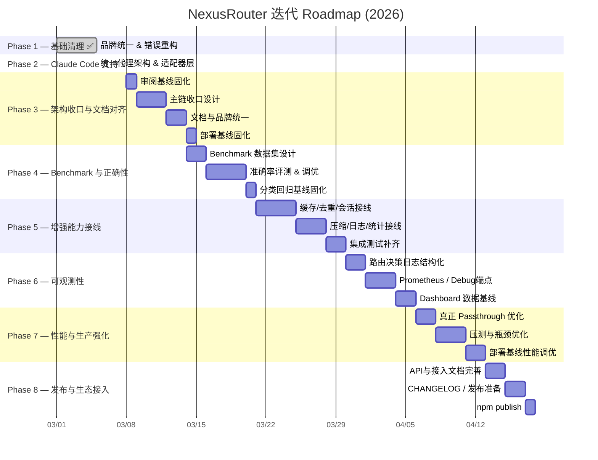
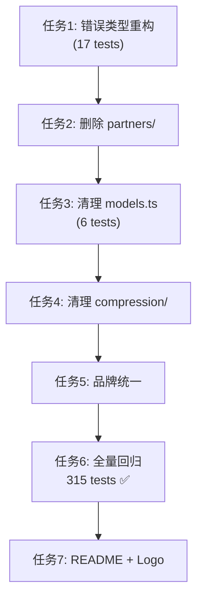

# NexusRouter — Roadmap & 进度追踪

> 当前 Roadmap 已根据 2026-03-08 项目审阅结果重排优先级。
> 审阅基线文档：`docs/reviews/2026-03-08-project-summary.md`
> 架构收口方案：`docs/plans/2026-03-08-architecture-consolidation-plan.md`
> Phase 规划依据：`docs/plans/2026-03-08-phase-priority-plan.md`

## 整体 Roadmap



## 注意事项

- [临时想法](#临时想法)这是一些临时想法，每当读取这个文件的时候，都要看一下这里，评估这些想法的可行性，难度，优先级，并分型拆分成可执行的需求任务移动到合适的阶段去执行，并更新其状态。

  > [!WARNING]
  >
  > 保持专业，并不是所有的想法都是合理的，要以你的专业态度去评判这个想法，如果不合理把他放到[垃圾箱](#垃圾箱)里

- 执行每个Phase时，每次都要要遵循SPEC +TDD 原则，

---

## 零散想法

### 临时想法

- [ ] 现在的文件到处散落，还有很多没用的文件，整理一下，让目录和文件变得清爽，但不要影响任何功能
- [ ] 对 README / docs / plugin metadata 做一次彻底收口，避免继续出现旧品牌和旧支付叙事
- [ ] 评估哪些模块应视为 experimental，哪些应该立即接入主链

### 垃圾箱

## 🔴 待处理缺陷（阻塞 Phase 3）

| 编号  | 缺陷                                                                                         | 严重级别 |                状态                 | 文档                                                                                                                           |
| :---- | :------------------------------------------------------------------------------------------- | :------: | :---------------------------------: | :----------------------------------------------------------------------------------------------------------------------------- |
| D-001 | `hasTools` 恒真使三层分类器退化：CC 流量 100% 钉在 COMPLEX/REASONING，SIMPLE/MEDIUM 永不生效 |  🔴 高   | ✅ 分类侧已修复（能力侧留 Phase 3） | [评审报告](docs/reviews/2026-08-17-classifier-hastools-defect.md) · [修复记录](docs/reviews/2026-08-18-classifier-d001-fix.md) |

**D-001 处置结果（2026-08-18）**：

- 实测观测 7 条真实 CC 流量，**修正了评审报告的核心预测**：`reason` 分布 100% 是 `reasoning-keyword` 而非 `has-tools`。根因是 `hybrid.ts` 用 `includes()` 做关键词匹配，CC 每轮注入的 skills 清单必含 `improve`（内含 `prove`），在 hasTools 分支之前就命中 REASONING。
- 本轮已修复（TDD，408/408 绿灯）：
  1. 推理关键词改 `\b` 整词匹配（`logical` → `logically`，对齐上游）
  2. 移植上游 `tool-intent.ts`：`requiresTools` 拆开「带工具表」与「这一轮要动手」
  3. `AgentProfile.sanitizeForClassification`：CC 剥离 `<system-reminder>` 注入块，转发 body 不受影响
  4. `hints.thinking` 开关（`config.yaml` 顶层，默认 `off`）—— thinking 恒真（`CLAUDE_CODE_EFFORT_LEVEL=max` 常开所致）不再参与档位融合
- 遗留（并入 Phase 3.3）：能力侧 `filterByToolCalling` 接入需 `router/` 上主链。**阻塞项**：`config.yaml` 四档模型（`claude-opus-*`）均未注册进 `models.ts`，直接接入会把四档全过滤掉；须先解决双配置源归属。

---

## Phase 状态总览

| Phase   | 目标                            |    状态     |   提交    |     测试      |
| :------ | :------------------------------ | :---------: | :-------: | :-----------: |
| Phase 1 | 基础清理 & 品牌统一             | ✅ **完成** | `e2b9adc` |    315/315    |
| Phase 2 | Claude Code 支持 & 统一代理架构 | ✅ **完成** | `1b43dae` |    340/340    |
| Phase 3 | 架构收口与文档对齐              |  🔲 未开始  |     —     | 基线：340/340 |
| Phase 4 | Benchmark 与正确性              |  🔲 未开始  |     —     | 继承 Phase 3  |
| Phase 5 | 增强能力接线                    |  🔲 未开始  |     —     | 继承 Phase 4  |
| Phase 6 | 可观测性                        |  🔲 未开始  |     —     | 继承 Phase 5  |
| Phase 7 | 性能与生产强化                  |  🔲 未开始  |     —     | 继承 Phase 6  |
| Phase 8 | 发布与生态接入                  |  🔲 未开始  |     —     | 继承 Phase 7  |

---

## ✅ Phase 1 — 基础清理与品牌统一

> **完成时间**: 2026-03-05 | **提交**: `cdad3f4` / `e2b9adc`

### 交付清单

- [x] 移除支付残留错误类型（`InsufficientFundsError` 等），替换为路由错误体系（`ConfigurationError` / `ProviderError` / `ClassificationError` / `RoutingError`）
- [x] 删除 `src/partners/` 支付合作伙伴模块
- [x] 清理 `src/models.ts` 中的 `BlockRun` / `blockrun/` 引用
- [x] 品牌统一：`ClawRouter / BlockRun` → `NexusRouter`，更新 `package.json`、`bin`、logger、stats、updater
- [x] 全量回归：`typecheck` 0 errors / `build` 成功 / 315 tests 全绿
- [x] 像素风格 README.md + NexusRouter Logo
- [x] `ROADMAP.md` / `TASK_TRACKER.md` / `WALKTHROUGH_PHASE1.md` 落地项目根目录
- [x] 代码评审：零高优先级遗留问题

### SDD/TDD 任务执行顺序（历史记录）



---

## ✅ Phase 2 — Claude Code 支持 & 统一代理架构

> **完成时间**: 2026-03-05 | **提交**: `90a150b`（功能）+ `1b43dae`（评审修复）

### 核心设计

深度研究 [claude-code-router](https://github.com/musistudio/claude-code-router)，借鉴其 Transformer 链模式，融合 NexusRouter 的 15 维分类器，设计出统一代理架构：

```
任何 Agent (Claude Code / OpenClaw / Cursor / ...)
        │
        ▼  POST /<agent>/v1/messages  OR  /v1/chat/completions
┌───────────────────────────────────┐
│  ProtocolAdapter (策略模式)        │  toUnified()
│  ├─ AnthropicAdapter              │
│  └─ OpenAIAdapter                 │
├───────────────────────────────────┤
│  AgentProfile (插件模式)           │  extractHints() → computeWeights()
│  ├─ claude-code: haiku=80% hint   │
│  └─ openclaw: 100% classifier     │
├───────────────────────────────────┤
│  15维分类器 × 动态加权融合         │  → Tier (SIMPLE/MEDIUM/COMPLEX/REASONING)
├───────────────────────────────────┤
│  ProviderForwarder                │  forward() → upstream API
└───────────────────────────────────┘
```

### 交付清单

- [x] `src/adapter/types.ts` — `UnifiedRequest` / `AgentHints` / `ClassifierWeights` 统一类型
- [x] `src/adapter/adapter.ts` — `ProtocolAdapter` 策略接口 + Factory + 协议检测器
- [x] `src/adapter/anthropic.ts` — `AnthropicAdapter`（Anthropic ↔ 统一格式，SSE 透传支持）
- [x] `src/adapter/openai.ts` — `OpenAIAdapter`（OpenAI ↔ 统一格式）
- [x] `src/adapter/profile.ts` — `AgentProfile` 插件注册表 + 动态加权融合
- [x] `src/server.ts` — 重构为 5 步流水线 + Agent 前缀路由（`/anthropic/` `/openclaw/` 等）+ 向后兼容
- [x] `src/adapter/adapter.test.ts` — 25 个专项测试
- [x] 全量回归：typecheck 0 errors / 340 tests 全绿
- [x] 代码评审（`CODE_REVIEW_PHASE2.md`）：6 个问题全部修复

### Claude Code 接入方式

```bash
export ANTHROPIC_BASE_URL=http://127.0.0.1:8402/anthropic
claude   # 15维分类器自动路由，无需其他配置
```

### Agent 端点兼容矩阵

| Agent         | URL                            |     状态      |
| :------------ | :----------------------------- | :-----------: |
| Claude Code   | `http://host:8402/anthropic`   |    ✅ 支持    |
| OpenClaw      | `http://host:8402/openclaw/v1` |    ✅ 支持    |
| 旧版 OpenClaw | `http://host:8402/v1`          |  ✅ 向后兼容  |
| Cursor        | `http://host:8402/cursor/v1`   | 🔲 框架已就绪 |
| Gemini CLI    | `http://host:8402/gemini/v1`   | 🔲 框架已就绪 |

---

## 🔲 Phase 3 — 架构收口与文档对齐

> **预计时长**: ~6 天
> **关联文档**:
> `docs/reviews/2026-03-08-project-summary.md`
> `docs/plans/2026-03-08-architecture-consolidation-plan.md`
> `docs/plans/2026-03-08-phase-priority-plan.md`

### 目标

1. 明确唯一 authoritative routing path
2. 收口 `server.ts` 与 `router/` 的职责边界
3. 统一 README / docs / plugin metadata 的产品叙事
4. 为后续 benchmark、接线、可观测性提供稳定基线

### 关键任务

- [ ] **3.1** 基于审阅报告确认“当前真实主链”与“计划保留主链”
- [ ] **3.2** 设计统一 `RoutingDecision` 输出结构
- [ ] **3.3** 决定 `HybridClassifier` 与 `router/` 的归位关系，消除双主线
  - 前置（D-001 遗留）：`config.yaml` 四档模型未注册 `models.ts`，`filterByToolCalling`/成本估算接入前必须先定模型注册表与 YAML 档位配置的归属（参考 `src/router/config.ts` 硬编码 DEFAULT_ROUTING_CONFIG 的双配置源问题）
- [x] **3.4** 清理 `README.md`、`docs/architecture.md`、`docs/features.md`、`docs/configuration.md` 中的旧叙事
- [x] **3.5** 清理 `openclaw.plugin.json`、`openclaw.security.json` 中的旧支付/x402 描述
- [ ] **3.6** 产出本 Phase 的架构收口说明与变更记录
- [ ] **3.7** 默认配置路径改为用户主目录 `~/.nexus-router/config.yaml`（跨平台），首启自动从内嵌模板创建，`--help` 按 OS 提示真实路径
- [x] **3.8 部署基线收口与文档入口统一**
  - 确认 `deploy/new-api/` 为唯一官方验证的远程部署形态（nginx + NexusRouter + new-api passthrough）
  - 在 `README.md` 与 `docs/usage-manual.md` 中增加部署入口与快速链接
  - 归档 `docs/plans/2026-02-13-e2e-docker-deployment.md` 等旧部署文档
- [ ] 全量回归 + 代码评审 + 提交

### 验收标准

| 指标       | 目标                                                                              |
| :--------- | :-------------------------------------------------------------------------------- |
| 主链唯一性 | `server.ts` 只保留一套清晰决策主线                                                |
| 文档一致性 | README / docs 主叙事与当前代码一致                                                |
| 品牌一致性 | 主文档与插件元数据不再出现旧产品核心叙事                                          |
| 部署基线   | README / usage-manual 指向 `deploy/new-api`，Phase 7 不再包含 Docker/Compose 任务 |
| 交付物     | 架构收口变更记录与文档更新                                                        |

---

## 🔲 Phase 4 — Benchmark 与正确性

> **预计时长**: ~7 天
> **关联文档**:
> `docs/plans/2026-03-08-phase-priority-plan.md`

### 目标

1. **Benchmark 数据集**：构建 500+ 带标注 prompt，量化 15 维分类器准确率
2. **准确率评测**：分类准确率 ≥ 85%，F1-Score 报告
3. **评分器调优**：根据 benchmark 结果优化 rule/heuristic/ai 权重
4. **分类基线固化**：建立回归集，防止后续收敛过程引入分类退化

### 关键任务

- [ ] **4.1** 设计 benchmark 数据集格式（prompt / expected_tier / reasoning）
- [ ] **4.2** 构建 500+ 标注样本（覆盖 SIMPLE/MEDIUM/COMPLEX/REASONING 各 125+）
- [ ] **4.3** 自动化 benchmark runner（输出准确率/F1/混淆矩阵）
- [ ] **4.4** 分类器调优（基于 benchmark 结果调整阈值和关键词）
- [ ] **4.5** 建立分类回归集与回归门禁
- [ ] **4.6** 输出 benchmark 报告与调优结论
- [ ] 全量回归 + 代码评审 + 提交

### 验收标准

| 指标                 | 目标                       |
| :------------------- | :------------------------- |
| 分类准确率           | ≥ 85%（vs 人工标注）       |
| F1-Score (REASONING) | ≥ 0.80                     |
| 回归门禁             | 有固定回归集并纳入测试流程 |
| 发布报告             | `BENCHMARK_PHASE4.md`      |

---

## 🔲 Phase 5 — 增强能力接线

> **预计时长**: ~9 天
> **关联文档**:
> `docs/reviews/2026-03-08-project-summary.md`
> `docs/plans/2026-03-08-architecture-consolidation-plan.md`
> `docs/plans/2026-08-19-savings-ledger-design.md`（5.6 省钱记账体系设计）

### 目标

- 将已实现但未接入的增强模块分批接入主请求链路
- 用统一 middleware / pipeline 方式承载这些能力
- 让 README 中列出的核心高级能力具备真实运行路径

### 关键任务

- [ ] **5.1** 设计 request/response middleware 或 pipeline 结构
- [ ] **5.2** 接入 `RequestDeduplicator`
- [ ] **5.3** 接入 `ResponseCache`
- [ ] **5.4** 接入 `SessionStore` / `SessionJournal`
- [ ] **5.5** 接入 `Compression`
- [ ] **5.6** 接入 `Logger` / `Stats` / `Report` —— **Savings Ledger 省钱记账体系**（方案：[`docs/plans/2026-08-19-savings-ledger-design.md`](docs/plans/2026-08-19-savings-ledger-design.md)）
  - 🔴 **硬前置**：Phase 3.3 未完成前不可施工。四档模型（`claude-opus-*`）未注册进 `models.ts`，成本计算 100% 依赖该价格表，此时接线记出来的账全是 `0` / `null`
    - 📌 **2026-08-20 窄口径解除**（Step 1/2/3 已落地）：改用「产品默认价 + 部署级 `PriceOverrides`，未知恒为 `null`」后，纯函数层与接线层不再依赖 3.3；但**没人填 override 时账面会是一片 `null`**（这是诚实的「未测」，不是 `0`），可运行但无可读省钱数字
  - 现状审计：`logUsage()` 零调用点、`stats.ts`/`report.ts` 无 CLI 入口、上游 `usage` 从不解析、美元数字基于 `maxTokens` 虚构、`savings` 字段单位一名两义（共 10 项缺陷，详见方案第 2 节）
  - ✅ **缺陷 11 已修**（2026-08-20，Step D0）：抽出 `src/paths.ts` 作为日志路径唯一真相源（`resolveLogDir()` **每次调用**重新解析 `NEXUSROUTER_LOG_DIR`，因为 CLI / 容器入口可能在模块 import 之后才设值），`logger.ts` 与 `stats.ts` 双侧改为共用；`getLogFiles()` 由模块常量改为参数传入。新增 `src/paths.test.ts`（8 例）与 `src/stats.test.ts`（5 例，含「读侧认环境变量」「日志目录不存在返回 0 而非抛错」「忽略 `routing-*.jsonl` 不交叉污染」）
  - ✅ **命名已统一**（2026-08-21）：日志目录默认改为 `~/.nexus-router/logs`，与配置目录一致；保留 `migrateLegacyLogDir()` 将旧 `~/.nexusrouter/logs` 自动迁移到新目录，避免老用户升级后历史日志丢失。旧目录为空后自动清理。`src/paths.test.ts` 补迁移测试。
  - [x] **5.6.1** `src/pricing/` 分档定价（in / out / cacheRead / cacheWrite5m / cacheWrite1h），未知模型返回 `null` 而非 `0` —— ✅ **2026-08-20 完成（Step 1）**
    - `src/pricing/price-book.ts` + 16 例测试。`costOf()` / `resolvePrice()` 纯函数，解析顺序：部署级 override → 注册表 id → `MODEL_ALIASES` → **无歧义**裸名（`moonshot/` 与 `nvidia/` 都有 `kimi-k2.5`，冲突裸名索引存 `null` 而不猜供应商）
    - 🔑 **窄口径解除 3.3 硬前置，且不预判 3.3 的双配置源决策**：网关费率属**部署数据**而非产品数据（仓库 `config.yaml` 那四档 opus 由第三方网关承载，本仓库没有诚实的办法知道其价格），故价格表默认值取自 `models.ts`，另开 `PriceOverrides` 让知道真实费率的人自己填；填不上就一直是 `null`。`models.ts` **一行未改**
    - `auto` / `free` / `eco` / `premium` 四个路由占位符在注册表里 `inputPrice: 0`，若不显式排除，`costOf(usage, "auto")` 会把真花了钱的请求报成 $0 —— 这正是缺陷 4。另导出 `isRoutingPlaceholder()` 供上层区分「没有反事实」与「有价格但没人填」
    - cacheRead 定死 **0.1×** input（长会话里 cache read 常占输入 90%+，`models.ts` 现在硬编码 `cacheRead: 0` 是差一个数量级）；cacheWrite5m 1.25×、1h 2.0×，缺 1h 乘数时回落 2× 而非丢弃这批 token（少记成本是更坏的失败）；token 计数非有限值 / 负数一律夹到 0
  - [x] **5.6.2** `src/accounting/` `BaselineResolver` 策略：`requested`（默认，用客户端实际请求的模型）/ `reference` / `off` —— ✅ **2026-08-20 完成（Step 1）**
    - `src/accounting/baseline.ts` + 11 例测试。纯函数（不读配置、不看时钟、无 I/O），输出显式带 `baselineMethod: "same-usage-repricing"` —— 「假设基线模型会吐出同样多的 token」这个假设必须写在产物里，这是可被外部审计的数字与营销数字的分界
    - `null` / `0` 三态严格区分（缺陷 8 的根因）：有数=已测；`0`=已测且路由器恰好选了客户端要的那个模型；`null`=未测（mode off / 无基线 / 价格未知）。旧代码用 `baseline !== actual` 反推「是否已记账」，把真实的 0 静默算成未记账
    - 路由**向上**（便宜请求进了贵模型）时 `savedUsd` 保留负值不夹 0：夹了就是营销数字，不是账
    - 客户端发 `auto` 时回落 `referenceModel`，没配则整条 `NOT_MEASURED`；但请求的是**真实但未定价**的模型时保留 `baselineModel` 可见、`baselineCostUsd: null`，绝不悄悄拿别的模型价格顶上（那等于凭空造出本记账体系要消灭的那个美元数）
  - [x] **5.6.3** `src/adapter/` usage 捕获：非流式复用既有 `JSON.parse`（+0.0001ms）；流式用 **4KB 预分配环形尾窗**，写法锁定 `Uint8Array` + `TypedArray.set`（实测 43-57 ns/chunk；改用 `Buffer.concat` 累积会慢 **1100×**，评审红线）—— ✅ **2026-08-20 完成（Step 3）**
    - `src/adapter/usage-sniffer.ts` + 18 例测试（含性能回归门禁）。`TailWindow` 用 `size` 字段追踪逻辑填充量，避免按 `pos === buf.length` 判断环绕导致未对齐 chunk 时数据丢失
    - Anthropic：非流式/流式均解析 `input_tokens` / `output_tokens` / `cache_read_input_tokens` / `cache_creation_input_tokens`；`message_start` 在流首，嗅探器仅检查前几个 chunk 直到拿到 input usage，之后不再解析中间 chunk
    - OpenAI：非流式解析 `usage.prompt_tokens` / `completion_tokens` / `prompt_tokens_details.cached_tokens`；流式不注入 `stream_options.include_usage`（零感知升级红线），无 usage chunk 时标记 `usageSource: "estimated"`
    - 流中断/客户端 abort 时 `truncated: true`，已收 usage 仍落账
  - [x] **5.6.4** 日志 schema v2（`costUsd` / `baselineCostUsd` / `savedUsd` / `usageSource` / `truncated`），`parseLogFile` 保留 v1 兼容分支 —— ✅ **2026-08-20 完成（Step 3）**
    - `src/logger.ts` 新增 `UsageEntryV2`（`schema: 2`）；`costUsd` 允许 `null` 以维持「未知≠免费」纪律（设计稿写死 `number`，但网关模型无价时 `null` 是诚实结果）
    - `src/stats.ts` `parseLogFile` 同时识别 v1（无 `schema` 字段）与 v2，统一为内部 `ParsedUsageEntry`；`entriesWithBaseline` 改为计数 `baselineCost !== null`，修复缺陷 8 在聚合层的残留
    - `src/server.ts` 请求路径接线：保存带 provider 前缀的 `finalModelWithProvider` → 解析 usage → `costOf()` → `resolveBaseline()` → 经 `AccountingSwitch.ledgerWriter` 批量落盘
  - [x] **5.6.5** `cli.ts` 补 `stats` / `report` 子命令，报表区分「真实 usage」与「估算」口径（实时大屏 `dash` 子命令同批接入，见 6.6）—— ✅ **2026-08-20 完成（Step 4）**
    - `nexusrouter stats [days]` 输出 ASCII 表；`--json` 输出 JSON
    - `nexusrouter report [days]` 输出详细报告，区分 `upstreamRequests` / `estimatedRequests` / `truncatedRequests`
    - `report` 尝试查询本机 `/health` 标注当前是否降级（`degradedNow`）；离线时标记为 `null`
    - `src/stats.ts` 聚合层新增 `upstreamRequests` / `estimatedRequests` / `truncatedRequests`，ASCII 表增加对应行
    - `src/cli.test.ts` 新增 `parseArgs` 覆盖；`src/stats.test.ts` 扩展 v1/v2 混读、`baselineCostUsd` 全 `null` 时不产出 `NaN`、usage source 分离三项断言
  - [x] **5.6.6** `LedgerWriter` 批量 flush（满 64 行 / 200ms / 退出时）—— ✅ **2026-08-20 完成（Step 0，已独立先行，不依赖 3.3）**
    - `src/accounting/ledger-writer.ts` + 13 例测试。队列为**数组 + head 指针**（触顶丢最旧走 O(1)，不用 `shift()` 的 O(n)；head 累积 4096 槽后整理数组），flush 用 Promise 链串行化，`take()` 在任何 `await` **之前**换出队列，故 flush 期间新入队的行既不丢也不重写；按目标文件分组，N 行 M 文件只花 M 次 `appendFile`
    - `logger.ts` 保留**两条写路径**：`logRoutingDecision()` 仍是 await 即落盘（现有测试与工具依赖此语义，向后兼容红线），新增同步的 `queueRoutingDecision()` 走批量，`server.ts` 请求路径改用后者；序列化与 `promptPreview` 截断由私有 `serializeRouting()` 共用，两条路径不可能漂移
    - 退出兜底：`cli.ts` 的 SIGINT/SIGTERM 处理器 `await flushLogs()`，另注册 `process.on("exit")` → `flushLogsSync()`。**`LedgerWriter` 自身不注册任何信号监听器** —— 注册 SIGINT 会抑制 Node 默认退出行为，作为库被引用时会吃掉宿主的 Ctrl+C
    - 定时器 `unref()`（测试用 `timerHasRef()` 断言为 false）；磁盘故障时吞错 + 丢批（不重试，避免堆内存无界增长）+ 计数 `writeFailures`；连续触顶 3 次单向降级并 WARN 一次
    - 顺带交付 5.6.7 的 **L3 一角**：`/health` 已返回 `ledger: { pending, droppedLines, writeFailures, degraded, degradedReason }`，`accounting.*` 开关字段待 Step 2 补齐
  - [x] **5.6.7** 🔴 **分层熔断开关（必须先于 5.6.3 接线交付）**——「发现性能问题能及时关闭」的落地（方案决策 6）—— ✅ **2026-08-20 完成（Step 2）**
    - `src/config/schema.ts` 新增 `AccountingConfigSchema`，整段缺失等价 `enabled: false`，所有字段带向后兼容默认值（首版 `enabled: false` experimental 默认关闭）
    - `src/accounting/switch.ts` 运行时开关：`enabled` / `captureNonStreaming` / `captureStreaming` / `persist`；`enabled: false` 时不创建 `LedgerWriter`、不实例化流式嗅探窗、不产生文件
    - L1 热切换：`fs.watch(config.yaml)` + 200 ms debounce，**仅**解析并热重载 `accounting.*` 子树，非法 YAML / schema 失败时保留旧配置继续服务，不影响进行中的流
    - L2 自动降级：复用 `LedgerWriter` 已有的连续触顶单向降级（`persist` 自动 false，不自动恢复，只 WARN 一次）
    - L3 可见性：`/health` 返回 `accounting: { enabled, captureNonStreaming, captureStreaming, persist, degraded, degradedReason }`；`accounting.close()` 在 Fastify `onClose` 钩子中释放 watcher 并刷盘
    - 新增 `src/accounting/switch.test.ts` 13 例覆盖 L0-L3；`npm test` 全绿 501/501
  - 性能实测基线：热路径净增 **+0.046 ms/请求**（典型 CC 回答 800 chunk），每连接常驻 **~3 KB**，事件循环延迟 avg 0.006ms 不变
  - 施工顺序（方案第 9 节）：~~Step 0（5.6.6，不依赖 3.3）~~ ✅ → ~~Step 1（5.6.1/5.6.2 纯函数）~~ ✅ → ~~Step 2（5.6.7 开关骨架，不依赖 3.3）~~ ✅ → ~~Step 3（5.6.3 接线 + 5.6.4 schema v2）~~ ✅ → ~~Step 4（5.6.5 CLI）~~ ✅ → ~~Step 5（清理缺陷 7/9）~~ ✅。全部 Saving Ledger 核心步骤已完成
  - 缺陷清理：
    - ✅ **缺陷 7**（2026-08-20，Step 5）：`stats.ts` ASCII 表过期标签 `Baseline Cost (Opus 4.5)` 改为中性 `Baseline Cost`
    - ✅ **缺陷 9**（2026-08-20，Step 5）：`src/router/selector.ts` `selectModel()` 与 `calculateModelCost()` 重复的成本公式已合并，后者成为唯一实现；顺带修正注释中的过期模型名 `Claude Opus 4.5` → 引用 `BASELINE_MODEL_ID`
    - ✅ **缺陷 8 残留**（2026-08-20，Step 3/4）：`entriesWithBaseline` 不再用 `baselineCost !== cost` 反推，改为计数 `baselineCost !== null`；`savedUsd === 0` 被正确视为已追踪
  - 📌 **顺带修掉一处红灯**（2026-08-20）：`default-config.test.ts` 的「内嵌模板与仓库根 `config.yaml` 字节相同」漂移守卫自 `c3dfe00` 起就是红的，且**断言的不变式本身是错的** —— 仓库根 `config.yaml` 是维护者的实际部署配置（钉死某网关 `baseUrl`、`passthroughApiKey: true`、四档 opus），若真拿它当新用户默认模板，等于给每个新装用户硬编码第三方网关并默认打开凭证透传。已改为**三条真正有意义的守卫**：模板过真实 `ConfigSchema` 校验、顶层配置段覆盖仓库 config 所需段（`hints` 可选）、`router.hosts` 必须仍是回环双栈（`c2bf803` 的回归守卫）
- [ ] **5.7** 补齐集成测试与功能文档
- [ ] 全量回归 + 代码评审 + 提交

### 验收标准

| 指标       | 目标                                           |
| :--------- | :--------------------------------------------- |
| 接线范围   | 至少完成缓存/去重/会话/日志四类核心能力接入    |
| 主链一致性 | 所有增强能力通过统一 pipeline 接入             |
| 文档状态   | 各能力标注为 enabled / optional / experimental |

---

## 🔲 Phase 6 — 可观测性

> **预计时长**: ~7 天
> **关联文档**：`docs/plans/2026-08-20-live-dashboard-design.md`（6.5/6.6 Web 实时大屏设计）

### 目标

- 结构化路由决策日志（Tier / Layer / Confidence / AgentProfile / 成本估算）
- Prometheus `/metrics` 端点
- Dashboard 所需的数据基线与调试端点
- **Web 实时大屏**：浏览器访问 `/dashboard`，实时查看 tier 分布、真实成本与省下来的钱

### 关键任务

- [ ] **6.1** 路由决策日志结构化（每次请求记录完整上下文）
- [ ] **6.2** `x-nexusrouter-*` 响应头完善（成本估算、provider 信息）
- [ ] **6.3** Prometheus metrics exporter（请求计数/延迟/tier 分布）
- [ ] **6.4** 补齐 `/metrics` / debug 端点
  - 可选 `GET /internal/stats`（供 `persist: false` 下的实时数值）：**只读 + 回环 only + 显式 opt-in + 默认关闭**，三条缺一不可
- [x] **6.5** 为 Dashboard 预留数据模型与接口 —— `src/dashboard/` 的 `Tailer` + `Aggregator` 纯函数层 —— ✅ **2026-08-20 完成**
  - `src/dashboard/tailer.ts`：byte offset 增量 tail，`fs.watch(logDir)` + 250ms 轮询兜底；半行残片拼接、跨日切换保留昨日聚合、文件截断/删除时 offset 归零、v1+v2 schema 混读；8 例测试覆盖
  - `src/dashboard/aggregator.ts`：纯滚动窗口聚合，60s 窗口 req/s、p50/p95 上游延迟；`upstream` / `estimated` / `partial` 分离计数不相加；`baselineCostUsd === null` 不当 0 聚合；7 例测试覆盖
- [x] **6.6** `/dashboard` HTML 实时大屏（SSE）—— ✅ **2026-08-20 完成**
  - `src/dashboard/web.ts`：router 进程内暴露 `/dashboard` 自包含 HTML 页面 + `/dashboard/events` SSE 端点；复用 `tailer.ts` + `aggregator.ts`；无客户端时停止所有循环，对 router 事件循环影响趋近于 0
  - 配置开关 `router.dashboard`，默认 `true`（开箱即用）；router 默认绑回环双栈，不主动暴露到局域网
  - 前端纯原生 JS + 内嵌 CSS，零前端框架依赖；1s SSE 推送 + `fs.watch` 文件变化即时刷新
  - `src/cli.ts` 移除 `nexusrouter dash` 终端子命令；TUI 相关 `lifecycle.ts` / `render.ts` 及测试已删除
  - `src/dashboard/web.test.ts`：3 例测试覆盖关闭 404、HTML 返回、SSE 首帧数据

---

## 🔲 Phase 7 — 性能与生产强化

> **预计时长**: ~7 天

### 目标

- 真正的 passthrough 优化
- 1000 QPS 级别压测与瓶颈定位
- 基于已锁定的 `deploy/new-api` 部署基线进行性能调优

### 关键任务

- [ ] **7.1** 实现真正的 Buffer Passthrough（同协议时尽量跳过多余序列化）
- [ ] **7.2** Adapter 单例化与轻量对象复用
- [x] **7.3** 负载测试（autocannon / k6），定位并优化瓶颈
  - ✅ **2026-08-20 完成**：新增 `src/load-test/` 可复用 runner + `scripts/load-test.ts` CLI，本地 mock 上游零 API 费用，输出 req/s、p50/p95/p99、内存。
  - 基线数据（本机 Windows 10 / Node 22 / 50 connections / 非流式 / mock 上游）：
    - accounting OFF：**~582 req/s**，p50 76 ms，p95 157 ms，p99 228 ms
    - accounting ON：**~592 req/s**，p50 146 ms，p95 282 ms，p99 610 ms
  - 观察：端到端天花板受 mock 上游 + fetch 连接开销限制， accounting 批量写路径本身不再是瓶颈（与 5.6.6 的 139,537 req/s 纯写路径声明一致）。
- [ ] **7.4** `Dockerfile` + `docker-compose.yml`（含 Ollama sidecar 配置）
- [ ] **7.5** 输出性能测试报告
- [ ] 全量回归 + 代码评审 + 提交

---

## 🔲 Phase 8 — 发布与生态接入

> **预计时长**: ~5 天

### 目标

- 完整 API 文档与 Agent 接入文档
- CHANGELOG / semver / npm 发布闭环

### 关键任务

- [ ] **8.1** 完整 API 文档（端点参考、Agent 配置示例、Provider 配置）
- [ ] **8.2** README 与安装文档最终收尾
- [ ] **8.3** CHANGELOG.md + npm publish 准备（semver、tag）
- [ ] **8.4** release checklist 与发布说明
- [ ] 全量回归 + 代码评审 + 提交

---

## 工作流程规范

> 每个 Phase 完成后必须执行：

```bash
# 1. 运行全量测试
npm run typecheck && npm run build && npm test

# 2. 提交功能代码
git commit -m "feat(phaseN): ..."

# 3. 运行代码评审 (/code-review workflow)
# → 生成 CODE_REVIEW_PHASE<N>.md
# → 修复高优先级问题
# → 提交: "review(phaseN): 代码评审报告 + 修复"

# 4. 更新本文件进度标注
git commit -m "docs: 更新 ROADMAP.md Phase N 完成状态"
```

---

## 差异化定位

| 特性              |  NexusRouter  | claude-code-router | 普通代理 |
| :---------------- | :-----------: | :----------------: | :------: |
| 多协议 Agent 支持 |  ✅ 统一端点  |   Anthropic Only   |  单协议  |
| 智能分类路由      | ✅ 15维/三层  |      手动配置      |    无    |
| 分类延迟          |    ✅ <1ms    |        N/A         |   N/A    |
| AgentProfile 插件 |   ✅ 可扩展   |         无         |    无    |
| 动态加权融合      | ✅ 按信号强度 |         无         |    无    |
| 向后兼容          |   ✅ 零改动   |       需配置       |  需配置  |
| 代码评审体系      |  ✅ 每 Phase  |         无         |    无    |
