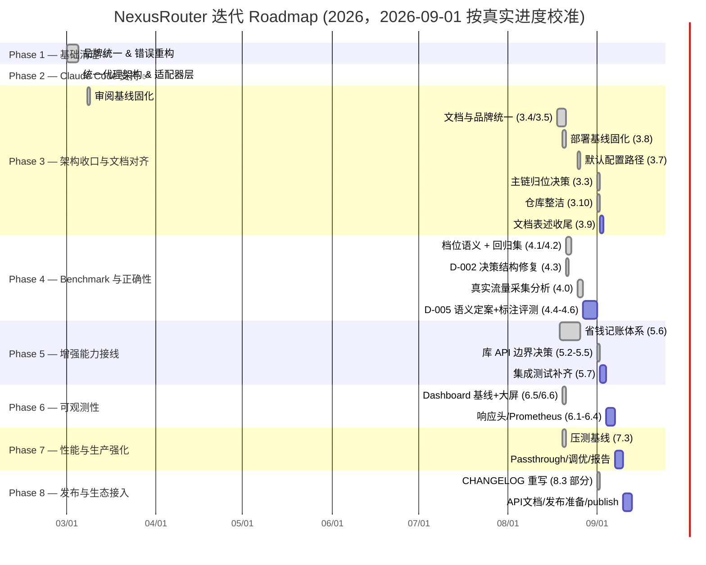
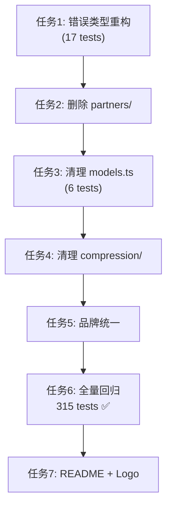

# NexusRouter — Roadmap & 进度追踪

> 当前 Roadmap 已根据 2026-03-08 项目审阅结果重排优先级。
> 审阅基线文档：`docs/reviews/2026-03-08-project-summary.md`
> 架构收口方案：`docs/plans/2026-03-08-architecture-consolidation-plan.md`
> Phase 规划依据：`docs/plans/2026-03-08-phase-priority-plan.md`
> 2026-08-21 分类器设计评审：`docs/reviews/2026-08-21-classifier-design-review.md`（登记 D-002，修订 Phase 3.3/3.9 与 Phase 4 全部任务）
> 2026-08-27 状态对齐（对 `main` @ `6400566`）：测试基线 **754/754**（修复 D-004 后全绿）；默认 `config.yaml` 四档已对齐价格注册表（`d63dba5`），D-001 / 3.3 / 4.1 / 5.6 中「四档 opus 未注册」的旧表述见各节更新；OpenAI 流式已支持自动注入 `stream_options.include_usage`（`01eeabf`，推翻 5.6.3 旧红线）；金额显示层统一 ¥（`65d4887`）。
> 2026-09-01 校准（对 `e8c64fa` 清理提交，版本 0.12.7）：一轮死代码清理删除了 `src/compression/`（~1170 行，从未接线）、`src/journal.ts`、`src/report.ts`、`src/updater.ts`、`src/router/llm-classifier.ts` 及 ClawRouter 时代的 test/ 残留（solana/wallet/x402、integration、docker）与失效 npm scripts；README / package.json / `src/index.ts` 已把 15 维评分器与 `SessionStore` / `RequestDeduplicator` / `ResponseCache` / `fetchWithRetry` 显式标注为**仅库 API、未接入服务管线**；CHANGELOG 已重写至 v0.12.7（含 0.12.x 全线，品牌已修正）；CI 改为跑全量单测。实测基线 `npm test` **742/742**（36 文件，旧文 754/761 均过时）、typecheck / lint 全绿。本文件各节状态据此重校准：3.3 / 3.7 / 3.10 视为已决，5.2–5.5 重定性，详见各节「2026-09-01 校准」注记。
> 2026-09-01 二次校准（对当前工作树）：第二批真实流量（8/28~9/1，**1114 条** routing，四个调优字段齐全）分析完成，发现 **D-009**（skill 正文污染，67 条）并于当日修复；「skill 是否参与难度判断」讨论结论与 ①~④ 落地跟踪项见 [讨论清单 2026-09-01 节](docs/plans/classifier-improvements.md)。测试基线 **748 passed + 1 expected fail**（D-009 新增 7 例），typecheck / lint 全绿。

## 整体 Roadmap



## 注意事项

- [临时想法](#临时想法)这是一些临时想法，每当读取这个文件的时候，都要看一下这里，评估这些想法的可行性，难度，优先级，并分型拆分成可执行的需求任务移动到合适的阶段去执行，并更新其状态。

  > [!WARNING]
  >
  > 保持专业，并不是所有的想法都是合理的，要以你的专业态度去评判这个想法，如果不合理把他放到[垃圾箱](#垃圾箱)里

- 执行每个Phase时，每次都要要遵循SPEC +TDD 原则，

---

## 零散想法

### 临时想法

> 2026-08-27 评估结论：
>
> 1. 「文件散落整理」—— 合理且仍有效：仓库根目录有两个构建产物（`nexusrouter-*.tgz` / `-offline.tar.gz`），**已确认由 `.gitignore` 第 9/10 行忽略且从未被 git 跟踪**（2026-08-27 用 `git ls-files` 与 `git log --all` 双向核实，原表述「已跟踪」有误）；`docs/ppt/`（结项评审 PPT）未跟踪待处置。已拆分为 **3.10**，移入 Phase 3。
> 2. 「README / docs / plugin metadata 收口」—— 与 3.4 / 3.5 / 3.9 完全重复；3.4 / 3.5 已完成，剩余即 3.9（「15 维」表述与实现对齐）。**已并入 3.9，不再单列**。
> 3. 「experimental 模块评估」—— 与 3.3（`router/` 归位决策，含 2546 行死代码处置）及 Phase 5 各接线任务重复。**已并入 3.3 / Phase 5，不再单列**。

### 垃圾箱

## 🔴 待处理缺陷

> D-001 阻塞 Phase 3（能力侧遗留）。D-002 已在 Phase 4.3 修复，回归集锁定。D-003 为本分支合并前登记的 usage-defense 入账问题，已作为 Hotfix 修复。D-004 为 2026-08-27 状态对齐时发现的测试断言竞态，已修。D-005 / D-006 由 4.0 真实流量分析发现：D-006（重试信号误报）已修，D-005（分类文本陈旧）本轮只补可观测性，**路由语义待设计讨论，是 4.4/4.5 出正式基线的前置**。D-009 由 2026-09-01 第二批日志（1114 条）分析发现：skill 正文污染分类输入，当日修复（剥离 + 回溯原始指令 + 日志记 `activeSkill`）。

| 编号  | 缺陷                                                                                                                                                                                            | 严重级别 |                           状态                            | 文档                                                                                                                                                          |
| :---- | :---------------------------------------------------------------------------------------------------------------------------------------------------------------------------------------------- | :------: | :-------------------------------------------------------: | :------------------------------------------------------------------------------------------------------------------------------------------------------------ |
| D-001 | `hasTools` 恒真使三层分类器退化：CC 流量 100% 钉在 COMPLEX/REASONING，SIMPLE/MEDIUM 永不生效                                                                                                    |  🔴 高   |            ✅ 分类侧已修复（能力侧留 Phase 3）            | [评审报告](docs/reviews/2026-08-17-classifier-hastools-defect.md) · [修复记录](docs/reviews/2026-08-18-classifier-d001-fix.md)                                |
| D-002 | 单向棘轮：档位调整只升不降，三处 +1 叠加使 CC 流量恒落最高两档；Layer 1 置信度门不可达成死代码                                                                                                  |  🔴 高   |               ✅ 已修复（4.3，回归集锁定）                | [设计评审](docs/reviews/2026-08-21-classifier-design-review.md) · [档位语义](docs/plans/tier-taxonomy.md) · [讨论清单](docs/plans/classifier-improvements.md) |
| D-003 | Usage-defense 默认关闭 + fallback-estimation 接线 bug 导致网关模型（MiniMax 等）入账全 0                                                                                                        |  🔴 高   |                ✅ 已修复（见下方 Hotfix）                 | [审计报告](docs/reviews/2026-08-26-usage-defense-audit.md)                                                                                                    |
| D-004 | `ledger-writer.test.ts` 定时器用例断言竞态：`advanceTimersByTimeAsync` 不等 drain 内的真实 fs I/O，Node 20/macOS 稳定红                                                                         |  🟡 低   |     ✅ 已修复（断言前 `await w.idle()`，754/754 绿）      | 2026-08-27 状态对齐记录（见 Hotfix 后续变更小节）                                                                                                             |
| D-005 | `extractClassificationText` 在 agentic loop 中返回陈旧文本：658 条真实请求只产生 116 个不同分类输入                                                                                             |  🔴 高   | ✅ 校准与可观测性已修；**档位语义仍留 4.6**（需标注数据） | 见下方「2026-08-27 真实流量分析」                                                                                                                             |
| D-006 | `same-text` 重试信号 74.3% 误报（489/658），`src/eval.ts` 的 retried 列不可用                                                                                                                   |  🔴 高   |                     ✅ 已修复（4.0）                      | 见下方「2026-08-27 真实流量分析」                                                                                                                             |
| D-007 | 入口守卫对符号链接失效：npm 安装后 `nexusrouter` 命令 exit 0 且零输出，`npm i -g` / `npx` / `.bin` 三种调用全中                                                                                 | 🔴 阻断  |         ✅ 已修复（`isMainModule` realpath 比较）         | 见下方「2026-08-27 安装级验证」                                                                                                                               |
| D-008 | `config.yaml` 的 `router.port` 是死配置：CLI 恒传具体 8402，`startServer` 的 `port \|\| config.router.port` 永远兜不到                                                                          |  🟠 中   |        ✅ 已修复（`resolveListenPort` 常规优先级）        | 见下方「2026-08-27 安装级验证」                                                                                                                               |
| D-009 | skill 正文（SKILL.md）以普通 user 消息注入、无 `<system-reminder>` 包裹，绕过剥离被当用户意图分类：67/1114 条（`proves`→REASONING×33、`trade-offs`→COMPLEX×34），且一次加载污染任务全部后续轮次 |  🔴 高   | ✅ 已修复（剥离 + 回溯到原始指令 + 日志记 `activeSkill`） | [讨论清单 2026-09-01 节](docs/plans/classifier-improvements.md)（含「skill 是否参与难度判断」讨论结论与落地顺序 ①~④）                                         |

**D-002 摘要（2026-08-21）**：

- **单向棘轮**：`long` 会话 +1（`hybrid.ts:309`）、`requiresTools` +1（`hybrid.ts:323`）、低置信兜底 +1（`hybrid.ts:215`）三处叠加且无任何下调通路。实测「把这个文件的函数改个名」在 `long + requiresTools` 下落 REASONING；真实日志 161/165 条恒为 `long`，故线上每条至少吃一级升档，SIMPLE 只剩 greeting 与 haiku 后台任务能命中。
- **Layer 1 死代码**：`heuristicThreshold = 0.92` 在无关键词路径上不可达（上限 0.5+0.1+0.15+0.05 = 0.8），穷举 24 种组合仅 2 种真走 `layer: "heuristic"`。线上实为「Layer 0 关键词 + Layer 3 档位 +1」两层。
- **附带**：`checkRules` 中 reference 早于 complex 且命中即 return，裸词「继续」把重活降到 MEDIUM；Layer 0 以 `confidence: 1.0` 短路但精度不足（`derived class` → REASONING、`where is the architecture doc?` → COMPLEX）；`split(/\s+/)` 使长度维度只对英文生效。
- **观测前提**：现有 165 条日志全部产生于 8/20 修复之前（缺 `promptCharsSanitized`），无法用于标注。修复后需先挂真实流量攒新日志（任务 4.0，未做）。

**D-002 处置结果（2026-08-21，任务 4.1→4.3）**：

- 前置产出：[`docs/plans/tier-taxonomy.md`](docs/plans/tier-taxonomy.md)（档位语义，判定的唯一依据）+ `src/classifier/tier-regression.test.ts`（53 条中英文用例，先红后绿）。
- **去棘轮**：三处升档全部改为信号驱动 —— 会话长度只调置信度不动档位；`requiresTools` 给 MEDIUM 下限而非逐级 +1；Layer 3 兜底照原样返回启发式档位（`reason` 随之由 `uncertain-upgrade` 改为 `heuristic-uncertain`，语义变了就换名）。
- **基线翻转**：启发式基点由 SIMPLE 改为 MEDIUM，SIMPLE 改为需要正面证据（`isTrivialQuery`：疑问句或文本操作，且不碰项目物件/动手动词/camelCase 标识符）。原设计「先假设最简单再无条件累加」正是棘轮的成因。
- **规则顺序与精度**：reference 检查移到 complex 之后（filler 词不再遮蔽重活）；新增确认语规则（好的/收到/ok）；裸词 `logical`/`derived`/`mathematical`/`security`/`architecture` 移出词表，改用词组；新增中文反向词表（`证明材料`/`解析器` 等不算推导，`变量名`/`命名` 等不算架构分析）。
- **CJK 词数**：`estimateWordCount` 按 0.6 权重折算 CJK 字符，长度维度对中文生效（109 字中文长指令从 1 词变为约 65 词）。
- 效果：模拟长会话 CC 流量 18 条的分布由「除问候外全落 COMPLEX/REASONING」变为 SIMPLE 5 / MEDIUM 7 / COMPLEX 4 / REASONING 2。
- 遗留：1 条用例以 `it.fails` 标记为语义缺口（`帮我写一个数学证明题的解析器` —— 规模只能从语义读出），待 4.4/4.6 或 Layer 2 处理。

**D-003 摘要（2026-08-26）**：

本次 Hotfix 修复的 usage-defense 入账问题，详见下方「✅ Hotfix — Usage-Defense 对齐」。

**D-001 处置结果（2026-08-18）**：

- 实测观测 7 条真实 CC 流量，**修正了评审报告的核心预测**：`reason` 分布 100% 是 `reasoning-keyword` 而非 `has-tools`。根因是 `hybrid.ts` 用 `includes()` 做关键词匹配，CC 每轮注入的 skills 清单必含 `improve`（内含 `prove`），在 hasTools 分支之前就命中 REASONING。
- 本轮已修复（TDD，408/408 绿灯）：
  1. 推理关键词改 `\b` 整词匹配（`logical` → `logically`，对齐上游）
  2. 移植上游 `tool-intent.ts`：`requiresTools` 拆开「带工具表」与「这一轮要动手」
  3. `AgentProfile.sanitizeForClassification`：CC 剥离 `<system-reminder>` 注入块，转发 body 不受影响
  4. `hints.thinking` 开关（`config.yaml` 顶层，默认 `off`）—— thinking 恒真（`CLAUDE_CODE_EFFORT_LEVEL=max` 常开所致）不再参与档位融合
- 遗留（并入 Phase 3.3）：能力侧 `filterByToolCalling` 接入需 `router/` 上主链。~~**阻塞项**：`config.yaml` 四档模型（`claude-opus-*`）均未注册进 `models.ts`~~ —— ✅ **2026-08-25 已解除**（`d63dba5`）：默认模板 tiers 已改为注册表内模型（SIMPLE `openai/gpt-4o-mini` / MEDIUM `openai/gpt-4o` / COMPLEX `anthropic/claude-sonnet-4.6` / REASONING `openai/o3-mini`），`referenceModel` 对齐 `anthropic/claude-opus-4.6`。剩余遗留仅是 `router/` 归位决策本身。

---

## Phase 状态总览

| Phase   | 目标                            |                         状态                         |   提交    |      测试      |
| :------ | :------------------------------ | :--------------------------------------------------: | :-------: | :------------: |
| Phase 1 | 基础清理 & 品牌统一             |                     ✅ **完成**                      | `e2b9adc` |    315/315     |
| Phase 2 | Claude Code 支持 & 统一代理架构 |                     ✅ **完成**                      | `1b43dae` |    340/340     |
| Phase 3 | 架构收口与文档对齐              | 🟢 主体完成（3.3/3.7/3.10 已决；3.6/3.9 余文档收尾） |     —     | 基线：742/742  |
| Phase 4 | Benchmark 与正确性              |   🚧 4.0–4.3 完成；D-009 已修；4.4 数据前置已解决    |     —     | 748+1 预期失败 |
| Phase 5 | 增强能力接线                    | 🚧 5.6 完成；5.2–5.5 重定性为库 API（压缩模块已删）  |     —     |  继承 Phase 4  |
| Phase 6 | 可观测性                        |    🚧 6.5/6.6 完成；6.1/6.2 部分；6.3/6.4 未开始     |     —     |  继承 Phase 5  |
| Phase 7 | 性能与生产强化                  |                    🚧 7.3 已完成                     |     —     |  继承 Phase 6  |
| Phase 8 | 发布与生态接入                  |   🚧 8.3 CHANGELOG 已重写（`e8c64fa`）；其余未开始   |     —     |  继承 Phase 7  |

> 测试基线说明（2026-09-01）：当前工作区实测 **748 通过 + 1 预期失败（36 文件，共 749）**。旧文 754/754（D-004 修复后）与 761/761（D-005 第二轮）均已被死代码清理后的测试集取代——删除了 `journal.test.ts`、`compression/` 全部测试与 test/ 目录 ClawRouter 残留，742 是清理后的基线；D-009 修复新增 7 例（`adapter.test.ts` 5 + `server.test.ts` 2），748+1 是当前唯一有效基线。

---

## ✅ Hotfix — Usage-Defense 对齐（2026-08-26）

> **触发**：用户要求对照 `new-api-main` 的 token 计费逻辑，确认 NexusRouter 是否一致。
> **报告**：[`docs/reviews/2026-08-26-usage-defense-audit.md`](docs/reviews/2026-08-26-usage-defense-audit.md)

### 已交付

- [x] 修复 `recordUsage` fallback-estimation 接线 bug（`src/accounting/usage-entry.ts` + 回归测试）
- [x] `tsconfig.json` 启用 `noUnusedLocals` / `noUnusedParameters`，清理 13 处历史死代码
- [x] `injectStreamUsage` / `estimateMissingTokens` 默认值改为 `true`
- [x] 移植 new-api 字符级加权 token 估算器（`src/adapter/token-estimator.ts`）
- [x] 估算前剥离 base64 多模态内容
- [x] 拆分 Anthropic 5m/1h cache-write tokens
- [x] 修复流式 output 估算被 SSE 框架字节放大的问题（累积 `delta.content` / `delta.text`）
- [x] 大屏 `formatRecent` 总 token 计入 `cacheWrite5m/1h`
- [x] 三门禁全绿：`typecheck` 0 errors / `build` success / `npm test` ~~690/690~~ **754/754**（2026-08-27 基线，含 D-004 修复）

### Hotfix 后续变更（2026-08-25 ~ 08-27，对账补充）

- `d63dba5` 默认模板 tiers/referenceModel 对齐价格注册表，四档不再引用未注册的 `claude-opus-*` 旧配置 —— D-001 遗留与 5.6 硬前置的「未注册」阻塞随之解除
- `65d4887` 金额显示统一为 ¥（dashboard / stats / report / CLI）；数据层字段仍按配置货币单位计量，设计见 `docs/superpowers/specs/2026-08-25-currency-display-cny-design.md`
- `01eeabf` OpenAI 流式自动注入 `stream_options.include_usage`（带配置开关）—— 推翻 5.6.3 施工时「流式不注入」的零感知红线，详见 5.6.3 更新注记
- `60ea73a` Layer 2 分类层支持 OpenAI 兼容协议（new-api / vLLM），配置段 `aiClassifier`；Ollama 层 `enabled` 开关真生效（`85bf9b0`）
- 2026-08-27 状态对齐：修复 D-004（`src/accounting/ledger-writer.test.ts` 定时器用例竞态），三门禁复跑全绿

### 对 Phase 规划的影响

本次 Hotfix 提前落地了部分原属 **Phase 5（增强能力接线）** 与 **Phase 6（可观测性）** 的能力：

- 用量估算/兜底逻辑可视为 Phase 5 的「日志/统计接线」前置子项。
- 默认开启的 usage-defense 与更精确的 token 估算直接提升 Dashboard / `stats` / `report` 数据基线，属于 Phase 6 的可观测性基础。

后续 Phase 5/6 启动时，应以上述实现为基线继续扩展，避免重复造轮。

---

## ✅ Phase 1 — 基础清理与品牌统一

> **完成时间**: 2026-03-05 | **提交**: `cdad3f4` / `e2b9adc`

### 交付清单

- [x] 移除支付残留错误类型（`InsufficientFundsError` 等），替换为路由错误体系（`ConfigurationError` / `ProviderError` / `ClassificationError` / `RoutingError`）
- [x] 删除 `src/partners/` 支付合作伙伴模块
- [x] 清理 `src/models.ts` 中的 `BlockRun` / `blockrun/` 引用
- [x] 品牌统一：`ClawRouter / BlockRun` → `NexusRouter`，更新 `package.json`、`bin`、logger、stats、updater
- [x] 全量回归：`typecheck` 0 errors / `build` 成功 / 315 tests 全绿
- [x] 像素风格 README.md + NexusRouter Logo
- [x] `ROADMAP.md` / `TASK_TRACKER.md` / `WALKTHROUGH_PHASE1.md` 落地项目根目录（后两者已随过程文档归档至 `_archive/process/trackers/` 与 `_archive/process/walkthroughs/`；Phase 2 的 `CODE_REVIEW_PHASE2.md` 在 `_archive/process/reviews/`）
- [x] 代码评审：零高优先级遗留问题

### SDD/TDD 任务执行顺序（历史记录）



---

## ✅ Phase 2 — Claude Code 支持 & 统一代理架构

> **完成时间**: 2026-03-05 | **提交**: `90a150b`（功能）+ `1b43dae`（评审修复）

### 核心设计

深度研究 [claude-code-router](https://github.com/musistudio/claude-code-router)，借鉴其 Transformer 链模式，融合 NexusRouter 的 15 维分类器，设计出统一代理架构：

```
任何 Agent (Claude Code / OpenClaw / Cursor / ...)
        │
        ▼  POST /<agent>/v1/messages  OR  /v1/chat/completions
┌───────────────────────────────────┐
│  ProtocolAdapter (策略模式)        │  toUnified()
│  ├─ AnthropicAdapter              │
│  └─ OpenAIAdapter                 │
├───────────────────────────────────┤
│  AgentProfile (插件模式)           │  extractHints() → computeWeights()
│  ├─ claude-code: haiku=80% hint   │
│  └─ openclaw: 100% classifier     │
├───────────────────────────────────┤
│  15维分类器 × 动态加权融合         │  → Tier (SIMPLE/MEDIUM/COMPLEX/REASONING)
├───────────────────────────────────┤
│  ProviderForwarder                │  forward() → upstream API
└───────────────────────────────────┘
```

### 交付清单

- [x] `src/adapter/types.ts` — `UnifiedRequest` / `AgentHints` / `ClassifierWeights` 统一类型
- [x] `src/adapter/adapter.ts` — `ProtocolAdapter` 策略接口 + Factory + 协议检测器
- [x] `src/adapter/anthropic.ts` — `AnthropicAdapter`（Anthropic ↔ 统一格式，SSE 透传支持）
- [x] `src/adapter/openai.ts` — `OpenAIAdapter`（OpenAI ↔ 统一格式）
- [x] `src/adapter/profile.ts` — `AgentProfile` 插件注册表 + 动态加权融合
- [x] `src/server.ts` — 重构为 5 步流水线 + Agent 前缀路由（`/anthropic/` `/openclaw/` 等）+ 向后兼容
- [x] `src/adapter/adapter.test.ts` — 25 个专项测试
- [x] 全量回归：typecheck 0 errors / 340 tests 全绿
- [x] 代码评审（`CODE_REVIEW_PHASE2.md`）：6 个问题全部修复

### Claude Code 接入方式

```bash
export ANTHROPIC_BASE_URL=http://127.0.0.1:8402/anthropic
claude   # 15维分类器自动路由，无需其他配置
```

### Agent 端点兼容矩阵

| Agent         | URL                            |     状态      |
| :------------ | :----------------------------- | :-----------: |
| Claude Code   | `http://host:8402/anthropic`   |    ✅ 支持    |
| OpenClaw      | `http://host:8402/openclaw/v1` |    ✅ 支持    |
| 旧版 OpenClaw | `http://host:8402/v1`          |  ✅ 向后兼容  |
| Cursor        | `http://host:8402/cursor/v1`   | 🔲 框架已就绪 |
| Gemini CLI    | `http://host:8402/gemini/v1`   | 🔲 框架已就绪 |

---

## 🚧 Phase 3 — 架构收口与文档对齐

> **预计时长**: ~6 天 | **状态**：✅ 主体完成（2026-09-01 校准）——3.3 / 3.4 / 3.5 / 3.7 / 3.8 / 3.10 已决，仅剩 3.6（变更记录，部分由 CHANGELOG 承担）与 3.9（文档表述收尾）
> **关联文档**:
> `docs/reviews/2026-03-08-project-summary.md`
> `docs/plans/2026-03-08-architecture-consolidation-plan.md`
> `docs/plans/2026-03-08-phase-priority-plan.md`

### 目标

1. 明确唯一 authoritative routing path
2. 收口 `server.ts` 与 `router/` 的职责边界
3. 统一 README / docs / plugin metadata 的产品叙事
4. 为后续 benchmark、接线、可观测性提供稳定基线

### 关键任务

- [x] **3.1** 基于审阅报告确认“当前真实主链”与“计划保留主链” —— ✅ **2026-09-01 校准**：真实主链已实证为 `src/server.ts` → `HybridClassifier`（规则 → 启发式 → 可选 AI → 兜底），`src/router/` 不在链上（README「库 API 说明」与 `src/index.ts` 注释均已显式标注）
- [ ] **3.2** 设计统一 `RoutingDecision` 输出结构 —— ⚠️ **2026-09-01 重定性**：`RoutingDecision` 已作为库 API 类型从 `src/router/index.js` 导出；服务主链并无消费方。若 5.1 pipeline 真启动则并入其时设计，否则本项可关闭
- [x] **3.3** 决定 `HybridClassifier` 与 `router/` 的归位关系，消除双主线 —— ✅ **2026-09-01 已决（保留为库 API，`e8c64fa`）**
  - 前置（D-001 遗留）：~~`config.yaml` 四档模型未注册 `models.ts`~~ ✅ 已解除（2026-08-25 `d63dba5`，默认 tiers 对齐注册表）；剩余决策：`filterByToolCalling`/成本估算接入时模型注册表与 YAML 档位配置的归属（参考 `src/router/config.ts` 硬编码 DEFAULT_ROUTING_CONFIG 的双配置源问题）
  - 决策输入（2026-08-21）：`src/router/` 共 2546 行，live 链路只用到 `tool-intent.ts`，其余（15 维 sigmoid 打分器、成本感知选模器、profile 分档）全是死代码。删除或收编须一并处理下方 3.9 的文档表述
  - **决策结果（2026-09-01，`e8c64fa`）**：不删不收编，**保留为显式标注的库 API** —— `route()` 及 15 维评分器继续从 `index.ts` 导出，注释明确「内置服务用 HybridClassifier，不用 route()」；README 新增「库 API 说明」一节；`src/router/llm-classifier.ts`（126 行，无调用方）已删，`src/router/` 现 2393 行。双主线叙事在文档层已消除，代码层维持现状是有意决策而非遗留
- [x] **3.4** 清理 `README.md`、`docs/architecture.md`、`docs/features.md`、`docs/configuration.md` 中的旧叙事
- [x] **3.5** 清理 `openclaw.plugin.json`、`openclaw.security.json` 中的旧支付/x402 描述
- [ ] **3.6** 产出本 Phase 的架构收口说明与变更记录 —— 🟡 **2026-09-01 部分达成**：CHANGELOG「Unreleased — cleanup」段已记录死代码删除与库 API 边界（`e8c64fa`）；独立的架构收口说明文档未产出
- [x] **3.7** 默认配置路径改为用户主目录 `~/.nexus-router/config.yaml`（跨平台），首启自动从内嵌模板创建，`--help` 按 OS 提示真实路径 —— ✅ **已完成**（`ensureConfigExists` + `cli.ts:50-51` 按 OS 输出 `~/.nexus-router/config.yaml` / `%USERPROFILE%\.nexus-router\config.yaml`；CHANGELOG v0.12.0–0.12.5 合并条目有载）
- [x] **3.8 部署基线收口与文档入口统一**
  - 确认 `deploy/new-api/` 为唯一官方验证的远程部署形态（nginx + NexusRouter + new-api passthrough）
  - 在 `README.md` 与 `docs/usage-manual.md` 中增加部署入口与快速链接
  - 归档 `docs/plans/2026-02-13-e2e-docker-deployment.md` 等旧部署文档
- [ ] **3.9 「15 维」表述与实现对齐**（2026-08-21 新增，依赖 3.3 的归位决策）—— 🟡 **2026-09-01 过半完成**
  - ✅ 已修（`e8c64fa`）：`README.md`（15 维改述为库 API，正文改为 HybridClassifier 三层说明）、`package.json` description、`src/index.ts` 导出注释（新增「库 API 说明」与逐条 library-only 标注）、`ROADMAP.md`（本轮校准）
  - 🔲 剩余：`CLAUDE.md`（仍写「14 维」）、`docs/architecture.md`（:91/:118）、`docs/features.md`（:15/:17；:67 已正确标注未接线）、`docs/routing-profiles.md`（:43）、`src/adapter/profile.ts:8` 与 `src/adapter/types.ts:70` 注释仍写 15-dim
  - 原始记录：`README.md`（3 处）、`ROADMAP.md`、`CLAUDE.md`（写「14 维」）、`docs/architecture.md`、`docs/features.md`、`docs/routing-profiles.md` 均以「15 维」描述 live 行为，实际生效的是 `HybridClassifier` 的三层级联 —— 文档指向死代码
- [x] **3.10 仓库整洁**（2026-08-27 由临时想法拆分，零功能影响）—— ✅ **2026-09-01 完成（`e8c64fa`）**
  - ~~移除 git 跟踪的构建产物~~ ✅ **无需处理**：`nexusrouter-*.tgz` / `-offline.tar.gz` 已被 `.gitignore` 忽略且从未进入版本库（2026-08-27 核实）。仅需注意本地会残留旧版本号的包文件，部署前核对 sha256 而非只看文件名
  - ✅ `docs/ppt/` 已提交入库（`228a4c3`，结项评审 PPT + handoff）
  - ✅ `CHANGELOG.md` 已重写：品牌改为 NexusRouter、补齐 0.12.x 全线（v0.12.7 / v0.12.6 / v0.12.0–0.12.5 合并条目 + Unreleased cleanup 段）—— 原「归 Phase 8.3」的顾虑以此方式落地
  - ✅ 清理改动已提交收口：`e8c64fa`（死代码删除 + CI/部署模板/文档口径）+ `c81a0c3`（核心管线最小 e2e）+ `541d448`（Dockerfile 改 pnpm、prettier 锁定）
  - ✅ 全量回归确认无功能影响：`npm test` 742/742（741 通过 + 1 预期失败）、`typecheck` / `lint` 全绿（2026-09-01 实测）
- [ ] 全量回归 + 代码评审 + 提交

### 验收标准

| 指标       | 目标                                                                              |
| :--------- | :-------------------------------------------------------------------------------- |
| 主链唯一性 | `server.ts` 只保留一套清晰决策主线                                                |
| 文档一致性 | README / docs 主叙事与当前代码一致                                                |
| 品牌一致性 | 主文档与插件元数据不再出现旧产品核心叙事                                          |
| 部署基线   | README / usage-manual 指向 `deploy/new-api`，Phase 7 不再包含 Docker/Compose 任务 |
| 交付物     | 架构收口变更记录与文档更新                                                        |

---

## 🚧 Phase 4 — Benchmark 与正确性

> **预计时长**: ~7 天
> **关联文档**:
> `docs/plans/2026-03-08-phase-priority-plan.md`
> `docs/reviews/2026-08-21-classifier-design-review.md`（本 Phase 的评测对象与顺序依此修订）
> `docs/plans/tier-taxonomy.md`（4.1 产出：档位判定的唯一依据）
> `docs/plans/classifier-improvements.md`

### 目标

> 2026-08-21 修订：评测对象是 live 链路的 `HybridClassifier`，**不是** `src/router/` 的 15 维打分器（2546 行，仅 `tool-intent.ts` 接线，归属待 3.3 决定 —— 2026-09-01 已决：保留为库 API，现 2393 行）。顺序也已调整：先定档位语义与回归集，再攒标注 —— taxonomy 未定则标注无从谈起，且现有 165 条日志全部产生于 8/20 修复之前，不可用。

1. **档位语义定义**：四档 vs 三档、difficulty 轴与 thinking 轴是否拆开 —— 标注与 benchmark 的前置条件
2. **回归集**：手写中英文用例覆盖四档 + 已知陷阱，纳入 `npm test` 门禁
3. **Benchmark 数据集**：标注真实 CC 流量，量化 `HybridClassifier` 准确率
4. **评分器调优**：根据 benchmark 结果修正决策结构与阈值（D-002 是其中的已知缺陷）

### 关键任务

- [x] **4.0** 挂真实流量攒 8/20 修复后的路由日志 —— ✅ **2026-08-27 完成**：8/25~8/27 共 **658** 条 `routing-*.jsonl` + 489 条 `routing-outcome-*.jsonl`，分析结论见下方「2026-08-27 真实流量分析」。本轮顺带修掉 D-006 并为 D-005 补可观测性
- [x] **4.1** 定义档位语义与标注格式 → [`docs/plans/tier-taxonomy.md`](docs/plans/tier-taxonomy.md)
  - 结论：**保留四档**。~~live config 四档是「能力轴 × 思考轴」的乘积（`opus-4-8`/`opus-5` × thinking 关/开）~~（2026-08-25 起默认模板已改为 `gpt-4o-mini` / `gpt-4o` / `claude-sonnet-4.6` / `o3-mini`，`d63dba5`；四档保留的结论不受影响，「要不要 thinking」仍是独立成本决策）
  - 代价矩阵已按「四档全是 opus」重算：欠档代价远小于通常假设，故「拿不准升档」不是免费保险，必须有封顶
  - 含 7 条判定边界裁决规则与标注格式（`expectedTier` + 可选 `note`，`src/eval.ts` 可直接消费）
- [x] **4.2** 手写回归集 → `src/classifier/tier-regression.test.ts`（53 条中英文用例，四档 + D-002 全部陷阱，接入 `npm test`）
  - 初次运行 28 红 / 25 绿，作为 4.3 的验收依据；语义缺口用 `it.fails` 标记而非放松期望
- [x] **4.3** 修 D-002 决策结构（去棘轮、基线翻转、规则顺序、裸词收紧、CJK 词数）—— 详见上方 D-002 处置结果
- [ ] **4.4** 标注真实流量样本 —— ⚠️ **目标已修订**：原定「200~300 条」在现有数据上不可达。658 条请求去重后只有 **116 个不同分类输入**（D-005 所致），且分布极度倾斜（单个输入最多占 59 条 = 9% 流量）。修订口径：标注全部唯一输入，报告同时给出**逐输入准确率**与**流量加权准确率**两个数字；`classificationStale` 为真的样本单独分层，不与首轮样本混算
  - ✅ **数据前置已解决（2026-09-01）**：第二批日志（8/28~9/1，1114 条）四个调优字段齐全，去重后 **236 个唯一输入**可标注；其中 67 条是 D-009 污染的实证样本（`classificationPreview` 为 skill 正文），标注时应单独分层。D-009 已修，修复后的新流量分类输入会变，但这批日志标注的是「分类器该判什么」，仍然有效
  - 🔴 **仍遗留**：D-005 的档位语义定案（4.6）会改变约 80% 轮次的分类输入语义，正式基线建议以语义定案后再攒的一批为准；本批先用于出第一版准确率数字与 skill/护栏专项分析
- [ ] **4.5** 用 `nexusrouter eval`（`src/eval.ts` 已实现）跑准确率 / 混淆矩阵 / 误判方向报告
  - ⚠️ `retried` 分列在 D-006 修复前不可用（74.3% 误报）；修复后按回放预估降至 11.7%，该列才有解释力
- [ ] **4.6** 基于报告二次调优；补 `logUsage` 调用点以量化成本节省
  - 新增输入（2026-08-27 实测）：`layer: "heuristic"` 在 658 条真实流量中 **0 次命中**，`heuristicThreshold = 0.92` 确认仍不可达。要么下调阈值让 Layer 1 真正生效，要么承认只有两层并把文档与 `layer` 枚举一起收口 —— 与 3.9 的「15 维」表述对齐问题同源。**2026-09-01 二次实证（1114 条）**：依旧 0 命中，`heuristicScore` 上限 0.90 < 0.92，且下调阈值只改标签不改档位 → 结论已定为**删门、承认两层架构**（与 4.4 基线同批落地，避免提前动结构影响口径）
- [ ] 全量回归 + 代码评审 + 提交

### 2026-08-27 真实流量分析（任务 4.0 产出）

> 数据集：`~/.nexus-router/logs/` 8/25~8/27，658 条 routing + 489 条 outcome。全部产生于 4.3（D-002 修复）之后，是第一批可用于评测的日志。

**四项实测结论：**

1. **档位分布真实可达**（验收项达成）：MEDIUM 449 / COMPLEX 129 / SIMPLE 75 / REASONING 5。SIMPLE 占 11.4%，不再是「只有 greeting 能命中」——4.3 的基线翻转在真实流量上生效。
2. **D-002 的棘轮确认已消除**：`classifierTier ≠ finalTier` 共 115 条，**115/115 全部由 `contextForcedComplex` 解释**（有意设计的上下文护栏，只抬到 COMPLEX 且封顶），零条无法解释的升档。
3. **Layer 1 仍是死代码**：`layer: "heuristic"` **0/658**，91.6%（603 条）走 `fallback` + `heuristic-uncertain`（confidence 恒 0.5），8.4%（55 条）走 `rule`（confidence 恒 1.0）。三层级联在真实流量上实际只有两层 —— 2026-08-21 评审对 `heuristicThreshold = 0.92` 不可达的判断，在 4.3 之后依然成立，归入 4.6。
4. **分类输入严重退化（D-005）**：658 条请求去重后只有 116 个不同分类输入。铁证是 8/27 03:13–03:16 的连续 18 条请求：`messageCount` 从 1 递增到 33，而 `promptCharsSanitized` 恒为 228、`promptPreview` 完全相同。

**D-005 机理**：`extractClassificationText`（`src/server.ts:190`）反向扫描「最后一条有文本的 user message」。Anthropic adapter 的 `extractText` 只保留 `type === "text"` 块，故 agentic loop 中携带 `tool_result` 的 user turn 一律 sanitize 成空串，扫描继续回退，最终永远落到任务最初那条指令上。后果三连：(a) 分类器对当前轮次完全失明；(b) 派生出 D-006；(c) 与结论 3 互为因果 —— 分类器反复评判同一段陈旧文本，置信度自然永远卡在同一档。

**本轮处置（语义不动，先止血 + 补可观测性）**：

- **D-006 已修**：`normalizeRetryTextKey` 纳入 `messageCount`。loop 推进时 `messageCount` 递增故不再自匹配，verbatim 重发时 `messageCount` 不变故仍能识别。用真实日志回放验证：**489 → 77 条（74.3% → 11.7%），消除 412 条误报**；回放模型先复现了修复前的 489 这一实测值，故该预估可信。
- **D-005 补可观测性**：`RoutingLogEntry` 新增 `classificationStale` / `classificationAgeTurns`（仅在陈旧时写入，遵循 `contextForcedComplex` 的条件展开惯例）。
- 新增 3 例回归（`src/server.test.ts`）：loop 推进不得产出 outcome 行、陈旧文本必须打标、首轮文本不得误打标。

**D-005 第二轮处置（校准 + 调优材料，仍不动档位选择）**

先说不做什么：**没有改任何档位选择逻辑**。「陈旧轮次该落哪一档」需要标注数据支撑，凭直觉设计正是 D-002 棘轮的成因，故留到 4.6。本轮修的是「日志在说谎」和「日志材料不够调优」两件事。

- **置信度校准**：陈旧文本命中规则时 `confidence` 封顶到 `STALE_CONFIDENCE_CAP = 0.5`。证据：8/25~8/27 的 55 条 rule 命中里 **43 条（78%）发生在 10 轮以上的会话**，最极端一条 `messageCount=99` 仍上报 `confidence: 1.0` —— 拿 98 轮前的文本做关键词匹配，不构成对当前轮次的确定判断。**可证明是档位中性的**：`resolveWeightedTier` 只读 `.tier` 从不读 `.confidence`，且封顶发生在分类器返回之后，故只影响日志与 `x-nexusrouter-confidence` 响应头。
- **四项调优材料补齐**（回答「日志是否能支撑分类算法调优」，逐项都有实测依据）：
  1. `classificationPreview` —— **原先无法标注**：`promptPreview` 记的是所有 user message 的原始拼接（实测 16854 字符）截断到 200 字，而分类器实际只看到 62 字；两者是不同的字符串，200 字窗口几乎必然照不到被评分的文本。新字段记分类器真正的输入，上限 600 字（中文长指令 200 字会截在半句）。**这是 4.4 标注的硬前置**
  2. `matched` —— 记下具体是哪个词/模式触发了 Layer 0。`reason` 只给类别（`reference-pattern`），不足以调词表：D-001 那次 skills 清单里的 `improve` 命中 `prove` 词干，当初只能靠读源码发现，日志里看不出来
  3. `heuristicScore` —— Layer 3 兜底原先用硬编码 `0.5` **覆盖**掉真实启发式分数，于是 603 条兜底记录的 confidence 全是 0.5，真实分数分布不可知。现在两个字段并存（`confidence` 仍是 0.5，不影响任何下游判断），4.6 才有依据判断 `heuristicThreshold = 0.92` 是该下调还是该承认只有两层
  4. `estimatedTokens` —— 原先只记 `contextForcedComplex` 布尔值，看不出请求离阈值有多远，`maxTokensForceComplex` 无从调整
- 新增 4 例回归（`src/classifier/hybrid.test.ts` 2 例 + `src/server.test.ts` 2 例）。三门禁全绿：`typecheck` 0 errors / `build` success / `npm test` **761/761**
- 端到端实测确认（临时脚本跑真实 `dist/`，三条请求模拟首轮 + 两次 loop 推进）：`matched: "架构设计"`、`classificationPreview` 已剥离 `<system-reminder>`、`classificationAgeTurns` 按 2 → 4 递增、陈旧规则命中的 `confidence` 为 0.5、`estimatedTokens` 52 → 1102 → 2153、**outcome 行 0 条**（D-006 修复在端到端链路上复现）

**对后续任务的影响**：4.4 的「200~300 条」目标不可达，已修订为「标注 116 个唯一输入 + 双口径准确率」。新增的四个字段（`classificationPreview` / `matched` / `heuristicScore` / `estimatedTokens`）落地后，须先在研发专网重新攒一批流量再出正式基线 —— 旧 658 条缺这四项，既标注不了也调不了阈值。D-005 的档位语义（陈旧轮次沿用首轮 tier，还是把 tool_result 摘要纳入分类文本）留到 4.6，用新日志的 `classificationAgeTurns` 分布来定。

### 验收标准

| 指标       | 目标                                                     | 状态                                                                                                                                                                                       |
| :--------- | :------------------------------------------------------- | :----------------------------------------------------------------------------------------------------------------------------------------------------------------------------------------- |
| 档位语义   | 有书面 taxonomy，标注者据此可复现判定                    | ✅ 4.1                                                                                                                                                                                     |
| 回归门禁   | 手写回归集纳入 `npm test`，D-002 全部陷阱有用例锁定      | ✅ 4.2（53 条）                                                                                                                                                                            |
| 分类准确率 | ≥ 85%（vs 人工标注，对象为 `HybridClassifier`）          | 🔲 待标注（第二批 1114 条已带齐字段，236 个唯一输入可开工）                                                                                                                                |
| 误判方向   | 欠档（final < expected）占比可控，且有封顶而非无条件升档 | ✅ 封顶已落地并实测（115/115 升档均为 `contextForcedComplex`）；占比待测                                                                                                                   |
| 档位分布   | SIMPLE/MEDIUM 在真实 CC 流量中实际可达（非仅 greeting）  | ✅ **真实流量已验证**（首批 MEDIUM 449 / SIMPLE 75；第二批 8/28~9/1 复证 classifierTier MEDIUM 738 / SIMPLE 106 —— 注意该批 `contextForcedComplex` 达 32.7%，护栏政策已列入 4.4 专项审查） |
| 发布报告   | `docs/reviews/` 下的 benchmark 报告与调优结论            | 🔲 待 4.5                                                                                                                                                                                  |

### 2026-08-27 安装级验证（D-007 / D-008）

> 触发：用户要求验证 0.12.6 包能否正常运行。方法：真实 tgz 装进干净 `node_modules` + mock 上游，全程未触碰用户的 `~/.nexus-router/config.yaml` 与日志目录。

**两个缺陷都只在「按 npm 方式安装后运行」时出现，`node dist/cli.js` 路径下完全看不出来 —— 三道门禁 100% 绿的同时，包是不可用的。**

- **D-007（阻断级）**：`import.meta.url === pathToFileURL(process.argv[1]).href` 恒为 false。npm 把 CLI 装成 `node_modules/.bin` 下的符号链接，Node 把 `import.meta.url` 解析成真实路径、却把 `argv[1]` 保留为链接路径。实测两值分别是 `file:///…/nexusrouter/dist/cli.js` 与 `/…/.bin/nexusrouter`，于是 `main()` 从不执行 —— `--help` / `--version` / 启动服务全部 exit 0 且零输出，`npm i -g` / `npx` / 本地 `.bin` 三种方式全中。改为两侧 realpath 后比较。
- **D-008（中）**：`args.port || parseInt(env ?? "8402")` 在两者都未设时也产出具体的 8402，而 `startServer` 用 `port || config.router.port` 兜底，故 `config.yaml` 里的端口永远到不了 —— 而 README 与 CLAUDE.md 都把 `router.port` 记作设置端口的方式。改为 `--port` > `NEXUSROUTER_PORT` > `config.router.port`，非数字环境变量按未设处理（原实现会去监听 `NaN`）。

**验证结果**（全部通过）：`--version` 输出 `0.12.6`；按 config 绑到 8599（证明 D-008 已修）；`/health` 返回 ledger + accounting 状态；一条 anthropic 请求 HTTP 200 且落 COMPLEX → `mock-complex`（provider 前缀已剥离）；四个新日志字段齐全 —— `matched: "深入分析"`、`classificationPreview` 已剥离 `<system-reminder>`、陈旧轮次 `confidence: 0.5` 且 `classificationAgeTurns: 2`、fallback 行 `heuristicScore: 0.5`；loop 推进 0 条 outcome 行、原样重发 1 条 `same-text` —— D-006 两个方向均成立。

**暴露的流程缺口**：`npm test` 全程只跑源码、从不碰打包产物，这一类缺陷对三道门禁完全隐形。已并入 **8.4 release checklist**。

**已知取舍**：`matched` 只在 reasoning / complex / reference 三类规则上填充；greeting / thanks / acknowledgement 是整句匹配，`matched` 会与 `classificationPreview` 完全重复，故留空以省每行字节。

---

## 🚧 Phase 5 — 增强能力接线

> **预计时长**: ~9 天 | **状态**：5.6 省钱记账体系核心已全部完成（5.6.1–5.6.7）；5.2–5.5 于 2026-09-01 重定性（见下）；5.1 / 5.7 未开始
> **关联文档**:
> `docs/reviews/2026-03-08-project-summary.md`
> `docs/plans/2026-03-08-architecture-consolidation-plan.md`
> `docs/plans/2026-08-19-savings-ledger-design.md`（5.6 省钱记账体系设计）

### 目标

- 将已实现但未接入的增强模块分批接入主请求链路
- 用统一 middleware / pipeline 方式承载这些能力
- 让 README 中列出的核心高级能力具备真实运行路径

### 关键任务

- [ ] **5.1** 设计 request/response middleware 或 pipeline 结构 —— ⚠️ **2026-09-01 重定性**：原定承载 5.2–5.5 的接线，但这些模块已决策不接线（见下），pipeline 失去承载对象。若未来确需接线（如缓存），再启动本项；否则可随 Phase 5 关闭
- [x] **5.2** 接入 `RequestDeduplicator` —— ✅ **已决策：不接线**（2026-09-01）。`src/dedup.ts` 保留为库 API，`index.ts` 导出注释与 README「库 API 说明」均显式标注未接入服务管线
- [x] **5.3** 接入 `ResponseCache` —— ✅ **已决策：不接线**（2026-09-01），同上（`src/response-cache.ts` 保留为库 API）
- [x] **5.4** 接入 `SessionStore` / `SessionJournal` —— ✅ **已决策：不接线**（2026-09-01）。`SessionStore` 保留为库 API；`src/journal.ts`（227 行，无调用方）已删除
- [x] **5.5** 接入 `Compression` —— ✅ **已决策：模块删除**（2026-09-01）。`src/compression/` 整体约 1170 行从未接线，已整目录删除；如需压缩能力将来重写，不做保留
- [ ] **5.6** 接入 `Logger` / `Stats` / `Report` —— **Savings Ledger 省钱记账体系**（方案：[`docs/plans/2026-08-19-savings-ledger-design.md`](docs/plans/2026-08-19-savings-ledger-design.md)）
  - 🔴 **硬前置**：~~Phase 3.3 未完成前不可施工。四档模型（`claude-opus-*`）未注册进 `models.ts`，成本计算 100% 依赖该价格表，此时接线记出来的账全是 `0` / `null`~~ —— ✅ **已双重解除**：① 2026-08-20 窄口径解除（「产品默认价 + 部署级 `PriceOverrides`，未知恒为 `null`」）；② 2026-08-25 `d63dba5` 默认 tiers 对齐价格注册表，四档均为已注册模型，无 override 也能出数
    - 📌 **2026-08-20 窄口径解除**（Step 1/2/3 已落地）：改用「产品默认价 + 部署级 `PriceOverrides`，未知恒为 `null`」后，纯函数层与接线层不再依赖 3.3；但**没人填 override 时账面会是一片 `null`**（这是诚实的「未测」，不是 `0`），可运行但无可读省钱数字
  - 现状审计：`logUsage()` 零调用点、`stats.ts`/`report.ts` 无 CLI 入口、上游 `usage` 从不解析、美元数字基于 `maxTokens` 虚构、`savings` 字段单位一名两义（共 10 项缺陷，详见方案第 2 节）
  - ✅ **缺陷 11 已修**（2026-08-20，Step D0）：抽出 `src/paths.ts` 作为日志路径唯一真相源（`resolveLogDir()` **每次调用**重新解析 `NEXUSROUTER_LOG_DIR`，因为 CLI / 容器入口可能在模块 import 之后才设值），`logger.ts` 与 `stats.ts` 双侧改为共用；`getLogFiles()` 由模块常量改为参数传入。新增 `src/paths.test.ts`（8 例）与 `src/stats.test.ts`（5 例，含「读侧认环境变量」「日志目录不存在返回 0 而非抛错」「忽略 `routing-*.jsonl` 不交叉污染」）
  - ✅ **命名已统一**（2026-08-21）：日志目录默认改为 `~/.nexus-router/logs`，与配置目录一致；保留 `migrateLegacyLogDir()` 将旧 `~/.nexusrouter/logs` 自动迁移到新目录，避免老用户升级后历史日志丢失。旧目录为空后自动清理。`src/paths.test.ts` 补迁移测试。
  - [x] **5.6.1** `src/pricing/` 分档定价（in / out / cacheRead / cacheWrite5m / cacheWrite1h），未知模型返回 `null` 而非 `0` —— ✅ **2026-08-20 完成（Step 1）**
    - `src/pricing/price-book.ts` + 16 例测试。`costOf()` / `resolvePrice()` 纯函数，解析顺序：部署级 override → 注册表 id → `MODEL_ALIASES` → **无歧义**裸名（`moonshot/` 与 `nvidia/` 都有 `kimi-k2.5`，冲突裸名索引存 `null` 而不猜供应商）
    - 🔑 **窄口径解除 3.3 硬前置，且不预判 3.3 的双配置源决策**：网关费率属**部署数据**而非产品数据（仓库 `config.yaml` 那四档 opus 由第三方网关承载，本仓库没有诚实的办法知道其价格），故价格表默认值取自 `models.ts`，另开 `PriceOverrides` 让知道真实费率的人自己填；填不上就一直是 `null`。`models.ts` **一行未改**
    - `auto` / `free` / `eco` / `premium` 四个路由占位符在注册表里 `inputPrice: 0`，若不显式排除，`costOf(usage, "auto")` 会把真花了钱的请求报成 $0 —— 这正是缺陷 4。另导出 `isRoutingPlaceholder()` 供上层区分「没有反事实」与「有价格但没人填」
    - cacheRead 定死 **0.1×** input（长会话里 cache read 常占输入 90%+，`models.ts` 现在硬编码 `cacheRead: 0` 是差一个数量级）；cacheWrite5m 1.25×、1h 2.0×，缺 1h 乘数时回落 2× 而非丢弃这批 token（少记成本是更坏的失败）；token 计数非有限值 / 负数一律夹到 0
  - [x] **5.6.2** `src/accounting/` `BaselineResolver` 策略：`requested`（默认，用客户端实际请求的模型）/ `reference` / `off` —— ✅ **2026-08-20 完成（Step 1）**
    - `src/accounting/baseline.ts` + 11 例测试。纯函数（不读配置、不看时钟、无 I/O），输出显式带 `baselineMethod: "same-usage-repricing"` —— 「假设基线模型会吐出同样多的 token」这个假设必须写在产物里，这是可被外部审计的数字与营销数字的分界
    - `null` / `0` 三态严格区分（缺陷 8 的根因）：有数=已测；`0`=已测且路由器恰好选了客户端要的那个模型；`null`=未测（mode off / 无基线 / 价格未知）。旧代码用 `baseline !== actual` 反推「是否已记账」，把真实的 0 静默算成未记账
    - 路由**向上**（便宜请求进了贵模型）时 `savedUsd` 保留负值不夹 0：夹了就是营销数字，不是账
    - 客户端发 `auto` 时回落 `referenceModel`，没配则整条 `NOT_MEASURED`；但请求的是**真实但未定价**的模型时保留 `baselineModel` 可见、`baselineCostUsd: null`，绝不悄悄拿别的模型价格顶上（那等于凭空造出本记账体系要消灭的那个美元数）
  - [x] **5.6.3** `src/adapter/` usage 捕获：非流式复用既有 `JSON.parse`（+0.0001ms）；流式用 **4KB 预分配环形尾窗**，写法锁定 `Uint8Array` + `TypedArray.set`（实测 43-57 ns/chunk；改用 `Buffer.concat` 累积会慢 **1100×**，评审红线）—— ✅ **2026-08-20 完成（Step 3）**
    - `src/adapter/usage-sniffer.ts` + 18 例测试（含性能回归门禁）。`TailWindow` 用 `size` 字段追踪逻辑填充量，避免按 `pos === buf.length` 判断环绕导致未对齐 chunk 时数据丢失
    - Anthropic：非流式/流式均解析 `input_tokens` / `output_tokens` / `cache_read_input_tokens` / `cache_creation_input_tokens`；`message_start` 在流首，嗅探器仅检查前几个 chunk 直到拿到 input usage，之后不再解析中间 chunk
    - OpenAI：非流式解析 `usage.prompt_tokens` / `completion_tokens` / `prompt_tokens_details.cached_tokens`；~~流式不注入 `stream_options.include_usage`（零感知升级红线）~~ —— ⚠️ **2026-08-26 红线已重新决策**（`01eeabf`）：现默认自动注入 `stream_options.include_usage` 以获取流式 usage，带配置开关可关；无 usage chunk 时仍标记 `usageSource: "estimated"`
    - 流中断/客户端 abort 时 `truncated: true`，已收 usage 仍落账
  - [x] **5.6.4** 日志 schema v2（`costUsd` / `baselineCostUsd` / `savedUsd` / `usageSource` / `truncated`），`parseLogFile` 保留 v1 兼容分支 —— ✅ **2026-08-20 完成（Step 3）**
    - `src/logger.ts` 新增 `UsageEntryV2`（`schema: 2`）；`costUsd` 允许 `null` 以维持「未知≠免费」纪律（设计稿写死 `number`，但网关模型无价时 `null` 是诚实结果）
    - `src/stats.ts` `parseLogFile` 同时识别 v1（无 `schema` 字段）与 v2，统一为内部 `ParsedUsageEntry`；`entriesWithBaseline` 改为计数 `baselineCost !== null`，修复缺陷 8 在聚合层的残留
    - `src/server.ts` 请求路径接线：保存带 provider 前缀的 `finalModelWithProvider` → 解析 usage → `costOf()` → `resolveBaseline()` → 经 `AccountingSwitch.ledgerWriter` 批量落盘
  - [x] **5.6.5** `cli.ts` 补 `stats` / `report` 子命令，报表区分「真实 usage」与「估算」口径（实时大屏 `dash` 子命令同批接入，见 6.6）—— ✅ **2026-08-20 完成（Step 4）**
    - `nexusrouter stats [days]` 输出 ASCII 表；`--json` 输出 JSON
    - `nexusrouter report [days]` 输出详细报告，区分 `upstreamRequests` / `estimatedRequests` / `truncatedRequests`
    - `report` 尝试查询本机 `/health` 标注当前是否降级（`degradedNow`）；离线时标记为 `null`
    - `src/stats.ts` 聚合层新增 `upstreamRequests` / `estimatedRequests` / `truncatedRequests`，ASCII 表增加对应行
    - `src/cli.test.ts` 新增 `parseArgs` 覆盖；`src/stats.test.ts` 扩展 v1/v2 混读、`baselineCostUsd` 全 `null` 时不产出 `NaN`、usage source 分离三项断言
  - [x] **5.6.6** `LedgerWriter` 批量 flush（满 64 行 / 200ms / 退出时）—— ✅ **2026-08-20 完成（Step 0，已独立先行，不依赖 3.3）**
    - `src/accounting/ledger-writer.ts` + 13 例测试。队列为**数组 + head 指针**（触顶丢最旧走 O(1)，不用 `shift()` 的 O(n)；head 累积 4096 槽后整理数组），flush 用 Promise 链串行化，`take()` 在任何 `await` **之前**换出队列，故 flush 期间新入队的行既不丢也不重写；按目标文件分组，N 行 M 文件只花 M 次 `appendFile`
    - `logger.ts` 保留**两条写路径**：`logRoutingDecision()` 仍是 await 即落盘（现有测试与工具依赖此语义，向后兼容红线），新增同步的 `queueRoutingDecision()` 走批量，`server.ts` 请求路径改用后者；序列化与 `promptPreview` 截断由私有 `serializeRouting()` 共用，两条路径不可能漂移
    - 退出兜底：`cli.ts` 的 SIGINT/SIGTERM 处理器 `await flushLogs()`，另注册 `process.on("exit")` → `flushLogsSync()`。**`LedgerWriter` 自身不注册任何信号监听器** —— 注册 SIGINT 会抑制 Node 默认退出行为，作为库被引用时会吃掉宿主的 Ctrl+C
    - 定时器 `unref()`（测试用 `timerHasRef()` 断言为 false）；磁盘故障时吞错 + 丢批（不重试，避免堆内存无界增长）+ 计数 `writeFailures`；连续触顶 3 次单向降级并 WARN 一次
    - 顺带交付 5.6.7 的 **L3 一角**：`/health` 已返回 `ledger: { pending, droppedLines, writeFailures, degraded, degradedReason }`，`accounting.*` 开关字段待 Step 2 补齐
  - [x] **5.6.7** 🔴 **分层熔断开关（必须先于 5.6.3 接线交付）**——「发现性能问题能及时关闭」的落地（方案决策 6）—— ✅ **2026-08-20 完成（Step 2）**
    - `src/config/schema.ts` 新增 `AccountingConfigSchema`，整段缺失等价 `enabled: false`，所有字段带向后兼容默认值（~~首版 `enabled: false` experimental 默认关闭~~ —— 2026-08-25 `7c185ab` 起内嵌默认模板已改为 `enabled: true` + `persist: true` + `estimateMissingTokens: true`，schema 层的默认值仍保持保守）
    - `src/accounting/switch.ts` 运行时开关：`enabled` / `captureNonStreaming` / `captureStreaming` / `persist`；`enabled: false` 时不创建 `LedgerWriter`、不实例化流式嗅探窗、不产生文件
    - L1 热切换：`fs.watch(config.yaml)` + 200 ms debounce，**仅**解析并热重载 `accounting.*` 子树，非法 YAML / schema 失败时保留旧配置继续服务，不影响进行中的流
    - L2 自动降级：复用 `LedgerWriter` 已有的连续触顶单向降级（`persist` 自动 false，不自动恢复，只 WARN 一次）
    - L3 可见性：`/health` 返回 `accounting: { enabled, captureNonStreaming, captureStreaming, persist, degraded, degradedReason }`；`accounting.close()` 在 Fastify `onClose` 钩子中释放 watcher 并刷盘
    - 新增 `src/accounting/switch.test.ts` 13 例覆盖 L0-L3；`npm test` 全绿 501/501
  - 性能实测基线：热路径净增 **+0.046 ms/请求**（典型 CC 回答 800 chunk），每连接常驻 **~3 KB**，事件循环延迟 avg 0.006ms 不变
  - 施工顺序（方案第 9 节）：~~Step 0（5.6.6，不依赖 3.3）~~ ✅ → ~~Step 1（5.6.1/5.6.2 纯函数）~~ ✅ → ~~Step 2（5.6.7 开关骨架，不依赖 3.3）~~ ✅ → ~~Step 3（5.6.3 接线 + 5.6.4 schema v2）~~ ✅ → ~~Step 4（5.6.5 CLI）~~ ✅ → ~~Step 5（清理缺陷 7/9）~~ ✅。全部 Saving Ledger 核心步骤已完成
  - 缺陷清理：
    - ✅ **缺陷 7**（2026-08-20，Step 5）：`stats.ts` ASCII 表过期标签 `Baseline Cost (Opus 4.5)` 改为中性 `Baseline Cost`
    - ✅ **缺陷 9**（2026-08-20，Step 5）：`src/router/selector.ts` `selectModel()` 与 `calculateModelCost()` 重复的成本公式已合并，后者成为唯一实现；顺带修正注释中的过期模型名 `Claude Opus 4.5` → 引用 `BASELINE_MODEL_ID`
    - ✅ **缺陷 8 残留**（2026-08-20，Step 3/4）：`entriesWithBaseline` 不再用 `baselineCost !== cost` 反推，改为计数 `baselineCost !== null`；`savedUsd === 0` 被正确视为已追踪
  - 📌 **顺带修掉一处红灯**（2026-08-20）：`default-config.test.ts` 的「内嵌模板与仓库根 `config.yaml` 字节相同」漂移守卫自 `c3dfe00` 起就是红的，且**断言的不变式本身是错的** —— 仓库根 `config.yaml` 是维护者的实际部署配置（钉死某网关 `baseUrl`、`passthroughApiKey: true`、四档 opus），若真拿它当新用户默认模板，等于给每个新装用户硬编码第三方网关并默认打开凭证透传。已改为**三条真正有意义的守卫**：模板过真实 `ConfigSchema` 校验、顶层配置段覆盖仓库 config 所需段（`hints` 可选）、`router.hosts` 必须仍是回环双栈（`c2bf803` 的回归守卫）
- [ ] **5.7** 补齐集成测试与功能文档
- [ ] 全量回归 + 代码评审 + 提交

### 验收标准

| 指标       | 目标                                                                                                                             | 状态                                                                          |
| :--------- | :------------------------------------------------------------------------------------------------------------------------------- | :---------------------------------------------------------------------------- |
| 接线范围   | ~~至少完成缓存/去重/会话/日志四类核心能力接入~~（2026-09-01 修订：日志/记账已接线 ✅；缓存/去重/会话经决策不接线，压缩模块已删） | 🟡 记账体系 ✅，其余已决策不接线                                              |
| 主链一致性 | 所有增强能力通过统一 pipeline 接入                                                                                               | 🟡 记账经 `AccountingSwitch` 接入；统一 pipeline（5.1）随接线决策失去承载对象 |
| 文档状态   | 各能力标注为 enabled / optional / experimental                                                                                   | ✅ README「库 API 说明」已显式标注未接线组件（2026-09-01，`e8c64fa`）         |

---

## 🚧 Phase 6 — 可观测性

> **预计时长**: ~7 天 | **状态**：6.5 / 6.6 已完成；6.1 主体完成、6.2 部分完成（2026-09-01 校准）；6.3 / 6.4（Prometheus / debug 端点）未开始
> **关联文档**：`docs/plans/2026-08-20-live-dashboard-design.md`（6.5/6.6 Web 实时大屏设计）

### 目标

- 结构化路由决策日志（Tier / Layer / Confidence / AgentProfile / 成本估算）
- Prometheus `/metrics` 端点
- Dashboard 所需的数据基线与调试端点
- **Web 实时大屏**：浏览器访问 `/dashboard`，实时查看 tier 分布、真实成本与省下来的钱

### 关键任务

- [x] **6.1** 路由决策日志结构化（每次请求记录完整上下文）—— 🟢 **主体已完成**：`routing-*.jsonl` 记录 tier / layer / confidence / agent / costUsd / baselineCostUsd / usageSource / classificationPreview / matched / heuristicScore / estimatedTokens / classificationStale 等字段（schema v2 + 2026-08-27 调优材料四字段）。缺口：无结构化查询接口，只能 `eval` / 肉眼读 jsonl
- [ ] **6.2** `x-nexusrouter-*` 响应头完善（成本估算、provider 信息）—— 🟡 **部分完成**：现有 `x-nexusrouter-tier` / `-layer` / `-confidence` / `-agent` 四个头（`src/server.ts:429-432`）；成本估算与 provider 信息头未加
- [ ] **6.3** Prometheus metrics exporter（请求计数/延迟/tier 分布）
- [ ] **6.4** 补齐 `/metrics` / debug 端点
  - 可选 `GET /internal/stats`（供 `persist: false` 下的实时数值）：**只读 + 回环 only + 显式 opt-in + 默认关闭**，三条缺一不可
- [x] **6.5** 为 Dashboard 预留数据模型与接口 —— `src/dashboard/` 的 `Tailer` + `Aggregator` 纯函数层 —— ✅ **2026-08-20 完成**
  - `src/dashboard/tailer.ts`：byte offset 增量 tail，`fs.watch(logDir)` + 250ms 轮询兜底；半行残片拼接、跨日切换保留昨日聚合、文件截断/删除时 offset 归零、v1+v2 schema 混读；8 例测试覆盖
  - `src/dashboard/aggregator.ts`：纯滚动窗口聚合，60s 窗口 req/s、p50/p95 上游延迟；`upstream` / `estimated` / `partial` 分离计数不相加；`baselineCostUsd === null` 不当 0 聚合；7 例测试覆盖
- [x] **6.6** `/dashboard` HTML 实时大屏（SSE）—— ✅ **2026-08-20 完成**
  - `src/dashboard/web.ts`：router 进程内暴露 `/dashboard` 自包含 HTML 页面 + `/dashboard/events` SSE 端点；复用 `tailer.ts` + `aggregator.ts`；无客户端时停止所有循环，对 router 事件循环影响趋近于 0
  - 配置开关 `router.dashboard`，默认 `true`（开箱即用）；router 默认绑回环双栈，不主动暴露到局域网
  - 前端纯原生 JS + 内嵌 CSS，零前端框架依赖；1s SSE 推送 + `fs.watch` 文件变化即时刷新
  - `src/cli.ts` 移除 `nexusrouter dash` 终端子命令；TUI 相关 `lifecycle.ts` / `render.ts` 及测试已删除
  - `src/dashboard/web.test.ts`：3 例测试覆盖关闭 404、HTML 返回、SSE 首帧数据

---

## 🚧 Phase 7 — 性能与生产强化

> **预计时长**: ~7 天 | **状态**：7.3 压测基线已完成；7.4 已重定性（随 3.8 部署基线收口，不再单独立项）；7.1 / 7.2 / 7.5 未开始

### 目标

- 真正的 passthrough 优化
- 1000 QPS 级别压测与瓶颈定位
- 基于已锁定的 `deploy/new-api` 部署基线进行性能调优

### 关键任务

- [ ] **7.1** 实现真正的 Buffer Passthrough（同协议时尽量跳过多余序列化）
- [ ] **7.2** Adapter 单例化与轻量对象复用
- [x] **7.3** 负载测试（autocannon / k6），定位并优化瓶颈
  - ✅ **2026-08-20 完成**：新增 `src/load-test/` 可复用 runner + `scripts/load-test.ts` CLI，本地 mock 上游零 API 费用，输出 req/s、p50/p95/p99、内存。
  - 基线数据（本机 Windows 10 / Node 22 / 50 connections / 非流式 / mock 上游）：
    - accounting OFF：**~582 req/s**，p50 76 ms，p95 157 ms，p99 228 ms
    - accounting ON：**~592 req/s**，p50 146 ms，p95 282 ms，p99 610 ms
  - 观察：端到端天花板受 mock 上游 + fetch 连接开销限制， accounting 批量写路径本身不再是瓶颈（与 5.6.6 的 139,537 req/s 纯写路径声明一致）。
- [x] **7.4** ~~`Dockerfile` + `docker-compose.yml`（含 Ollama sidecar 配置）~~ —— ✅ **已重定性**（2026-09-01）：与 Phase 3 验收标准「Phase 7 不再包含 Docker/Compose 任务」矛盾，以验收标准为准。部署形态已由 `deploy/new-api/`（含 Dockerfile + compose，`e8c64fa` 修复 `router.hosts: ["0.0.0.0"]` 解决 nginx 502）承载；Ollama sidecar 无实际需求，不立项
- [ ] **7.5** 输出性能测试报告
- [ ] 全量回归 + 代码评审 + 提交

---

## 🚧 Phase 8 — 发布与生态接入

> **预计时长**: ~5 天 | **状态**：8.3 的 CHANGELOG 部分已完成（`e8c64fa`）；8.1 / 8.2 / 8.4 / publish 未开始

### 目标

- 完整 API 文档与 Agent 接入文档
- CHANGELOG / semver / npm 发布闭环

### 关键任务

- [ ] **8.1** 完整 API 文档（端点参考、Agent 配置示例、Provider 配置）
- [ ] **8.2** README 与安装文档最终收尾
- [ ] **8.3** CHANGELOG.md + npm publish 准备（semver、tag）—— 🟡 **CHANGELOG 已重写**（`e8c64fa`，含 0.12.x 全线 + Unreleased cleanup 段）；publish 准备未开始。当前版本 0.12.7
- [ ] **8.4** release checklist 与发布说明
  - 🔴 **必须包含装包冒烟**（2026-08-27 D-007 教训）：`npm test` 只跑源码、从不碰打包产物，D-007（npm 安装后 CLI 静默退出）在三道门禁 100% 绿的情况下依然存在。发布前须做：真实 tgz 装进干净 `node_modules` → 经 `.bin` 调用 `--version` → 起服务 → 打一条请求 → 确认日志落盘。缺这一步，版本号绿灯不代表包能跑
- [ ] 全量回归 + 代码评审 + 提交

---

## 工作流程规范

> 每个 Phase 完成后必须执行：

```bash
# 1. 运行全量测试
npm run typecheck && npm run build && npm test

# 2. 提交功能代码
git commit -m "feat(phaseN): ..."

# 3. 运行代码评审 (/code-review workflow)
# → 生成 CODE_REVIEW_PHASE<N>.md
# → 修复高优先级问题
# → 提交: "review(phaseN): 代码评审报告 + 修复"

# 4. 更新本文件进度标注
git commit -m "docs: 更新 ROADMAP.md Phase N 完成状态"
```

---

## 差异化定位

| 特性              |            NexusRouter            | claude-code-router | 普通代理 |
| :---------------- | :-------------------------------: | :----------------: | :------: |
| 多协议 Agent 支持 |            ✅ 统一端点            |   Anthropic Only   |  单协议  |
| 智能分类路由      | ✅ 三层混合（规则+启发式+可选AI） |      手动配置      |    无    |
| 分类延迟          |              ✅ <1ms              |        N/A         |   N/A    |
| AgentProfile 插件 |             ✅ 可扩展             |         无         |    无    |
| 动态加权融合      |           ✅ 按信号强度           |         无         |    无    |
| 向后兼容          |             ✅ 零改动             |       需配置       |  需配置  |
| 代码评审体系      |            ✅ 每 Phase            |         无         |    无    |
