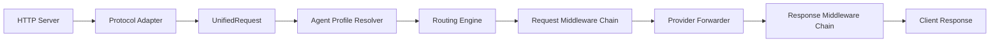

# NexusRouter 架构收口与重构方案

> 日期：2026-03-08
> 目的：为后续 Phase 提供明确的技术收口方向，避免继续在双主线架构上叠加功能。

## 1. 背景

当前系统存在两套并行的路由思想：

- 运行主链：`src/server.ts` -> `HybridClassifier` -> `config.tiers`
- 增强链：`src/router/index.ts` -> `route()` -> richer routing metadata

这会导致：

- 新功能接入路径不明确
- benchmark、调优、观测打点很难统一
- 文档容易围绕不同实现展开

## 2. 重构总目标

将项目收口为一条清晰的主链：

`Server -> Adapter -> UnifiedRequest -> Routing Engine -> Provider Forwarding -> Observability`

要求：

- 服务端运行逻辑只保留一套 authoritative router
- 文档、测试、配置结构围绕同一主线展开
- 增强能力以 middleware / pipeline step 的形式接入，而不是散落为旁系模块

## 3. 推荐收口方案

推荐保留：

- `server.ts` 的统一接入与 Adapter/Profile 架构
- `router/` 目录下更完整的 tier / pricing / filter / profile routing 能力

推荐重构方向：

1. 将 `HybridClassifier` 作为 Routing Engine 的一个子能力，而不是最终决策器
2. 让 `server.ts` 主流程调用统一的 `route()` 或新 `RoutingEngine` 封装
3. 由统一 Routing Engine 输出：
   - tier
   - selected model
   - method / layer
   - confidence
   - cost estimate
   - fallback chain
   - routing profile / agentic metadata

这样可以同时保留：

- 当前 Adapter / AgentProfile 设计
- 更完整的 Router 能力

并消除“双主线”问题。

## 4. 推荐目标架构

其中：

- `Routing Engine` 统一负责 tier/model/cost/fallback 决策
- `Request Middleware Chain` 承载压缩、去重、缓存、会话、日志注入
- `Response Middleware Chain` 承载缓存写入、journal 提取、usage log、stats

## 5. 代码层面建议拆分

### 5.1 Routing Engine

建议新增或重构为：

- `src/routing/engine.ts`
- `src/routing/context.ts`
- `src/routing/decision.ts`

职责：

- 聚合 `HybridClassifier`、`router/rules.ts`、`router/selector.ts`
- 统一输出 `RoutingDecision`

### 5.2 Pipeline / Middleware

建议新增：

- `src/pipeline/request/`
- `src/pipeline/response/`

优先接入模块：

- `ResponseCache`
- `RequestDeduplicator`
- `SessionStore`
- `SessionJournal`
- `Compression`
- `Logger / Stats`

### 5.3 文档收口

需统一替换和校正：

- `docs/architecture.md`
- `docs/features.md`
- `docs/configuration.md`
- `README.md`
- `openclaw.plugin.json`
- `openclaw.security.json`

原则：

- 文档只描述默认启用或明确可用的能力
- 未接线能力必须标注为 planned / experimental

## 6. 分阶段执行建议

### Step A: 架构收口

- 明确 authoritative router
- 收敛配置来源
- 统一 decision schema

### Step B: 文档收口

- 统一品牌与产品叙事
- 将旧支付/x402 描述从主文档移除

### Step C: 能力接线

- 按 middleware/pipeline 方式逐步接入缓存、会话、压缩、统计

### Step D: Benchmark 与调优

- 对 authoritative router 做 benchmark
- 防止在旧实现上继续做局部优化

## 7. 验收标准

完成架构收口后，应满足：

- `server.ts` 只有一套清晰决策主线
- 所有请求级元数据由统一 `RoutingDecision` 输出
- README 与 architecture 文档不再描述已废弃实现
- benchmark、日志、metrics 基于同一条路由链路

## 8. 暂不建议立即做的事

以下事项应在收口后再做，否则会扩大技术债：

- 新增更多 provider 特性
- 大规模调 benchmark 参数
- 大范围增加 dashboard 页面
- 发布生产宣传文档

## 9. 结论

当前最优先的不是增加功能，而是先把项目收口成一个“只有一条主线”的系统。

如果不先做这一步，后续任何 benchmark、可观测性、生产化工作都会建立在不稳定的架构基线上。
