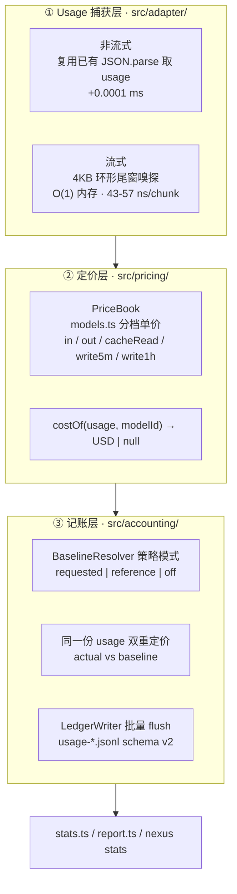

# NexusRouter Savings Ledger 设计方案（省钱记账体系）

> 日期：2026-08-19（含同日性能实测修订，见附录变更记录）
> 目的：为 NexusRouter 建立**可信的成本记账与省钱核算体系**，替换现有从未接线的"省钱统计"死支路。
> 落位：`ROADMAP.md` Phase 5.6（Logger/Stats/Report 接入）+ Phase 6.2（成本响应头）+ Phase 7.3（吞吐）
> 硬前置：Phase 3.3（模型注册表与 YAML 档位归属，D-001 遗留项）—— 唯 Step 0 例外
> 性能结论：热路径 **+0.046 ms / 请求**（约 8 秒对话的 0.0006%），每连接 **~3 KB**，详见第 5 节实测
> 参考基线：`E:\Code\new-api-main`（Go / QuantumNous new-api）计费体系调研

---

## 1. 结论先行

**不应照搬 new-api 的计费体系。**

new-api 的复杂度（Redis Lua 原子预扣、双账本、`defer` 退款、trust-quota 绕过、int32 饱和审计）唯一来源是**钱真的从用户余额里扣**，因此必须防并发超支、防重复退款、防溢出成负数。

NexusRouter 不收钱。移植预扣/结算/退款状态机 = 引入 400+ 行状态机换取零收益。

NexusRouter 需要的是 **counterfactual accounting（反事实记账）**，只求三个数：

| 指标              | 含义                              |
| :---------------- | :-------------------------------- |
| `costUsd`         | 这条请求**实际**花了多少          |
| `baselineCostUsd` | 不经过 NexusRouter **本会**花多少 |
| `savedUsd`        | 差额                              |

难点完全不在原子性，而在下面三点：

| 难点                        | 当前状态                                                                       |
| :-------------------------- | :----------------------------------------------------------------------------- |
| 真实 token 从哪来           | **完全没有** —— `src/server.ts` 全文无 `usage` 字样                            |
| baseline 如何定义才站得住脚 | 硬编码"永远全用 Opus"，是虚荣指标                                              |
| 缓存 token 如何计价         | `models.ts` 中 `cacheRead: 0, cacheWrite: 0`，而这是 Claude 上最大的真实成本项 |

---

## 2. 现状审计：10 个实测缺陷

写侧（`logger.ts`）与读侧（`stats.ts` / `report.ts`）都存在，**中间从未接线**。

| #   | 缺陷                                              | 证据                                                                                                                                  | 严重级别 |
| :-- | :------------------------------------------------ | :------------------------------------------------------------------------------------------------------------------------------------ | :------: |
| 1   | `logUsage()` 零调用点                             | 全仓 grep 仅命中定义 `src/logger.ts:50`、re-export `src/index.ts:66`、`stats.ts` 的 import                                            |  🔴 高   |
| 2   | `stats.ts` / `report.ts` 亦为孤儿                 | `src/cli.ts` 仅有 `doctor` / `--port` / `--config` / `--help` / `--version`，**无 `stats` / `report` 子命令**，报表子系统对用户不可达 |  🔴 高   |
| 3   | 上游 usage 从不解析                               | `ForwardResult` 仅 `{status, headers, body, isStream}`；`server.ts:288-293` `JSON.parse` 后直接 send，从不读 `usage`                  |  🔴 高   |
| 4   | 美元数字是虚构的                                  | `selector.ts` 用 `maxOutputTokens`（请求上限）而非实际产出算 output 成本，系统性高估。比例尚可看，绝对值不可用                        |  🔴 高   |
| 5   | `savings` 一名两义                                | `logger.ts:22` 声明 0-1 比例；`stats.ts:119` 的 `totalSavings` 是美元。`stats.ts:61` 解析了 `entry.savings` 却从不聚合                |  🟠 中   |
| 6   | baseline 是虚荣指标                               | `BASELINE_MODEL_ID = "anthropic/claude-opus-4.6"`（$5/$25），"省钱"永远相对于"全程用 Opus"，而无人会那样用                            |  🟠 中   |
| 7   | 标签已过期                                        | `stats.ts:233` 打印 `Baseline Cost (Opus 4.5)`，常量却是 `4.6`                                                                        |  🟢 低   |
| 8   | `entriesWithBaseline` 检测脆弱                    | 靠 `totalBaselineCost !== totalCost` 反推，路由恰好选中 baseline 模型时静默漏计                                                       |  🟠 中   |
| 9   | 成本公式复制粘贴                                  | `selectModel`（`selector.ts:44-62`）与 `calculateModelCost`（`:99-119`）逐行重复                                                      |  🟢 低   |
| 10  | `routingProfile === "premium"` 强制 `savings = 0` | 设计如此，但导致 premium 用户报表全零，需在报表侧区分口径                                                                             |  🟢 低   |

---

## 3. 架构：三层单向数据流



设计模式对应（符合 `.claude/rules/architecture.md`）：

- **策略模式** —— `BaselineResolver` 三种语义可替换
- **纯函数隔离** —— `pricing/` 与 `accounting/` 不依赖 Fastify / 网络，可独立单测
- **Passthrough 不破坏** —— 捕获层只旁路观测，不改写转发内容

---

## 4. 关键决策

### 决策 1：baseline 用「客户端实际请求的模型」

**这是整个方案的核心，也是唯一诚实的反事实定义。**

Claude Code 从不发 `"auto"` —— 它发的是真实模型名（`claude-sonnet-4-5` / `claude-haiku` / `opus`）。因此"不装 NexusRouter 这条请求会打到哪"这个问题，答案**白送在请求里**；而 `RoutingLogEntry.requestedModel`（`logger.ts:72`）**已经在记录**，只是从未用于计价。

| 模式                    | 定义                                         | 适用场景                           |
| :---------------------- | :------------------------------------------- | :--------------------------------- |
| `requested`（建议默认） | 用同一份 usage 按 `unified.model` 的价格重算 | Claude Code / Cursor —— 真实反事实 |
| `reference`             | 用户配置一个参照模型                         | OpenClaw 等真发 `auto` 的客户端    |
| `off`                   | 只记实际成本，不记省钱                       | 不接受虚荣指标的用户               |

**必须写进字段与文档的 caveat**：`baselineMethod: "same-usage-repricing"` —— 该方法假设 baseline 模型产出**相同 token 数**。此假设不严格成立（Opus 可能更简洁也可能更啰嗦）。**标注出来，不要假装是精确值**。这是该指标能否被外部信任的分界线。

### 决策 2：分档成本公式，废弃 input/output 两项模型

```
cost = ( in_uncached      × P_in
       + cache_read       × P_in × 0.10
       + cache_write_5m   × P_in × 1.25
       + cache_write_1h   × P_in × 2.00
       + out              × P_out ) / 1e6
```

Claude 的 cache read 为 0.1×。Claude Code 长会话中 cache read 常占 input 的 90%+；用当前公式（`cacheRead = 0`，或按全价）算出的成本**可以错一个数量级**。

倍率应作为 `ModelDefinition` 的可选字段进入 `models.ts`，而非散落硬编码常量。

### 决策 3：流式捕获用 4KB 环形尾窗，绝不缓冲全流

在现有转发循环（`server.ts:272-285`）中加入**预分配定长环形缓冲区**，**先 `write` 后嗅探**，流结束时从窗口中提取：

- Anthropic：`message_delta` 中的 usage
- OpenAI：末尾带 usage 的 chunk

usage 永远位于流末尾，故窗口足够；中间 chunk 一律不解析。

**窗口尺寸定为 4KB**（原设计 8KB）。Anthropic `message_delta` 行仅约 200B，4KB 已是 20× 余量；实测每连接常驻内存 8KB 窗口为 5.9KB、4KB 窗口约 3KB，1000 路并发下从 5.8MB 降至 ~2.9MB。窗口大小设为常量，可调。

**实现写法必须锁定为「预分配 `Uint8Array` + `TypedArray.set` 直写」。** 实测同一功能不同写法性能差 **1100 倍**（见第 5 节），此项为评审红线：

```ts
// ✅ 唯一允许的写法：预分配 + set，无 per-chunk 对象分配
class TailWindow {
  private buf = new Uint8Array(4096);
  private pos = 0;
  private wrapped = false;
  push(chunk: Uint8Array): void {
    /* set() 直写，跨界拆两段 */
  }
  text(): string {
    /* 仅在流结束时调用一次 */
  }
}

// ❌ 禁止：逐 chunk Buffer.concat 累积       → 52.3 ms / 191KB 流（1100×）
// ❌ 禁止：缓冲全流后再查找                  → 内存随流大小线性增长
// ⚠️ 避免：每 chunk 新建 Buffer.from(u8.buffer, ...) 视图 → 0.217 ms（5×）
```

**Anthropic 流天然带 usage**（`message_start` 给 input，`message_delta` 给 output），Claude Code 主战场覆盖率 100%，**无需改动请求**。

**OpenAI 需要 `stream_options.include_usage`。** `openai.ts:68` 是 `{...rawBody, model}`，技术上可注入 —— **但明确不建议**：那会让客户端多收到一个 chunk，破坏"零感知升级"（`.claude/rules/architecture.md` 第一节）。检测不到即退回本地估算并标记 `usageSource: "estimated"`。**诚实标记优于偷偷改请求。**

### 决策 4：不做预扣，但要处理流中断

无余额需保护，故不需要 pre-consume/settle 两阶段，响应结束后一次性落账即可。

唯一例外：**流式请求被客户端中断**时仍需落账，标记 `truncated: true` 并使用已收到的 usage —— 否则长任务被中断的成本会凭空消失。这对应 new-api 的 refund 场景，但我们只需一个 flag。

### 决策 5：日志落盘必须批量 flush（🔴 本方案唯一真实性能风险）

**这是实测推翻初版设计的一条。** 初版打算沿用 `logger.ts` 现有的「每请求一次 `appendFile`」，为 usage 再开一个独立文件。实测表明这会**把现有吞吐上限直接砍半**：

| 落盘策略                                      |             吞吐上限 | 事件循环延迟 avg / max |
| :-------------------------------------------- | -------------------: | :--------------------- |
| `appendFile` ×1（**现状** routing 日志）      |          2,959 req/s | 0.006 / 2.97 ms        |
| `appendFile` ×2（初版：独立 `usage-*.jsonl`） |   **1,522 req/s** ❌ | 0.006 / 3.89 ms        |
| 批量 flush（满 64 行或 200ms）                | **139,537 req/s** ✅ | 0.006 / 0.40 ms        |

根因：每请求两次 `open/write/close` 打满 libuv 默认 4 线程的 threadpool。

注意事件循环延迟三档都是 0.006ms —— 文件写走 threadpool，所以**这不是单请求延迟问题，是吞吐天花板问题**。单机跑 Claude Code 完全感知不到；ROADMAP **Phase 7.3（1000 QPS 压测）** 时它是第一个瓶颈。

因此新增 `LedgerWriter`：

```ts
interface LedgerWriter {
  append(entry: UsageEntryV2): void; // 同步入内存队列，不 await
  flush(): Promise<void>; // 满 64 行 / 200ms / 进程退出时触发
}
```

要求：

- `append()` 只入队，**绝不返回 Promise 给请求路径**
- 触发条件：队列 ≥ 64 行 **或** 距上次 flush ≥ 200ms **或** 进程退出（`beforeExit` + `SIGINT`/`SIGTERM`）
- 定时器必须 `unref()`，否则挡住进程退出
- flush 失败沿用 `logger.ts` 的"Never break the request flow"：吞掉错误，队列丢弃（不无限堆积）
- 队列上限（如 10,000 行）防止磁盘故障时内存爆掉

**附带收益**：这条同时修掉**现存**的 `logRoutingDecision` 落盘开销 —— 那 2,959 req/s 的天花板本来就已经存在，只是尚未压到。可作为独立优化先行，不必等本方案其余部分。

### 决策 6：分层熔断开关（性能出问题必须能立刻关掉）

要求：一旦发现性能问题能**及时**关闭。"及时"意味着不能只有一个需要重启才生效的布尔。分四层。

#### L0 配置开关：分粒度，不是一个总布尔

三条捕获路径成本差 **220×**，一刀切会因为贵的那条把免费的也关掉：

| 路径                                | 实测成本 | 关闭优先级                    |
| :---------------------------------- | -------: | :---------------------------- |
| 非流式捕获（复用既有 `JSON.parse`） |  +0.1 µs | 几乎没有关闭理由              |
| 流式捕获（4KB 环形窗）              |   +22 µs | 出问题**第一个**关这个        |
| 落盘（批量 flush 摊薄后）           |   +14 µs | 关掉仍可保留响应头/内存态统计 |

#### L1 热切换：当前做不到，必须补

**现状阻碍**：`loadConfig()` 仅在启动时调用一次（`config/loader.ts:71`），config 被 `createServer` 闭包捕获后传入 `handleUnified`。**改 `config.yaml` 必须重启进程才生效** —— 不满足"及时"。

| 方案                                                                      |  判定   | 理由                                                                                                                                                           |
| :------------------------------------------------------------------------ | :-----: | :------------------------------------------------------------------------------------------------------------------------------------------------------------- |
| `fs.watch(configPath)` + 200ms debounce，**仅**热更新 `accounting.*` 子树 | ✅ 采纳 | 跨平台可靠；限定子树避免热改 provider/apiKey 造成半初始化状态                                                                                                  |
| `SIGHUP` 重载                                                             | ❌ 否决 | **Windows 不支持**（Node 在 win32 上 SIGHUP 语义是控制台关闭），而本项目主平台为 win32                                                                         |
| 环境变量                                                                  | ❌ 否决 | 同样需要重启，未解决问题                                                                                                                                       |
| 新增 HTTP 管理端点                                                        | ❌ 否决 | 流量咽喉的代理增加**可变更状态**的端点会扩大攻击面。即便监听已收回回环双栈（commit `c2bf803`），仍属不必要风险。若确需，必须回环 only + 显式 opt-in + 默认关闭 |

#### L2 自动降级：只在 I/O 侧做，CPU 侧不做

**CPU 侧明确不做自动熔断。** 22 µs 不值得为它写自测量逻辑 —— `hrtime` 采样本身的开销会接近被测对象，属于用观测成本换观测结果的负收益。

**I/O 侧必须做**，因为磁盘停顿是**无界**的，且在 Windows 上尤其真实：杀软实时扫描 `.jsonl`、日志目录落在网络盘、磁盘写满。

触发条件用**零成本指标**（数组 `length` 比较，非计时）：

- 队列达 `maxQueueLines` → 丢弃最旧项并计数
- 连续 3 次触顶 → `persist` **自动降级为 false**，WARN 一次
- **降级单向、不自动恢复** —— 抖动式恢复会产生断断续续的数据，比彻底停掉更难解读。恢复只能靠改配置或重启

#### L3 可见性：状态必须可查

否则"到底关没关"只能靠猜：

- `/health` 扩展（`server.ts:411` 目前只返回 `{status, timestamp}`）：
  ```jsonc
  {
    "status": "ok",
    "timestamp": 1755561600000,
    "accounting": {
      "enabled": true,
      "captureStreaming": false,
      "persist": false,
      "degraded": true,
      "degradedReason": "ledger-queue-overflow×3",
    },
  }
  ```
- 自动降级时 WARN **一次**，不刷屏
- `nexus stats` 报表须标注该时段是否降级过 —— 否则数据缺口会被误读成"这段时间没省钱"

#### 关闭必须真便宜（实测确认）

| 写法（800 chunk / 191KB 流）                                                   |      耗时 | 相对基线   |
| :----------------------------------------------------------------------------- | --------: | :--------- |
| 当前代码（无开关、无记账）                                                     | 0.0107 ms | 基线       |
| 关闭：`const sniffer = enabled ? new TailWindow() : null` + `sniffer?.push(c)` | 0.0061 ms | **噪声内** |
| 关闭：双循环体（"零残留"写法）                                                 | 0.0106 ms | 噪声内     |
| 开启                                                                           | 0.0330 ms | +22 µs     |

**结论：关闭后残留开销低于测量噪声（±5 µs），不需要为"关闭时零残留"写两份循环体。** 一个 `?.` 即可，代码不必为此重复。

#### 默认值：首版默认关闭（experimental）

ROADMAP Phase 5 验收标准已有一条「各能力标注为 enabled / optional / experimental」。本功能首版按 **experimental 交付、`enabled: false` 默认关闭**，待 Phase 7.3 压测通过后再翻默认值。

这样「发现性能问题要及时关闭」的最坏情况被降级为「本来就没开」—— 用默认值消灭风险，优于用运维手段应对风险。

---

## 5. 性能实测基线

> 环境：Windows 10 / 8 核 / Node.js（libuv threadpool = 4 默认值）
> 方法：三轮微基准，模拟真实 Anthropic SSE chunk 形态（`content_block_delta` 平均 ~180B/chunk），非估算。
> 结论：**功能本身的开销在噪声以下；唯一真实风险是落盘策略（见决策 5）。**

### 5.1 CPU

| 场景                               |  当前代码 |  加记账后 |                         净增 |
| :--------------------------------- | --------: | --------: | ---------------------------: |
| 典型 CC 回答（800 chunk / 191KB）  |  0.023 ms |  0.069 ms | **+0.046 ms**（57 ns/chunk） |
| 超长流（8000 chunk / 1.87MB）      |  0.030 ms |  0.372 ms | **+0.342 ms**（43 ns/chunk） |
| 非流式（body 本来就 `JSON.parse`） | 0.0058 ms | 0.0059 ms |               **+0.0001 ms** |

参照系：一次 CC 请求上游耗时 2–60 秒，`+0.046ms` 约为 8 秒对话的 **0.0006%**；分类器自身预算为 <10ms，记账开销是其 **1/200**。

非流式几乎完全免费 —— `server.ts:290` 已在 `JSON.parse`，新增动作仅为从已解析对象读 4 个字段 + 5 次乘法。

### 5.2 内存

| 窗口尺寸        | 每连接 | 1000 路并发 |
| :-------------- | -----: | ----------: |
| 8KB（初版）     | 5.9 KB |     5.79 MB |
| **4KB（采纳）** |  ~3 KB | **~2.9 MB** |

窗口为预分配定长，**流多大都不增长** —— 1.87MB 流与 191KB 流占用完全相同。

### 5.3 实现写法的差距（1100×，评审红线）

同一个"尾窗"功能，写法不同性能差三个数量级：

| 写法                                           | 191KB 流耗时 |          判定           |
| :--------------------------------------------- | -----------: | :---------------------: |
| 逐 chunk `Buffer.concat` 累积                  |      52.3 ms |    ❌ 禁止（1100×）     |
| 全流缓冲成字符串后查找                         |     0.447 ms | ❌ 禁止（内存线性增长） |
| 每 chunk 新建 `Buffer.from(u8.buffer, …)` 视图 |     0.217 ms |      ⚠️ 避免（5×）      |
| **预分配 `Uint8Array` + `TypedArray.set`**     | **0.046 ms** |       ✅ 唯一采纳       |

**"加这个功能性能影响多大"的答案取决于评审能否卡住前两种写法。** 故须以性能回归测试固化上界（见 7.3），不依赖自觉。

### 5.4 落盘吞吐

见决策 5 表格。要点：`appendFile` ×2 会使吞吐从 2,959 降至 1,522 req/s；批量 flush 提升至 139,537 req/s（**70×**），且把现存 routing 日志的天花板一并解决。

---

## 6. 日志 Schema v2

修复单位崩塌（缺陷 5），同时保持向后兼容。

```ts
export type TokenUsage = {
  inputUncached: number;
  output: number;
  cacheRead: number;
  cacheWrite5m: number;
  cacheWrite1h: number;
};

export type UsageEntryV2 = {
  schema: 2;
  timestamp: string;
  tier: string;
  model: string;
  usage: TokenUsage;
  usageSource: "upstream" | "estimated" | "partial";
  costUsd: number; // 单位写进字段名
  baselineModel: string | null;
  baselineCostUsd: number | null;
  baselineMethod: "same-usage-repricing" | "none";
  savedUsd: number | null; // 不存比例：比例是派生量，存了必然漂移
  truncated?: boolean;
  latencyMs: number;
};
```

`parseLogFile` 保留 v1 分支（`schema` 字段缺失即视为 v1），老日志继续可读 —— **绝对向后兼容红线**。

---

## 7. 配置（新增顶层 `accounting`）

```yaml
accounting:
  # ── L0 分粒度开关（决策 6）──
  enabled: false # 🔴 首版默认关闭（experimental），Phase 7.3 压测后再翻
  captureNonStreaming: true # +0.1 µs  几乎无关闭理由
  captureStreaming: true # +22 µs   性能出问题第一个关这个
  persist: true # 落盘；关闭后仅保留响应头/内存态统计

  # ── L1 热切换（决策 6）──
  hotReload: true # fs.watch(config.yaml)，仅热更新 accounting.* 子树

  # ── L2 自动降级（决策 6）──
  maxQueueLines: 10000 # 队列上限，防磁盘故障时内存爆掉
  degradeAfterOverflows: 3 # 连续触顶 N 次 → persist 自动降级（单向，不自动恢复）

  # ── 语义与容量 ──
  baseline: requested # requested | reference | off
  referenceModel: anthropic/claude-opus-4.6 # baseline: reference 时生效
  redactPrompts: false # 见第 10 节隐私提醒
  tailWindowBytes: 4096 # 流式 usage 嗅探窗口（决策 3）
  flushLines: 64 # 批量落盘阈值（决策 5）
  flushIntervalMs: 200 # 批量落盘超时
```

**开启后**实测代价：非流式 +0.0001 ms、流式 +0.022 ms、每连接 ~3 KB、落盘 ~0.014 ms/req（批量摊薄）。
**关闭后**残留开销低于测量噪声（±5 µs），见决策 6。

向后兼容：整个 `accounting` 段缺失时等价于 `enabled: false`，老配置文件零改动可用。

---

## 8. TDD 测试清单（写功能代码前先写）

### 8.1 `src/pricing/price-book.test.ts`

- 分档单价加总正确；cache read = 0.1× 校验
- **未知模型 → 返回 `null` 而非 `0`**（`0` 会静默产出"免费"结论）
- usage 全零 → cost 为 0，不产出 `NaN`
- 缺失 `cacheWrite1h` 定义时的降级行为明确

### 8.2 `src/accounting/baseline.test.ts`

- `requested` 模式：`model: "claude-opus-4.6"` → baseline 用 opus 价
- `requested` 模式收到 `"auto"` → 降级到 `reference`，并正确标记 method
- `off` 模式：`baselineCostUsd === null`，且 stats 不把 `null` 当 `0` 参与聚合
- **baseline 模型 == 实际模型 → `savedUsd === 0`**（而非被误判为"未追踪"，修复缺陷 8）

### 8.3 `src/adapter/usage-sniffer.test.ts`（最关键）

- Anthropic 非流式 → 精确取出 input / output / cache_read / cache_creation
- **Anthropic SSE 分片：usage 字段被切断在两个 chunk 边界仍能拼出**
- **单 chunk 超过窗口尺寸（>4KB）→ 只保留尾部，仍能取出 usage**
- **环形缓冲跨界回绕（`pos` 折返）后 `text()` 顺序正确**
- OpenAI SSE 无 `include_usage` → `usageSource: "estimated"`，不抛错
- 上游 500 / body 非 JSON / 窗口内 JSON 截断 → 不记账、不抛错、不影响响应（沿用 `logger.ts` 的 "Never break the request flow"）
- 流中途 `reader` 抛错 → `truncated: true` 且已收 usage 落账
- **4KB 窗口在 10MB 流下内存不增长**

### 8.4 性能回归门禁（防止写法退化，对应 5.3）

固化实测上界，防止后人改回 `Buffer.concat`：

- 800 chunk / 191KB 流：尾窗净增耗时 **< 0.5 ms**（实测 0.046ms，留 10× 余量抗 CI 抖动）
- 8000 chunk / 1.87MB 流：**< 2 ms**（实测 0.342ms）
- 窗口对象常驻内存 **≤ 8 KB/连接**，且 1.87MB 流与 191KB 流占用相同（断言"不随流大小增长"）

> 阈值刻意留大余量：门禁目的是拦住数量级退化（52ms / 1100×），不是拦住 CI 抖动。

### 8.5 `src/accounting/ledger-writer.test.ts`（对应决策 5）

- `append()` 为同步、不返回 Promise、不触发 I/O
- 满 `flushLines` 触发一次写入；写入内容为多行拼接（一次 `appendFile`，非 N 次）
- 距上次 flush 超 `flushIntervalMs` 触发；**定时器已 `unref()`**（断言进程可正常退出）
- 进程退出信号触发最终 flush，队列不丢
- `appendFile` 抛错 → 吞掉、队列清空、不抛给调用方
- 队列达 `maxQueueLines` → 丢弃最旧项，内存不无限增长

### 8.6 `src/accounting/switch.test.ts`（对应决策 6）

- `accounting` 段缺失 → 等价 `enabled: false`，老配置零改动可用（向后兼容红线）
- `enabled: false` → `logUsage` 零调用、无文件创建、无 `TailWindow` 实例化
- `captureStreaming: false` 但 `captureNonStreaming: true` → 非流式仍记账，流式不建窗
- `persist: false` → 仍算出 `costUsd`（供响应头），但不落盘
- **热切换**：`fs.watch` 触发后新请求即刻生效，**进行中的流不受影响**（不得中途换语义）
- 热切换只作用于 `accounting.*`；同时改了 `providers.*` 时后者被忽略且给出提示
- `fs.watch` 的 debounce：连续 5 次写文件只触发 1 次重载
- config.yaml 写成非法 YAML → **保持旧配置继续服务**，不得崩溃、不得回退成默认值
- **自动降级**：队列连续触顶 `degradeAfterOverflows` 次 → `persist` 转 false，WARN 仅一条
- 降级后不自动恢复（断言后续正常请求不会自行重新开启落盘）
- `/health` 反映 `degraded` / `degradedReason`
- 关闭路径的性能断言：`enabled: false` 时 800 chunk 流耗时与基线差 **< 50 µs**

### 8.7 `src/stats.test.ts`

- v1 + v2 日志混读
- `savingsPercentage` 在 `baselineCostUsd` 全为 `null` 时不产出 `NaN`
- 报表区分「真实 usage 请求数」与「估算请求数」

---

## 9. 落位与硬前置阻塞

无需新增 Phase，`ROADMAP.md` 已有位置：

| ROADMAP 条目                                     | 本方案对应部分                                                                                                                                                                 |
| :----------------------------------------------- | :----------------------------------------------------------------------------------------------------------------------------------------------------------------------------- |
| **5.6** 接入 `Logger` / `Stats` / `Report`       | 方案主体（第 3-7 节）                                                                                                                                                          |
| **6.2** `x-nexusrouter-*` 响应头完善（成本估算） | 记账层的顺带出口                                                                                                                                                               |
| **7.3** 负载测试与瓶颈优化                       | 决策 5 的批量 flush 直接解除 2,959 req/s 天花板                                                                                                                                |
| **6.5 / 6.6** Dashboard 与控制台实时大屏         | 本方案的读侧出口，独立设计：[`2026-08-20-live-dashboard-design.md`](2026-08-20-live-dashboard-design.md)（含本方案未列出的**缺陷 11**：`stats.ts` 忽略 `NEXUSROUTER_LOG_DIR`） |

### 🔴 硬前置：Phase 3.3 未完成前不可施工

`ROADMAP.md:90`（D-001 遗留项）已写明：`config.yaml` 四档模型（`claude-opus-*`）**均未注册进 `models.ts`**，双配置源归属未定。

而成本计算 **100% 依赖 `models.ts` 的价格表** —— 此时接线，四档模型全部查不到单价，记出来的账全是 `0` 或 `null`。

**正确顺序**：Phase 3.3 先解决模型注册表与 YAML 档位的归属 → 再实施本方案。此依赖不解决而先写记账层，等于主动制造技术债。

**唯一例外**：Step 0（`LedgerWriter` 批量 flush）不依赖价格表，可脱离本方案先行。

### 建议施工切分

| 步骤       | 范围                                                                                                  | 风险                                                 | 依赖 3.3 |
| :--------- | :---------------------------------------------------------------------------------------------------- | :--------------------------------------------------- | :------: |
| **Step 0** | `src/accounting/ledger-writer.ts` 批量 flush，先接现有 `logRoutingDecision`（决策 5）                 | 低风险，且是**独立性能收益**（70×）                  |  ❌ 否   |
| Step 1     | `src/pricing/` + `src/accounting/` 纯函数模块及其测试                                                 | 零风险，不碰主链，可独立验证                         |  ✅ 是   |
| Step 2     | **开关骨架先行**：`accounting` 配置段 + Zod schema + `fs.watch` 热切换 + `/health` 暴露状态（决策 6） | 低风险；**必须排在 Step 3 之前**，否则接线后无法关闭 |  ❌ 否   |
| Step 3     | `src/adapter/` usage 捕获（4KB 环形窗）+ `server.ts` 接线                                             | 触及主链，需完整回归 + 8.4 性能门禁                  |  ✅ 是   |
| Step 4     | `cli.ts` 补 `stats` / `report` 子命令（修缺陷 2）                                                     | 低风险                                               |  ✅ 是   |
| Step 5     | 清理 `selector.ts` 重复成本公式（修缺陷 9）、`stats.ts` 过期标签（修缺陷 7）                          | 低风险                                               |  ✅ 是   |

**Step 2 必须先于 Step 3。** 先接线后补开关，等于在没有刹车的情况下先踩油门 —— 一旦 Step 3 上线后发现性能问题，唯一手段是回滚代码而非改配置。

每步均须过三道门禁：`npm run typecheck` / `npm run build` / `npm test`。Step 3 额外须过 8.4 性能回归门禁。

---

## 10. 两个顺带提醒

### 隐私

`RoutingLogEntry.promptPreview`（`logger.ts:93`）已在落盘 200 字符真实 prompt。本方案不加重这一点，但一旦做团队级共享报表即会暴露。建议 `accounting.redactPrompts` 开关一并加入。

### 报表口径

报表必须区分「已捕获真实 usage 的请求数」与「估算请求数」。将二者混合给出一个总省钱金额，是在重复缺陷 4 的错误。

---

## 11. 对照：new-api 哪些该借、哪些不该借

| new-api 机制                                 | 是否借鉴  | 理由                                                             |
| :------------------------------------------- | :-------: | :--------------------------------------------------------------- |
| 分档 token 计价（cache read/write 独立倍率） |   ✅ 借   | 真实成本结构，不借则错一个数量级                                 |
| `decimal` 精确计算避免浮点误差               |  ⚠️ 部分  | 记账非结算，`number` 足够；仅在报表求和处注意累积误差            |
| 冻结的 `BillingSnapshot`（价格快照）         | ✅ 借思路 | 记账时快照当时单价，避免改配置后历史报表漂移                     |
| 饱和/钳制 + 审计记录（`QuotaClamp`）         | ✅ 借思路 | 换成 `usageSource` / `truncated` / `baselineMethod` 三个诚实标记 |
| 两阶段预扣 + 结算 + `defer` 退款             |  ❌ 不借  | 无余额需保护，纯粹复杂度                                         |
| Redis Lua 原子预留                           |  ❌ 不借  | 无并发超支风险                                                   |
| 双账本（Token + 资金来源）                   |  ❌ 不借  | 不收钱，无账本概念                                               |
| trust-quota 绕过                             |  ❌ 不借  | 同上                                                             |
| `billingexpr` 表达式 DSL                     |  ❌ 不借  | 为多租户定价灵活性设计，NexusRouter 只需单一成本公式             |

---

## 附录：变更记录

| 日期       | 变更                                                                                                                                                                                                                                                                                                                                           |
| :--------- | :--------------------------------------------------------------------------------------------------------------------------------------------------------------------------------------------------------------------------------------------------------------------------------------------------------------------------------------------- |
| 2026-08-19 | 初版：现状审计 + 三层架构 + 决策 1-4 + schema v2                                                                                                                                                                                                                                                                                               |
| 2026-08-19 | **性能实测后修订三处**：① 尾窗 8KB → 4KB；② 写法锁定 `Uint8Array` + `TypedArray.set`（实测差 1100×），并新增 8.4 性能回归门禁；③ **新增决策 5** —— 落盘必须批量 flush，初版的「每请求 ×2 次 `appendFile`」会把吞吐从 2,959 砍到 1,522 req/s。新增第 5 节性能实测基线、8.5 `LedgerWriter` 测试、Step 0 可独立先行                               |
| 2026-08-19 | **新增决策 6：分层熔断开关**（L0 分粒度配置 / L1 `fs.watch` 热切换 / L2 队列深度自动降级 / L3 `/health` 可见性）。否决 SIGHUP（Windows 不支持）与 HTTP 管理端点（攻击面）。首版默认 `enabled: false` 按 experimental 交付。实测确认关闭后残留开销在噪声内，无需双循环体。新增 8.6 开关测试清单；施工切分插入 **Step 2 开关骨架，必须先于接线** |
