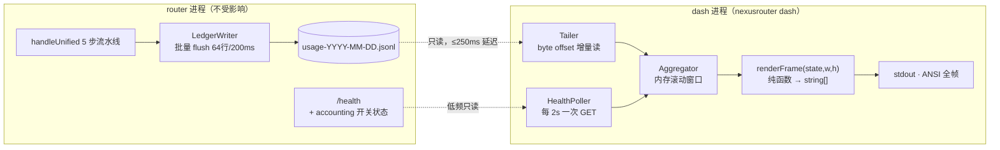

# NexusRouter Live Dashboard 设计方案（控制台实时大屏）

> 日期：2026-08-20
> 目的：账目落盘之后，提供一个**终端实时大屏**，实时看见 tier 分布、真实成本与省下来的钱。
> 落位：`ROADMAP.md` Phase 6.5（Dashboard 数据基线）+ 新增 6.6（`nexusrouter dash` TUI）
> 硬前置：Phase 5.6 Savings Ledger —— 否则大屏显示的是[缺陷 4](2026-08-19-savings-ledger-design.md) 的虚构美元
> 关联方案：[`2026-08-19-savings-ledger-design.md`](2026-08-19-savings-ledger-design.md)（写侧）
> 性能立场：大屏对 router 进程的影响必须为 **0**，唯一耦合是文件读 + 低频 `/health` 轮询

---

## 1. 结论先行

三条硬结论，其中两条是反直觉的：

**① 大屏必须是独立进程，绝不与 router 同进程渲染。**
1Hz 全帧重绘 + 聚合计算放进流量咽喉的事件循环，等于给代理延迟加周期性抖动。记账本身才 +0.046 ms，而一次渲染是它的几十倍 —— 把观测工具塞进被观测对象，是本方案最容易犯的错。

**② 数据源用增量 tail（byte offset），绝不复用 `getStats()`。**
`stats.ts:129 getStats()` 每次调用都全量重读并重解析整天文件。1Hz 刷新 × 10 万行/天 = **每分钟解析 600 万行**。这会让**大屏本身比被它观测的记账贵三个数量级**。真正的性能陷阱在读侧，不在写侧。

**③ 开关状态必须从 `/health` 读，不能从文件推。**
`persist: false` 或自动降级时文件里根本没有新行。若大屏只看文件，它会显示一片 `0` —— 而「关掉了落盘」和「这段时间没省钱」在屏上长得一模一样。这是[省钱方案第 10 节报表口径](2026-08-19-savings-ledger-design.md)要求的直接延伸。

---

## 2. 现状核实（工具实测，非推断）

| 事实 | 证据 |
|:--|:--|
| **零 TUI 基础设施** | 全仓 grep `dashboard\|/metrics\|tui\|isTTY\|process.stdout.write\|watch(` 仅命中 `session.ts:44,51` 的 cleanup `setInterval` |
| 只有一个静态渲染器 | `stats.ts:220 formatStatsAscii()` —— 固定 61 字符宽、一次性输出、无刷新循环 |
| 运行时依赖仅 3 个 | `package.json`：`fastify` / `yaml` / `zod`。这是产品资产，不是巧合 |
| `/health` 极简 | `server.ts:411` 只返回 `{status, timestamp}`；默认仅绑回环双栈（commit `c2bf803`） |
| CLI 无报表入口 | `cli.ts` 仅 `--version` / `--help` / `doctor` / `--port` / `--config` |

### 🔴 新发现缺陷 11：读侧忽略 `NEXUSROUTER_LOG_DIR`（大屏的先决 bug）

`stats.ts:15` 硬编码 `const LOG_DIR = join(homedir(), ".nexusrouter", "logs")`，而 `logger.ts:38` 是 `process.env.NEXUSROUTER_LOG_DIR || DEFAULT_LOG_DIR`。

**后果**：一旦用户（或测试、或容器部署）设置了 `NEXUSROUTER_LOG_DIR`，写侧写到 A 目录、读侧从 B 目录读 —— 大屏永远显示 0，且没有任何报错。这条必须先修，否则大屏在最常见的容器场景下直接是死屏。

### ⚠️ 目录命名不一致

配置在 `~/.nexus-router/`（带连字符，commit `c3dfe00`），日志在 `~/.nexusrouter/`（不带）。建议读侧统一由一个 `paths.ts` 解析，不再各处 `join(homedir(), ...)`；迁移须兼容既有日志目录。

---

## 3. 架构：观测者与被观测者彻底分离



耦合面只有两条虚线，且都是单向只读。**dash 进程崩掉、卡住、被 Ctrl+C，router 完全不受影响** —— 这是选独立进程而非同进程渲染的全部理由。

---

## 4. 关键决策

### 决策 1：独立命令 `nexusrouter dash`，独立进程

沿用 `cli.ts` 现有的 `parseArgs` 分派风格新增子命令，与 Phase 5.6.5 的 `stats` / `report` 同批落地：

| 命令 | 语义 |
|:--|:--|
| `nexusrouter stats` | 一次性快照（复用 `formatStatsAscii`） |
| `nexusrouter report --json` | 离线报表（复用 `report.ts`） |
| `nexusrouter dash` | **实时大屏**，进 alt screen，1Hz 刷新，Ctrl+C 退出 |

### 决策 2：增量 tail，不复用 `getStats()`

状态只需 `{ file, offset }`：

- `fs.watch(logDir)` 触发 + **250ms 轮询兜底** —— `fs.watch` 在 Windows 网络盘、以及「写临时文件再 rename」的写法下会漏事件，不能只靠它
- 只 `read(fd, buf, 0, len, offset)` 读 offset 之后的字节，读完 `offset += n`
- **半行残片**：最后一个 `\n` 之后的内容留在 buffer 等下一轮 —— 批量 flush 与读取无锁协调，必然读到半行
- **跨日切换**：00:00 后文件名变化，需 open 新文件并保留昨日聚合，不能把当日计数清零
- **文件被截断/删除**（logrotate、手工清理）：`size < offset` 即视为换文件，offset 归零，不崩不重复计数

### 决策 3：渲染零新依赖，纯 ANSI 手写

**否决 `ink`（要拖进 React，+2MB 量级）与 `blessed`（久未维护）。** 一个 `npx` 就能起的路由器，运行时依赖只有 3 个是它的产品资产；为了一块看板把 React 拉进 `dependencies`，代价与收益完全不成比例。40 行 × 120 列的定频重绘，手写 ANSI 约 200 行即可。

必须做对的四件事：

- **进出 alt screen**：`\x1b[?1049h` 进、`\x1b[?25l` 隐藏光标；**退出时必须恢复** `\x1b[?1049l` + `\x1b[?25h`，且要挂在 `SIGINT` / `SIGTERM` / `exit` / `uncaughtException` 上 —— 漏一个就把用户的终端留在坏状态里
- **非 TTY 降级**：`process.stdout.isTTY` 为假（管道、CI、重定向）时**不进循环**，直接输出一次快照。否则 `nexusrouter dash > out.txt` 会写出一坨转义序列
- **宽度自适应**：读 `process.stdout.columns`，监听 `SIGWINCH` 重排；< 60 列时降级为纵向单列。现有 `formatStatsAscii` 的 61 字符硬编码不复用
- **逐行 `\x1b[K` 清行**，不用全屏 `\x1b[2J` —— 全清屏在慢终端上会可见闪烁

### 决策 4：v1 只读「文件 + `/health`」，不新增数据端点

`persist: false` 时文件里没有数据，此时的实时数值只能来自 router 内存。但这需要一个新端点，而[省钱方案决策 6](2026-08-19-savings-ledger-design.md) 已否决在流量咽喉加端点。折中：

| 场景 | v1 行为 |
|:--|:--|
| 正常（`persist: true`） | 文件 tail，数据完整 |
| `persist: false` / 已自动降级 | 屏上**显著标注**「落盘已关闭，仅显示开关状态」，不显示 0 |
| router 未运行 | 屏上标注「router 离线」，仍展示历史文件聚合 |

若确需 `persist: false` 下的实时数值，留给 Phase 6.4 的 `GET /internal/stats`：**只读 + 回环 only + 显式 opt-in + 默认关闭**，三条缺一不可。

> 🔒 **安全提醒**：`/health` 目前**无任何鉴权**。为 L3 可见性加上 `accounting` 段后，它会带出成本口径与开关状态。默认只绑回环双栈（`c2bf803`）时无碍，但一旦用户显式配 `hosts` 暴露到局域网，这些字段会一并暴露。因此 `/health` 的 `accounting` 段应**仅对回环来源返回**，或由配置显式 opt-in。

### 决策 5：口径诚实，屏上不许混算

延续省钱方案第 10 节：`upstream` 与 `estimated` 的请求数**分栏显示**，降级时段在屏上带标记。把二者相加成一个「今日已省 $X」是重复缺陷 4 的错误 —— 只是这次错在实时屏上，传播更快。

---

## 5. 屏幕布局（120 列示意）

```
╔══════════════════════════════════════════════════════════════════════════════════════════════════╗
║  NexusRouter v0.12.5 · LIVE           ⬤ router 127.0.0.1:8402   accounting: ON  persist: ON      ║
╠═════════════════════════════════════╦════════════════════════════════════════════════════════════╣
║  TODAY                              ║  ROUTING BY TIER                    (last 60s / today)     ║
║    requests      1,284              ║    SIMPLE     ████████████████░░░░   41.2%  ·   529        ║
║    actual cost   $ 2.1873           ║    MEDIUM     ███████░░░░░░░░░░░░   18.6%  ·   239        ║
║    baseline      $ 9.4410           ║    COMPLEX    ██████████░░░░░░░░░   27.0%  ·   347        ║
║    ▲ saved       $ 7.2537  (76.8%)  ║    REASONING  ████░░░░░░░░░░░░░░░   13.2%  ·   169        ║
║    usage src     1,190 upstream     ║                                                            ║
║                     94 estimated    ║  TOP MODELS                                                ║
║  THROUGHPUT                         ║    claude-haiku-4-5        529 reqs   $ 0.1204             ║
║    now           3.2 req/s          ║    claude-sonnet-4-5       347 reqs   $ 0.9871             ║
║    upstream p50  1,840 ms           ║    claude-opus-4-6         169 reqs   $ 1.0102             ║
║    upstream p95  8,210 ms           ║    gpt-4o-mini             239 reqs   $ 0.0696             ║
║    classify avg  0.8 ms             ║                                                            ║
╠═════════════════════════════════════╩════════════════════════════════════════════════════════════╣
║  LIVE  time      tier       model                    in/out      cache      cost      latency     ║
║        14:07:52  SIMPLE     claude-haiku-4-5        1.2k/210     11.4k r   $0.0004      940 ms    ║
║        14:07:50  COMPLEX    claude-sonnet-4-5       3.8k/1.1k    42.0k r   $0.0161    4,120 ms    ║
║        14:07:44  REASONING  claude-opus-4-6         9.1k/2.4k    88.2k r   $0.0602   11,380 ms    ║
╠══════════════════════════════════════════════════════════════════════════════════════════════════╣
║  baseline: requested (same-usage-repricing · 近似值)          q ctrl+c 退出   1s 刷新             ║
╚══════════════════════════════════════════════════════════════════════════════════════════════════╝
```

底栏常驻 `same-usage-repricing · 近似值` —— 省钱数字是反事实估算，屏幕越好看越要把这句话钉在上面。

---

## 6. 性能预算

| 项 | 预算 / 实测依据 |
|:--|:--|
| 对 router 进程的开销 | **0**（不同进程）。唯一负载是每 2s 一次 `/health` GET —— 一次 JSON 序列化 |
| tail 增量读 | 1Hz 下每帧只读新增字节；3 req/s ≈ 每帧 3 行、约 1 KB |
| 聚合 | 滚动窗口 O(新增行数)，不重算历史；跨日只做一次合并 |
| 渲染 | 40 行 × 120 列全帧 ≈ 5 KB/s stdout，一帧 `renderFrame` 目标 < 2 ms |
| dash 进程 RSS | < 60 MB（含 LIVE 滚动区上限 200 条） |

**刷新频率与 `/health` 轮询必须解耦**（数据 1s、健康 2s）。否则大屏就成了 router 的一个固定 1Hz 负载 —— 观测工具给被观测对象加基线负载，是本方案第二个容易犯的错。

---

## 7. TDD 清单（写功能代码前先写）

### 7.1 `src/dashboard/tailer.test.ts`
- offset 续读：追加 3 行只解析新增的 3 行，不重解析历史
- **半行残片**：一行被切在两次读之间，拼接后正确解析、不丢不重
- **跨日**：文件名滚到次日，昨日聚合保留，当日从 0 起算
- **截断/删除**（logrotate）：`size < offset` → offset 归零，不崩、不重复计数
- 日志目录不存在 / 无 `usage-*.jsonl` → 空态渲染，不抛错
- 混读 v1 + v2 schema 日志（对齐省钱方案 §6 兼容红线）

### 7.2 `src/dashboard/aggregator.test.ts`
- 60s 滚动窗口 req/s 正确出窗
- p50 / p95 上游延迟；样本 < 2 条时不产出 `NaN`
- `usageSource` 的 upstream / estimated **分离计数**，不相加
- `baselineCostUsd === null`（`baseline: off`）不当 0 参与聚合

### 7.3 `src/dashboard/render.test.ts`（关键：把 TUI 变成可测纯函数）
- `renderFrame(state, width, height): string[]` 为**纯函数**，无终端、无 stdout 也能断言
- 80 / 120 / 200 列快照；**< 60 列降级为纵向单列**
- 大数字（`$1,234,567.8901`、`999,999 reqs`）不撑破边框
- `persist: false` / `degraded` → 屏上出现显著标注，且**不显示 $0.0000**
- `baseline: off` → 隐藏省钱栏而非显示 0

### 7.4 `src/dashboard/lifecycle.test.ts`
- 非 TTY（`isTTY` 假）→ 输出一次性快照，**不含 alt screen 转义序列**
- `SIGINT` → 输出含 `\x1b[?1049l` 与 `\x1b[?25h`（终端状态已恢复）
- `uncaughtException` 路径同样恢复终端
- `/health` 不可达 → 显示「router 离线」，仍渲染文件聚合，不崩
- 定时器 `unref()`，`Ctrl+C` 后进程立即退出

### 7.5 性能门禁
- 单帧 `renderFrame` < **2 ms**
- 10 万行 `usage-*.jsonl` 冷启动首帧 < **300 ms**
- 稳态每帧新增解析行数 == 实际新增行数（**断言未走全量重读**，即防止有人图省事改回 `getStats()`）

---

## 8. 落位与施工切分

| ROADMAP 条目 | 本方案对应 |
|:--|:--|
| **6.5** Dashboard 数据基线 | `Aggregator` 的 `DashboardState` 即数据模型 |
| **6.6**（新增）`nexusrouter dash` 实时大屏 | 方案主体 |
| 5.6.5 CLI 子命令 | `dash` 与 `stats` / `report` 同批接入 `cli.ts` |
| 6.4 debug 端点 | 可选的 `GET /internal/stats`（回环 only + opt-in + 默认关闭） |

### 🔴 硬前置

1. **Phase 5.6 Savings Ledger 必须先落地。** 当前 `logUsage()` 零调用点，日志文件根本不存在；即便造出来，成本也是[缺陷 4](2026-08-19-savings-ledger-design.md) 的 `maxOutputTokens` 虚构值。**大屏会把虚构数字实时放大**。
2. **缺陷 11 必须先修**（`stats.ts` 忽略 `NEXUSROUTER_LOG_DIR`），否则容器/自定义日志目录场景下是死屏。

| 步骤 | 范围 | 风险 |
|:--|:--|:--|
| **Step D0** | 修缺陷 11 + 抽 `paths.ts` 统一日志目录解析 | 低；可与 Phase 5.6 并行 |
| Step D1 | `src/dashboard/tailer.ts` + `aggregator.ts` 纯函数与测试 | 零；不碰主链 |
| Step D2 | `src/dashboard/render.ts` 纯函数 `renderFrame` + 快照测试 | 零；无终端依赖 |
| Step D3 | `lifecycle.ts` 终端接管 + `cli.ts` 接 `dash` 子命令 | 低；仅 CLI，router 零改动 |
| Step D4 | `/health` 的 `accounting` 段（与省钱方案 5.6.7 L3 合并交付） | 低；注意回环限定 |

每步过三道门禁：`npm run typecheck` / `npm run build` / `npm test`；Step D2 额外过 7.5 性能门禁。

---

## 9. 明确不做（避免范围膨胀）

| 不做 | 理由 |
|:--|:--|
| Web UI / 浏览器大屏 | 要起 HTTP + 静态资源 + 鉴权，与「npx 起一个 CLI 路由器」的定位相悖。真要图形化，**Prometheus + Grafana 才是正解**，Phase 6.3 已排 exporter |
| 同进程渲染 | 见结论 ①，给流量咽喉加抖动 |
| 历史回放 / 时间轴缩放 | `stats` / `report` 已覆盖离线分析，实时屏只管「现在」 |
| 鼠标交互 / 多面板切换 | 手写 ANSI 的复杂度会失控；真需要就该上 Grafana |
| 新引入 TUI 框架 | 见决策 3，3 个运行时依赖是产品资产 |

---

## 附录：变更记录

| 日期 | 变更 |
|:--|:--|
| 2026-08-20 | 初版：独立进程 + 增量 tail + 零依赖 ANSI 渲染 + 纯函数 `renderFrame` 可测化；核实并新增**缺陷 11**（`stats.ts` 忽略 `NEXUSROUTER_LOG_DIR`）；否决 ink/blessed、Web UI、同进程渲染；标注 `/health` 无鉴权的暴露风险 |
| 2026-08-20 | 按产品方向调整：移除 TUI，改为 router 内 `/dashboard` + `/dashboard/events` SSE 的 Web 大屏；`router.dashboard` 默认 `false`（opt-in）；复用 `tailer.ts` / `aggregator.ts` 数据层 |
| 2026-08-20 | 默认开启：`router.dashboard` 改为默认 `true`；页面改为中文指标标签、科幻动效风格，并将「省了多少钱」作为首屏最大视觉焦点 |


