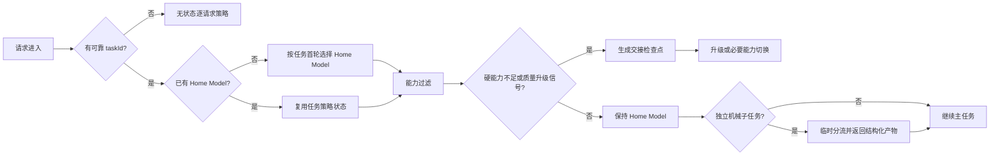

# 任务级模型路由、缓存经济学与认知连续性决策记录

> 日期：2026-09-02  
> 状态：规划已接受，代码未实施  
> 适用范围：NexusRouter live server 的 `model:auto` 路径  
> 关联缺陷：D-005、D-012、D-013、D-014、D-015  
> Roadmap 落位：4.1b、4.4a、4.6.3–4.6.7、4.7

## 1. 决策结论

NexusRouter 不再把“每个请求都重新选择最便宜模型”作为长任务的默认理想形态。最终采用双模式路由契约：

1. **无状态短请求**仍可逐请求路由；请求之间没有需要继承的任务状态，缓存与认知交接成本有限。
2. **Agentic 长任务**采用“Home Model（任务主模型）+ 任务级粘性 + 有证据升级”的默认策略。
3. **任务内降级不是绝对禁止**，但只能发生在可识别的阶段边界；必须同时满足可显式交接、预计后续驻留足够长、缓存重暖后仍有净收益、质量门禁允许。
4. **机械且可隔离的子任务**可以分流给便宜模型，但子任务返回结构化产物，主任务的 Home Model 不随之切换。
5. **上下文长度是能力约束，不是难度证据**。它只能过滤装不下请求的模型，不能把 SIMPLE/MEDIUM 直接抬到 COMPLEX。
6. **Provider fallback 是冷交接**。它首先服务可用性，不得伪装成无损、可共享缓存的普通切换。
7. 路由策略是否优于单模型，必须以**完整任务质量非劣 + 实际总成本下降**证明；分类准确率和逐请求重定价均不能单独证明项目收益。

一句话定位：

> NexusRouter 应从“逐请求分类器”升级为“缓存感知、能力约束、任务连续性优先的模型策略器”。

## 2. 已证实事实、代理指标与未知项

### 2.1 live 实现事实

- `src/server.ts` 对每个 `model:auto` 请求重新执行分类、Tier 融合与模型读取；当前没有 task/session 状态参与决策。
- `src/session.ts` 的 `SessionStore` 只作为库 API 导出，built-in server 不使用。
- `src/response-cache.ts` 的响应缓存也只作为库 API 导出；本议题主要涉及上游模型的 prompt/KV cache，而不是 NexusRouter 本地响应缓存。
- OpenAI adapter 走 Chat Completions passthrough；Anthropic adapter 原样复用 raw body，仅覆盖 `model`。当前没有跨模型 reasoning/thinking 状态适配层。
- `same-usage-repricing` 会把实际请求的 `inputUncached/cacheRead/cacheWrite` 分布直接按基线模型价格重算。它声明了“不同模型输出长度可能不同”的局限，却没有建模“不同策略产生不同缓存轨迹”。
- 未显式声明倍率时，PriceBook 默认使用 Anthropic 的 cache read/write multiplier；这不是跨厂商和私有网关的通用事实。

### 2.2 2026-08-28～2026-09-01 最新日志快照

数据源：用户提供的 `/Users/neo/Downloads/new-log/`。分析只聚合结构化字段，不展示提示词正文。

| 指标                            |                                       结果 | 能说明什么                         |
| :------------------------------ | -----------------------------------------: | :--------------------------------- |
| routing / usage 行数            |                              1,334 / 1,334 | 请求与 usage 行数齐平              |
| 唯一 `classificationPreview`    |                                        268 | 1,066 次、79.9% 为重复分类         |
| `classificationStale`           |                             1,093（81.9%） | Agent loop 大量回溯旧用户文本      |
| Layer 分布                      |    rule 288 / fallback 1,046 / heuristic 0 | 现有置信门仍未命中真实流量         |
| `contextForcedComplex`          |                               410（30.7%） | 358 MEDIUM、52 SIMPLE 被护栏抬档   |
| 有 cache read 的 usage 行       |                                        139 | 只能证明部分上游返回了缓存信息     |
| cache read tokens               |                                  6,465,442 | 命中时缓存规模不可忽略             |
| 单次 cache read P50 / P95 / max |                  49,152 / 65,536 / 114,688 | 一次错误冷切换可能重读数万 tokens  |
| usageSource                     | estimated 1,190 / partial 139 / upstream 5 | 不足以计算全局真实命中率或精确节省 |

按“日期 + 完全相同的 `classificationPreview`”分组，只分析同文本续轮：

- 192 个重复组中，`classifierTier` 变化组数为 **0**；这证明分类器对同一输入是确定性的，不证明分类正确。
- 11 个组发生 `finalTier` 变化，共 16 次模型切换：11 次 MEDIUM→COMPLEX、1 次 SIMPLE→COMPLEX、4 次 COMPLEX→MEDIUM。
- 16 次切换全部伴随 `contextForcedComplex` 状态变化；这是当前唯一被该代理口径观测到的同文本切换源。
- 最密集的一组在约 5.3 分钟内发生 4 次切换（2 次往返），说明 100k 阈值与 compact/上下文形态能造成真实抖动。

### 2.3 不能从当前日志推出的结论

上述 1.5% 左右的同文本相邻切换率**不是任务级模型切换率**：

- 同一任务收到新用户指令时，`classificationPreview` 会变化，代理分组无法继续关联。
- 所有流量只有 `agent: claude-code`，没有可靠 `taskId/sessionId/turnIndex`。
- `routing-outcome` 的 `model-switch` 描述客户端 requestedModel 变化，不等价于 Router 在同一任务内改变 served model。
- 没有任务完成率、隐藏测试、返工次数、人工接管或盲评质量，无法评价“降智”。
- 只有 5 条完整 upstream usage，不能拿当前 `savedUsd` 证明路由比单模型便宜。

因此，当前证据既不能证明应取消模型路由，也不能证明逐请求路由具有净收益。

## 3. 术语与边界

| 术语           | 定义                                                                 |
| :------------- | :------------------------------------------------------------------- |
| 逐请求重算     | 每个请求重新运行分类与模型选择逻辑，即使结果与上一轮相同             |
| 模型切换       | 同一任务相邻两次由不同模型实际服务                                   |
| 同文本续轮稳定 | tool-result loop 回溯到同一分类文本，确定性分类器给出同一结果        |
| 任务级粘性     | Router 显式记住任务 Home Model，并按状态机决定保持/升级/阶段性降级   |
| 能力切换       | 原模型不满足 context/tool/vision/protocol 等硬约束而更换模型         |
| 经济切换       | 能力均满足时，为降低完整任务成本而更换模型                           |
| 认知交接税     | 新模型重建隐含假设、计划、已排除路径和未显式推理状态的成本与质量风险 |

“逐请求重算”与“模型经常变化”不是同一概念；“确定性稳定”与“判定正确”也不是同一概念。

## 4. 缓存经济学

### 4.1 为什么切换可能适得其反

Prompt/KV cache 依赖模型权重、渲染后的稳定前缀和厂商缓存域。不同模型通常不能共享彼此的 KV 状态，跨 Provider 更不能假设共享。切到新模型时，新模型需要重新处理历史上下文；切回旧模型时，旧缓存若仍存活且前缀未被改写，最多复用切换前的稳定前缀，中间新增内容仍需处理。

设：

- `H`：切换时已有历史 tokens；
- `P_A/P_B`：原模型 A、新模型 B 的基础输入单价；
- `r_A/r_B`：两模型 cache read 倍率；
- `w_B`：B 首次处理或 cache write 的有效倍率；无写入溢价时可近似为 1；
- `K`：切换后预计在 B 上连续驻留的轮数。

首次切换相对继续使用 A 的历史输入成本差近似为：

```text
WarmPenalty ≈ H × (w_B × P_B − r_A × P_A)
```

后续驻留每轮才可能获得：

```text
RecurringSaving ≈ cached-history 价差 + 新增输入价差 + 输出价差
```

经济切换只有在以下条件成立时才值得：

```text
Σ FutureSaving(K)
>
WarmPenalty + ClassifyCost + HandoffCost + ExpectedRework + QualityRisk
```

这解释了两个同时成立的事实：

1. 长上下文上的单次便宜模型切换可能比继续读取高阶模型缓存更贵。
2. 若切换后有足够长且稳定的低风险阶段，重暖成本可以被后续多轮摊销。

当前 Router 不知道 `K`，也没有阶段边界、策略级缓存轨迹或交接质量数据，因此不能安全执行纯经济型的任务内降级。

### 4.2 账本边界

现有 `costUsd` 在 usage 与价目都可靠时仍可表示**实际请求成本**。但现有 `baselineCostUsd/savedUsd` 只能标记为逐请求估算，不能用来证明任务级反事实：

- 实际策略的 cache miss，不代表固定模型基线也会 miss；直接重定价会高估基线成本和节省。
- 实际策略的 cache hit，不代表另一个模型在同一时刻也会 hit。
- 不同策略会改变模型序列、输出长度、后续输入内容、缓存 TTL 和返工轮数。

正式收益必须来自同任务的策略对照或可重放实验，分别观察每种策略自己产生的真实缓存轨迹。

## 5. 认知连续性与“神之一笔”

后一个模型通常能看到客户端显式回传的会话内容、工具结果和文件状态，但不能假设它继承：

- 前一个模型未写出的假设、计划和注意力焦点；
- 已经在内部排除但没有记录的路径；
- 厂商或模型专用的 reasoning/thinking state；
- 对整个代码库形成但未外化的工作记忆。

OpenAI Responses API 等受支持链路可以通过完整 replay response items 保留部分 reasoning state；这不是 Chat Completions passthrough 的通用能力。Anthropic thinking blocks 与生成模型绑定，跨模型时需要按厂商规则剥离或转换。NexusRouter 当前没有跨模型状态适配契约，因此模型切换应视为冷认知交接。

高阶模型偶发的“神之一笔”属于长尾价值，不能只看平均准确率。正式评测必须单列：

- 需要架构判断、根因定位或新颖解法的 breakthrough cohort；
- 严重欠档、破坏性修改与不可逆决策；
- 首次解决率、返工轮数、人工接管和 time-to-green；
- 每任务相对固定高阶模型的 regret 分布，而非只看总体均值。

质量采用词典序门禁：先证明非劣，再比较成本。严重失败不能用大量便宜成功样本平均掉。

## 6. 目标架构



### 6.1 Task Identity Resolver

任务标识优先级：

1. 显式、可配置的 task/session header；
2. 经客户端 profile 验证确实表示任务而非用户的 provider metadata；
3. 对话锚点派生 ID，仅作兼容 fallback，并明确 compact、碰撞和并发限制；
4. 无可靠来源时返回 `unknown`，不得伪造一个看似精确的 taskId。

`metadata.user_id` 的 API 契约是外部用户标识，不得直接当 taskId。若某客户端版本把 session hash 编入该字段，必须用真实请求 fixture 验证同任务稳定、跨任务区分、compact 前后保持，再由 profile 显式启用。日志只保存不可逆 hash，不保存原值。

### 6.2 Task Routing State

最小状态：

```text
taskIdHash
homeModel / currentModel / currentTier
policyVersion / configHash / taxonomyVersion
createdAt / lastSeenAt / turnIndex
lastSwitchAt / lastSwitchReason
qualitySignals / capabilityConstraints
```

状态必须有 TTL、LRU 上限、显式失效条件和进程重启语义。不得直接把通用 `SessionStore` 接回主链；先定义任务策略状态，再实现最小专用存储。

### 6.3 模型转换规则

| 转换              | 默认策略   | 允许条件                                                |
| :---------------- | :--------- | :------------------------------------------------------ |
| 保持              | 首选       | 能力满足且没有升级证据                                  |
| 升级              | 允许       | 重试、验证失败、用户要求、明确不确定性或硬能力不足      |
| 降级              | 默认拒绝   | 明确阶段边界、状态可交接、预计驻留足够长、质量门禁通过  |
| 独立分流          | 允许       | 输入/输出契约清晰、结果可验证、不改变主任务 Home Model  |
| Provider fallback | 可用性兜底 | 记录为 cold-handoff；协议、工具和 thinking 兼容检查通过 |

### 6.4 Context Capability Filter

能力过滤顺序：

1. 从实际模型元数据读取 context window、tool、vision、protocol 等硬能力；
2. 用真实 tokenizer 或经过校准的保守估算计算所需容量，并留安全 buffer；
3. 在同一策略档的候选池内过滤；
4. 若 primary 不满足但同档候选满足，执行“能力切换”，Tier 不变；
5. 若全部不满足，走明确配置的跨档/拒绝策略，不得返回已知装不下的原链；
6. 记录候选数、过滤原因、最终模型和是否发生能力切换。

“消灭切换”不是验收目标；验收目标是消灭无依据的难度升档，并保证每次容量切换可解释。

### 6.5 Handoff Checkpoint

跨模型切换前生成最小显式状态：

```text
objective / hardConstraints / confirmedFacts
decisions / completedWork / artifacts
failedAttempts / currentValidation / pendingPlan
```

Checkpoint 只保存完成任务所需事实，不保存或伪造 chain-of-thought。Provider adapter 负责按目标模型契约处理 reasoning/thinking blocks；不兼容时剥离并记录 `reasoningStateDropped: true`。

## 7. 遥测与隐私契约

Routing log schema 升级时新增：

| 字段                                                 | 用途                           |
| :--------------------------------------------------- | :----------------------------- |
| `routingPolicyVersion`                               | 区分逐请求、sticky、实验策略   |
| `taskIdHash` / `taskIdSource`                        | 任务关联与来源可信度           |
| `turnIndex`                                          | 任务内顺序                     |
| `previousModel` / `servedModel`                      | 计算真实切换                   |
| `modelSwitched` / `switchDirection` / `switchReason` | 区分能力、质量、经济、fallback |
| `classificationReused`                               | 任务缓存是否复用               |
| `estimatedContextTokens` / `requiredCapabilities`    | 解释能力过滤                   |
| `eligibleModelsCount` / `capabilityFiltered`         | 解释候选变化                   |
| `handoffCheckpointCreated` / `reasoningStateDropped` | 交接风险                       |
| `cacheRead/cacheWrite/inputUncached` + `usageSource` | 实际缓存轨迹                   |
| `configHash` / `taxonomyVersion`                     | 保证报告可复现                 |

约束：

- Prometheus 不使用 taskId、模型序列或 prompt/skill 名作高基数 label。
- JSONL 只记 task ID 的不可逆 hash；原始 provider metadata 不落盘。
- `unknown` 是合法值，缺失数据不得被填成 0 或假阳性。
- 旧 schema 至少保留一个迁移窗口，reader 必须兼容旧日志。

## 8. 任务级对照实验

### 8.1 实验单位与策略臂

实验单位必须是完整任务，不是单个请求。对同一组可重放任务比较：

| 策略          | 定义                                  | 目的                           |
| :------------ | :------------------------------------ | :----------------------------- |
| A 固定高阶    | 全任务使用当前高质量基线模型          | 质量上界与真实缓存基线         |
| B 固定中档    | 全任务使用成本中档模型                | 判断路由是否优于简单固定策略   |
| C 当前逐请求  | 每请求分类并选模                      | 现状对照                       |
| D Task-sticky | 首轮选 Home Model，只按证据升级       | 候选默认策略                   |
| E 阶段路由    | D + 经门禁的阶段性降级/独立子任务分流 | 验证摊销假设，未证实前不做默认 |

### 8.2 Cohort

- 短、独立、无状态请求；
- 长 Agent tool loop；
- compact 前后跨 100k 的任务；
- breakthrough：架构、根因、数学/逻辑推导；
- 可机械验证的局部修改；
- Provider fallback 与 reasoning/thinking 场景；
- 中文、英文与混合输入。

### 8.3 指标

质量优先：

- 任务完成率、隐藏测试通过率、盲评偏好；
- 严重欠档/破坏性错误；
- 首次解决率、返工轮数、人工接管、time-to-green；
- breakthrough cohort 的任务 regret 分布。

成本与性能：

- 每任务实际 `inputUncached/cacheRead/cacheWrite/output` 与总费用；
- cache token hit ratio、首次切换重暖量、模型切换次数；
- TTFT、任务 wall time、分类器耗时；
- 按 `usageSource` 分开报告，估算数据不得进入正式节省结论。

### 8.4 Go / No-Go 门禁

实验开始前预注册质量非劣界限与严重失败容忍度，避免看完结果后移动门槛。决策顺序：

1. 任一策略若严重失败显著增加，直接淘汰，不看省钱比例。
2. 通过质量非劣门禁后，比较每任务实际成本与 wall time 的置信区间。
3. 若 D 支配 C，长任务默认切到 task-sticky；C 只保留给无状态请求。
4. E 只有在阶段边界可识别且净收益稳定时才启用；否则保持实验功能。
5. 若任何路由策略都不能优于简单固定中档模型 B，收缩产品定位到能力过滤、fallback、治理与观测，不宣传智能省钱。

分类器 `≥85%` 只能作为内部判定质量指标，不能替代上述任务级门禁。

## 9. 分解计划与依赖

实施分三批推进：

1. **P0 证据基础**：4.1a → 4.4 → 4.5 的分类证据链，与 4.1b → 4.4a 的任务链路观测并行；在两条链汇合前不实现 task-sticky。
2. **P1 行为收口**：4.6.1/4.6.2/4.6.5 可在分类基线后启动；4.6.3/4.6.6/4.6.7 必须等待可靠 task telemetry。每项先写状态转换、旧 schema、未知 metadata、全候选不足和跨 provider fixture 的红测试。
3. **P2 价值验证**：全部行为契约完成后进入 4.7。五个策略臂分别运行并保留自己的实际缓存轨迹，不从某个策略的日志外推另一个策略；4.7.3 是发布“智能省钱”结论的硬门禁。

| Roadmap | 工作包                           | 关键交付                                                   | 依赖        |
| :------ | :------------------------------- | :--------------------------------------------------------- | :---------- |
| 4.1b    | 路由单位与经济学决策             | 本文、术语、策略状态机、实验门禁                           | 已完成      |
| 4.4a    | Task/switch telemetry 设计与接线 | schema v3、task identity resolver、switch reason、隐私规则 | 4.1b        |
| 4.5     | 分类器调优前基线                 | 只回答 Tier 判定，不宣称产品净收益                         | 4.1a、4.4   |
| 4.6.3   | Task-sticky 最小实现             | Home Model、TTL/LRU、升级信号、续轮复用                    | 4.4a、4.5   |
| 4.6.4   | 能力过滤                         | 活跃模型元数据、同档候选过滤、明确失败策略                 | 4.5         |
| 4.6.6   | 跨模型交接                       | checkpoint、thinking/reasoning 兼容、fallback 标记         | 4.4a、4.6.3 |
| 4.6.7   | 缓存反事实账本边界               | actual 与 estimate 分层，禁止复用实际 cache split 冒充基线 | 4.4a        |
| 4.7.1   | 修复后采集                       | 每策略真实 usage、任务链路、config/taxonomy 指纹           | 4.6         |
| 4.7.2   | 五策略任务级实验                 | A–E 对照、质量与成本结果                                   | 4.7.1       |
| 4.7.3   | 产品 Go/No-Go 决策               | 默认策略、适用范围、发布 claim                             | 4.7.2       |

所有代码工作遵循 SDD + TDD：先以 16 次历史切换和 provider thinking fixture 写红测试，再实现；每个工作包独立通过 typecheck、build、test 后才能进入下一依赖。

## 10. 明确不做

- 不把 `metadata.user_id` 未经验证地当 taskId。
- 不用 COMPLEX 会话锁存或 110k/90k 滞回掩盖 D-012。
- 不追求“模型切换率归零”；必要的能力切换和可靠性 fallback 必须保留。
- 不把稳定重复错误视为分类器正确。
- 不用当前 `savedUsd`、模型分布变均匀或低分类延迟证明产品收益。
- 不保存或生成 chain-of-thought；交接只保存显式任务状态。
- 不在没有任务级对照实验前默认开启任务内经济降级。

## 11. 外部契约参考

- [OpenAI Prompt Caching](https://developers.openai.com/api/docs/guides/prompt-caching)：完整渲染前缀、模型/工具/reasoning 设置、cache read/write 与生命周期。
- [OpenAI Conversation State](https://developers.openai.com/api/docs/guides/conversation-state)：Responses API 的 continuation 与 reasoning items 保存边界。
- [Claude Prompt Caching](https://platform.claude.com/docs/en/build-with-claude/prompt-caching)：cache breakpoint、TTL、写入/读取计价与失效条件。
- [Claude Thinking](https://platform.claude.com/docs/en/about-claude/models/extended-thinking-models)：thinking block 保存、模型切换与 tool loop 连续性。
- [Claude Messages API](https://platform.claude.com/docs/en/api/messages/create)：`metadata.user_id` 是外部用户标识，不是任务标识。
- [Gemini Context Caching](https://ai.google.dev/gemini-api/docs/caching)：隐式/显式缓存与稳定前缀要求。
